# Analisi esplorativa

## Introduzione

Questo capitolo vi mostrerà come usare la visualizzazione e la trasformazione per esplorare i vostri dati in modo sistematico, un compito che gli statistici chiamano analisi esplorativa dei dati, o EDA in breve. L'EDA è un ciclo iterativo. Voi:

1. Generate domande sui vostri dati.

2. Cercate le risposte visualizzando, trasformando e modellando i vostri dati.

3. Usare ciò che si impara per raffinare le domande e/o generare nuove domande.

L'EDA non è un processo formale con un rigido insieme di regole. Più che altro, l'EDA è uno stato mentale. Durante le fasi iniziali dell'EDA dovreste sentirvi liberi di investigare ogni idea che vi viene in mente. Alcune di queste idee andranno a buon fine e altre saranno vicoli ciechi. Man mano che la vostra esplorazione continua, vi concentrerete su alcune aree particolarmente produttive che alla fine metterete per iscritto e comunicherete agli altri.

L'EDA è una parte importante di qualsiasi analisi dei dati, anche se le domande ti vengono servite su un piatto d'argento, perché devi sempre indagare sulla qualità dei tuoi dati. La pulizia dei dati è solo un'applicazione dell'EDA: vi chiedete se i vostri dati soddisfino o meno le vostre aspettative. Per fare la pulizia dei dati, avrete bisogno di impiegare tutti gli strumenti dell'EDA: visualizzazione, trasformazione e modellazione.

### Prerequisiti

In questo capitolo combineremo ciò che avete imparato su dplyr e ggplot2 per porre domande in modo interattivo, rispondere con i dati e poi porre nuove domande.


```r
library(tidyverse)
```

## Domande

> "Non ci sono domande statistiche di routine, solo domande statistiche discutibili
> routine". --- Sir David Cox

> Molto meglio una risposta approssimativa alla domanda giusta, che è spesso
> vaga, che una risposta esatta alla domanda sbagliata, che può sempre essere resa
> precisa". --- John Tukey

Il tuo obiettivo durante l'EDA è quello di sviluppare una comprensione dei tuoi dati. Il modo più semplice per farlo è usare le domande come strumenti per guidare la vostra indagine. Quando fate una domanda, la domanda focalizza la vostra attenzione su una parte specifica del vostro set di dati e vi aiuta a decidere quali grafici, modelli o trasformazioni fare.

L'EDA è fondamentalmente un processo creativo. E come la maggior parte dei processi creativi, la chiave per fare domande di _qualità_ è generare una grande _quantità_ di domande. È difficile fare domande rivelatrici all'inizio della vostra analisi perché non sapete quali intuizioni sono contenute nel vostro set di dati. D'altra parte, ogni nuova domanda che ponete vi esporrà a un nuovo aspetto dei vostri dati e aumenterà le vostre possibilità di fare una scoperta. È possibile scavare rapidamente nelle parti più interessanti dei vostri dati - e sviluppare una serie di domande che fanno riflettere - se fate seguire ad ogni domanda una nuova domanda basata su ciò che trovate.

Non c'è una regola su quali domande dovresti porre per guidare la tua ricerca. Tuttavia, due tipi di domande saranno sempre utili per fare scoperte all'interno dei tuoi dati. Queste domande possono essere formulate liberamente come:

1. Che tipo di variazione si verifica all'interno delle mie variabili?

2. Che tipo di covariazione si verifica tra le mie variabili?

Il resto di questo capitolo esaminerà queste due domande. Spiegherò cosa sono la variazione e la covariazione, e vi mostrerò diversi modi per rispondere a ciascuna domanda. Per facilitare la discussione, definiamo alcuni termini: 

* Una __variabile__ è una quantità, qualità o proprietà che si può misurare. 

* Un __valore__ è lo stato di una variabile quando la si misura. Il valore di una
    Il valore di una variabile può cambiare da una misurazione all'altra.
  
* Una __osservazione__ è un insieme di misurazioni fatte in condizioni simili
    (di solito si fanno tutte le misure di un'osservazione nello stesso 
    tempo e sullo stesso oggetto). Un'osservazione conterrà diversi valori, 
    ciascuno associato ad una variabile diversa. A volte mi riferirò a 
    un'osservazione come un punto di dati.

* I __Dati tabulari__ sono un insieme di valori, ciascuno associato a una variabile e a un'osservazione.
    osservazione. I dati tabulari sono _ordinati_ se ogni valore è collocato nella sua
    "cella", ogni variabile nella sua colonna e ogni osservazione nella sua 
    riga. 

Finora, tutti i dati che avete visto sono stati ordinati. Nella vita reale, la maggior parte dei dati non è ordinata, quindi torneremo di nuovo su queste idee in [dati ordinati].

## Variazione

La **Variazione** è la tendenza dei valori di una variabile a cambiare da una misurazione all'altra. Puoi vedere facilmente la variazione nella vita reale; se misuri qualsiasi variabile continua due volte, otterrai due risultati diversi. Questo è vero anche se si misurano quantità che sono costanti, come la velocità della luce. Ognuna delle vostre misurazioni includerà una piccola quantità di errore che varia da misura a misura. Le variabili categoriche possono anche variare se misurate attraverso soggetti diversi (per esempio i colori degli occhi di persone diverse), o tempi diversi (per esempio i livelli di energia di un elettrone in momenti diversi). 
Ogni variabile ha il suo modello di variazione, che può rivelare informazioni interessanti. Il modo migliore per capire questo modello è quello di visualizzare la distribuzione dei valori della variabile.

### Visualizzare le distribuzioni

Il modo in cui si visualizza la distribuzione di una variabile dipende dal fatto che la variabile sia categorica o continua. Una variabile è **categorica** se può assumere solo uno di un piccolo insieme di valori. In R, le variabili categoriche sono solitamente salvate come fattori o vettori di caratteri. Per esaminare la distribuzione di una variabile categorica, usate un grafico a barre:


```r
ggplot(data = diamonds) +
  geom_bar(mapping = aes(x = cut))
```


L'altezza delle barre mostra quante osservazioni si sono verificate con ogni valore x. Puoi calcolare questi valori manualmente con `dplyr::count()`:


```r
diamonds %>% 
  count(cut)
#> # A tibble: 5 × 2
#>   cut           n
#>   <ord>     <int>
#> 1 Fair       1610
#> 2 Good       4906
#> 3 Very Good 12082
#> 4 Premium   13791
#> 5 Ideal     21551
```

Una variabile è **continua** se può prendere uno qualsiasi di un insieme infinito di valori ordinati. I numeri e le date-ora sono due esempi di variabili continue. Per esaminare la distribuzione di una variabile continua, usate un istogramma:


```r
ggplot(data = diamonds) +
  geom_histogram(mapping = aes(x = carat), binwidth = 0.5)
```

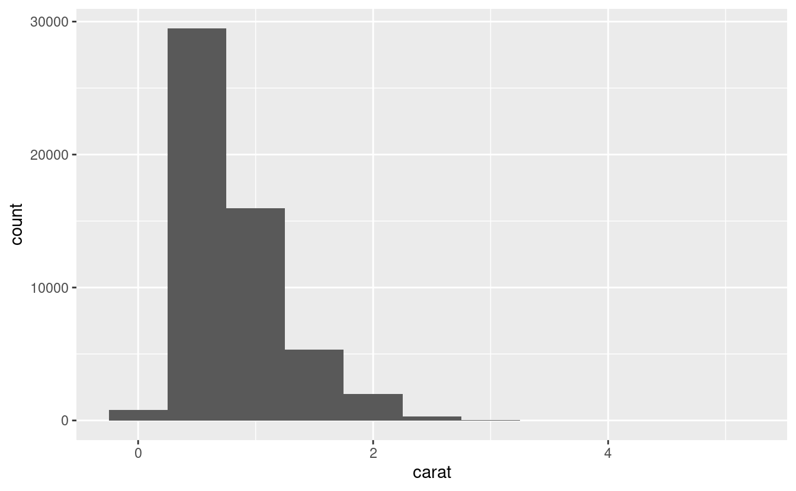

Puoi calcolarlo a mano combinando `dplyr::count()` e `ggplot2::cut_width()`:


```r
diamonds %>% 
  count(cut_width(carat, 0.5))
#> # A tibble: 11 × 2
#>   `cut_width(carat, 0.5)`     n
#>   <fct>                   <int>
#> 1 [-0.25,0.25]              785
#> 2 (0.25,0.75]             29498
#> 3 (0.75,1.25]             15977
#> 4 (1.25,1.75]              5313
#> 5 (1.75,2.25]              2002
#> 6 (2.25,2.75]               322
#> # … with 5 more rows
```

Un istogramma divide l'asse x in intervalli equamente distanziati e poi usa l'altezza di una barra per mostrare il numero di osservazioni che rientrano in ciascun intervallo. Nel grafico qui sopra, la barra più alta mostra che quasi 30.000 osservazioni hanno un valore di `carat` tra 0,25 e 0,75, che sono i bordi sinistro e destro della barra. 

Potete impostare la larghezza degli intervalli in un istogramma con l'argomento `binwidth`, che è misurato nelle unità della variabile `x`. Dovreste sempre esplorare una varietà di larghezze di binario quando lavorate con gli istogrammi, poiché diverse larghezze di binario possono rivelare diversi modelli. Per esempio, ecco come appare il grafico qui sopra quando ingrandiamo solo i diamanti con una dimensione inferiore a tre carati e scegliamo una larghezza di banda più piccola.


```r
smaller <- diamonds %>% 
  filter(carat < 3)
  
ggplot(data = smaller, mapping = aes(x = carat)) +
  geom_histogram(binwidth = 0.1)
```

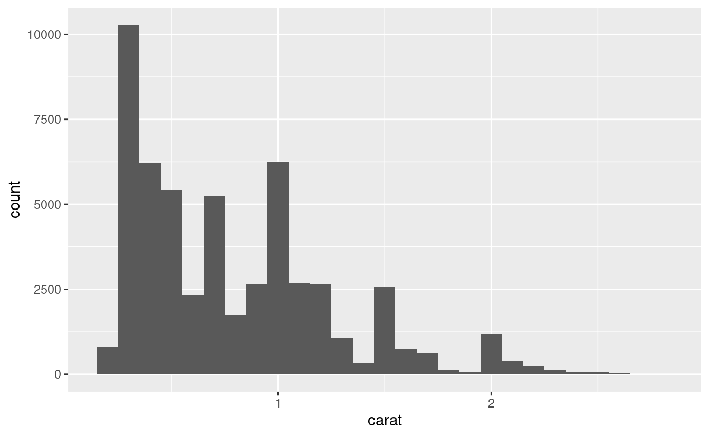

Se vuoi sovrapporre più istogrammi nello stesso grafico, ti consiglio di usare `geom_freqpoly()` invece di `geom_histogram()`. La funzione `geom_freqpoly()` esegue lo stesso calcolo di `geom_histogram()`, ma invece di visualizzare i conteggi con delle barre, utilizza delle linee. È molto più facile capire le linee sovrapposte rispetto alle barre.


```r
ggplot(data = smaller, mapping = aes(x = carat, colour = cut)) +
  geom_freqpoly(binwidth = 0.1)
```

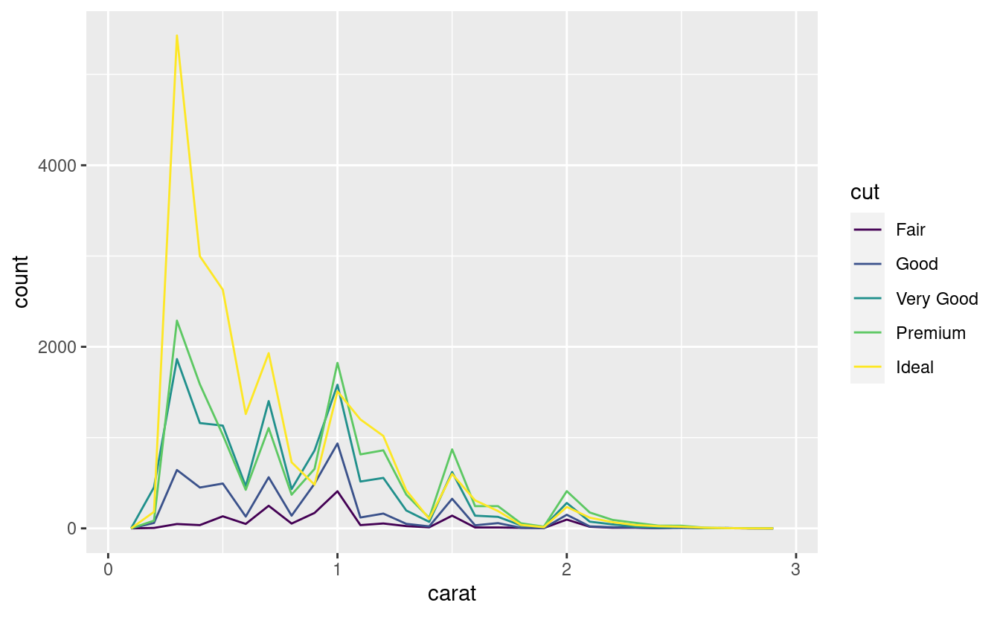

Ci sono alcune sfide con questo tipo di grafico, su cui torneremo in [visualizzare una variabile categorica e una continua](#cat-cont).

Ora che potete visualizzare la variazione, cosa dovreste cercare nei vostri grafici? E che tipo di domande successive dovresti fare? Ho messo insieme una lista qui sotto dei tipi di informazioni più utili che troverete nei vostri grafici, insieme ad alcune domande di follow-up per ogni tipo di informazione. La chiave per fare buone domande di follow-up sarà fare affidamento sulla tua curiosità (Cosa vuoi sapere di più?) e sul tuo scetticismo (Come potrebbe essere fuorviante?).

### Valori tipici

Sia nei grafici a barre che negli istogrammi, le barre alte mostrano i valori comuni di una variabile, e le barre più corte mostrano i valori meno comuni. I punti che non hanno barre rivelano valori che non sono stati visti nei vostri dati. Per trasformare queste informazioni in domande utili, cercate qualcosa di inaspettato:

* Quali valori sono i più comuni? Perché?

* Quali valori sono rari? Perché? Corrisponde alle tue aspettative?

* Riesci a vedere qualche schema insolito? Cosa potrebbe spiegarli?

Come esempio, l'istogramma qui sotto suggerisce diverse domande interessanti: 

* Perché ci sono più diamanti a carati interi e frazioni comuni di carati?

* Perché ci sono più diamanti leggermente a destra di ogni picco rispetto a quelli 
  sono leggermente a sinistra di ogni picco?
  
* Perché non ci sono diamanti più grandi di 3 carati?


```r
ggplot(data = smaller, mapping = aes(x = carat)) +
  geom_histogram(binwidth = 0.01)
```


I raggruppamenti di valori simili suggeriscono l'esistenza di sottogruppi nei tuoi dati. Per capire i sottogruppi, chiedetevi:

* Come sono simili tra loro le osservazioni all'interno di ogni cluster?

* In che modo le osservazioni in cluster separati sono diverse l'una dall'altra?

* Come puoi spiegare o descrivere i cluster?

* Perché l'aspetto dei cluster potrebbe essere fuorviante?

L'istogramma qui sotto mostra la durata (in minuti) di 272 eruzioni dell'Old Faithful Geyser nel Parco Nazionale di Yellowstone. I tempi di eruzione sembrano essere raggruppati in due gruppi: ci sono eruzioni brevi (di circa 2 minuti) ed eruzioni lunghe (4-5 minuti), ma poco nel mezzo.


```r
ggplot(data = faithful, mapping = aes(x = eruptions)) + 
  geom_histogram(binwidth = 0.25)
```


Molte delle domande di cui sopra vi spingeranno ad esplorare una relazione *tra* variabili, per esempio, per vedere se i valori di una variabile possono spiegare il comportamento di un'altra variabile. Ci arriveremo tra poco.

### Valori insoliti

I valori anomali sono osservazioni insolite; punti di dati che non sembrano adattarsi allo schema. A volte i valori anomali sono errori di inserimento dei dati; altre volte i valori anomali suggeriscono importanti novità scientifiche. Quando si hanno molti dati, i valori anomali sono a volte difficili da vedere in un istogramma.  Per esempio, prendiamo la distribuzione della variabile `y` dal set di dati dei diamanti. L'unica prova dell'esistenza di outlier sono i limiti insolitamente ampi sull'asse delle x.


```r
ggplot(diamonds) + 
  geom_histogram(mapping = aes(x = y), binwidth = 0.5)
```


Ci sono così tante osservazioni nei bin comuni che i bin rari sono così corti che non potete vederli (anche se forse se fissate intensamente lo 0 noterete qualcosa). Per rendere facile vedere i valori insoliti, abbiamo bisogno di zoomare a piccoli valori dell'asse y con `coord_cartesian()`:


```r
ggplot(diamonds) + 
  geom_histogram(mapping = aes(x = y), binwidth = 0.5) +
  coord_cartesian(ylim = c(0, 50))
```


(`coord_cartesian()` ha anche un argomento `xlim()` per quando avete bisogno di zoomare sull'asse x. ggplot2 ha anche le funzioni `xlim()` e `ylim()` che lavorano in modo leggermente diverso: buttano via i dati al di fuori dei limiti).

Questo ci permette di vedere che ci sono tre valori insoliti: 0, ~30, e ~60. Li tiriamo fuori con dplyr: 


```r
unusual <- diamonds %>% 
  filter(y < 3 | y > 20) %>% 
  select(price, x, y, z) %>%
  arrange(y)
unusual
#> # A tibble: 9 × 4
#>   price     x     y     z
#>   <int> <dbl> <dbl> <dbl>
#> 1  5139  0      0    0   
#> 2  6381  0      0    0   
#> 3 12800  0      0    0   
#> 4 15686  0      0    0   
#> 5 18034  0      0    0   
#> 6  2130  0      0    0   
#> 7  2130  0      0    0   
#> 8  2075  5.15  31.8  5.12
#> 9 12210  8.09  58.9  8.06
```


La variabile `y` misura una delle tre dimensioni di questi diamanti, in mm. Sappiamo che i diamanti non possono avere una larghezza di 0mm, quindi questi valori devono essere errati. Potremmo anche sospettare che le misure di 32mm e 59mm non siano plausibili: quei diamanti sono lunghi più di un pollice, ma non costano centinaia di migliaia di dollari!

È una buona pratica ripetere l'analisi con e senza i valori anomali. Se hanno un effetto minimo sui risultati, e non riesci a capire perché sono lì, è ragionevole sostituirli con valori mancanti e andare avanti. Tuttavia, se hanno un effetto sostanziale sui tuoi risultati, non dovresti abbandonarli senza giustificazione. Dovrai capire cosa li ha causati (ad esempio un errore di inserimento dati) e rendere noto che li hai rimossi nel tuo scritto.


### Esercizi

1.  Esplora la distribuzione di ciascuna delle variabili `x`, `y` e `z`. 
    in `diamanti`. Cosa hai imparato? Pensa a un diamante e a come
    potresti decidere quale dimensione è la lunghezza, la larghezza e la profondità.

1.  Esplora la distribuzione del `prezzo`. Scopri qualcosa di insolito
    o sorprendente? (Suggerimento: pensa attentamente alla `larghezza di banda` e assicurati di
    di provare una vasta gamma di valori).

1.  Quanti diamanti sono 0,99 carati? Quanti sono da 1 carato? Quale
    pensi che sia la causa della differenza?
    
1.  Confrontate e contrastate `coord_cartesian()` vs `xlim()` o `ylim()` quando
    zoomare su un istogramma. Cosa succede se lasciate `binwidth` non impostato?
    Cosa succede se provate a zoomare in modo da mostrare solo metà della barra?
    
## Valori mancanti

Se avete incontrato valori insoliti nel vostro set di dati e volete semplicemente passare al resto della vostra analisi, avete due opzioni.

1.  Eliminare l'intera riga con i valori strani:

    
    ```r
    diamonds2 <- diamonds %>% 
      filter(between(y, 3, 20))
    ```
    
    Non raccomando questa opzione perché solo perché una misurazione
    non è valida, non significa che tutte le misure lo siano. Inoltre, se si hanno
    dati di bassa qualità, quando avrete applicato questo approccio a tutte le variabili, 
    potreste scoprire che non vi rimane alcun dato!

1.  Invece, consiglio di sostituire i valori insoliti con valori mancanti.
    Il modo più semplice per farlo è usare `mutate()` per sostituire la variabile
    con una copia modificata. Potete usare la funzione `ifelse()` per sostituire
    valori insoliti con `NA`:

    
    ```r
    diamonds2 <- diamonds %>% 
      mutate(y = ifelse(y < 3 | y > 20, NA, y))
    ```

`ifelse()` ha tre argomenti. Il primo argomento `test` dovrebbe essere un vettore logico. Il risultato conterrà il valore del secondo argomento, `yes`, quando `test` è `TRUE`, e il valore del terzo argomento, `no`, quando è false. In alternativa a ifelse, usate `dplyr::case_when()`. `case_when()` è particolarmente utile all'interno di mutate quando si vuole creare una nuova variabile che si basa su una combinazione complessa di variabili esistenti.

Come R, ggplot2 sottoscrive la filosofia che i valori mancanti non dovrebbero mai mancare silenziosamente. Non è ovvio dove si dovrebbero tracciare i valori mancanti, quindi ggplot2 non li include nel grafico, ma avverte che sono stati rimossi:


```r
ggplot(data = diamonds2, mapping = aes(x = x, y = y)) + 
  geom_point()
#> Warning: Removed 9 rows containing missing values (`geom_point()`).
```


Per sopprimere questo avvertimento, impostate `na.rm = TRUE`:


```r
ggplot(data = diamonds2, mapping = aes(x = x, y = y)) + 
  geom_point(na.rm = TRUE)
```

Altre volte vuoi capire cosa rende le osservazioni con valori mancanti diverse dalle osservazioni con valori registrati. Per esempio, in `nycflights13::flights`, i valori mancanti nella variabile `dep_time` indicano che il volo è stato cancellato. Quindi potresti voler confrontare gli orari di partenza programmati per gli orari cancellati e non cancellati. Potete farlo creando una nuova variabile con `is.na()`.


```r
nycflights13::flights %>% 
  mutate(
    cancelled = is.na(dep_time),
    sched_hour = sched_dep_time %/% 100,
    sched_min = sched_dep_time %% 100,
    sched_dep_time = sched_hour + sched_min / 60
  ) %>% 
  ggplot(mapping = aes(sched_dep_time)) + 
    geom_freqpoly(mapping = aes(colour = cancelled), binwidth = 1/4)
```


Tuttavia questo grafico non è ottimale perché ci sono molti più voli non cancellati che voli cancellati. Nella prossima sezione esploreremo alcune tecniche per migliorare questo confronto.

### Esercizi

1.  Cosa succede ai valori mancanti in un istogramma?  Cosa succede ai valori mancanti
    valori mancanti in un grafico a barre? Perché c'è una differenza?

1.  Cosa fa `na.rm = TRUE` in `mean()` e `sum()`?

## Covariazione

Se la variazione descrive il comportamento _all'interno_ di una variabile, la covariazione descrive il comportamento _tra_ le variabili. La **Covariazione** è la tendenza dei valori di due o più variabili a variare insieme in modo correlato. Il modo migliore per individuare la covariazione è visualizzare la relazione tra due o più variabili. Il modo in cui lo si fa dovrebbe dipendere ancora una volta dal tipo di variabili coinvolte.

### Una variabile categorica e continua {#cat-cont}

È comune voler esplorare la distribuzione di una variabile continua suddivisa da una variabile categorica, come nel precedente poligono di frequenza. L'aspetto predefinito di `geom_freqpoly()` non è molto utile per questo tipo di confronto perché l'altezza è data dal conteggio. Ciò significa che se uno dei gruppi è molto più piccolo degli altri, è difficile vedere le differenze di forma. Per esempio, esploriamo come il prezzo di un diamante varia con la sua qualità:


```r
ggplot(data = diamonds, mapping = aes(x = price)) + 
  geom_freqpoly(mapping = aes(colour = cut), binwidth = 500)
```

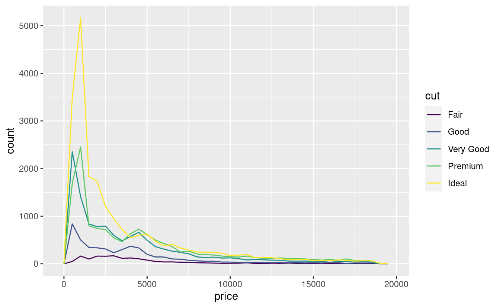

È difficile vedere la differenza di distribuzione perché i conteggi complessivi sono molto diversi:


```r
ggplot(diamonds) + 
  geom_bar(mapping = aes(x = cut))
```

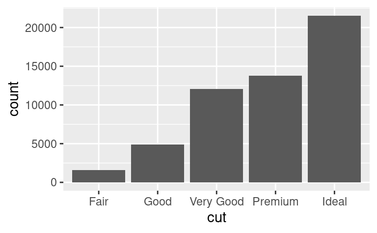

Per rendere il confronto più facile, dobbiamo scambiare ciò che viene visualizzato sull'asse y. Invece di visualizzare il conteggio, visualizzeremo __densità__, che è il conteggio standardizzato in modo che l'area sotto ogni poligono di frequenza sia uno.


```r
ggplot(data = diamonds, mapping = aes(x = price, y = ..density..)) + 
  geom_freqpoly(mapping = aes(colour = cut), binwidth = 500)
#> Warning: The dot-dot notation (`..density..`) was deprecated in ggplot2 3.4.0.
#> ℹ Please use `after_stat(density)` instead.
```

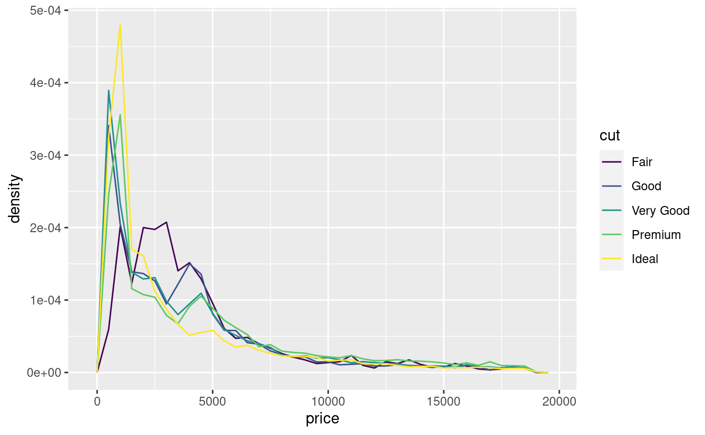

C'è qualcosa di piuttosto sorprendente in questo grafico - sembra che i diamanti discreti ('fair', la qualità più bassa) abbiano il prezzo medio più alto!  Ma forse è perché i poligoni di frequenza sono un po' difficili da interpretare - c'è molto da fare in questo grafico.

Un'altra alternativa per visualizzare la distribuzione di una variabile continua suddivisa per una variabile categorica è il boxplot. Un **boxplot** è un tipo di stenografia visiva per una distribuzione di valori che è popolare tra gli statistici. Ogni boxplot è composto da:

* Un riquadro che si estende dal 25° percentile della distribuzione al 
  75° percentile, una distanza nota come intervallo interquartile (IQR). Nel
  mezzo del riquadro c'è una linea che mostra la mediana, cioè il 50° percentile,
  della distribuzione. Queste tre linee vi danno un senso della diffusione della
  distribuzione e se la distribuzione è simmetrica o meno intorno alla
  mediana o inclinata su un lato. 

* Punti visivi che mostrano le osservazioni che cadono a più di 1,5 volte il 
  IQR da entrambi i bordi del riquadro. Questi punti fuori misura sono insoliti
  quindi sono tracciati singolarmente.

* Una linea (o baffo) che si estende da ogni estremità del riquadro e va fino al   
  punto non anomalo più lontano nella distribuzione.


Diamo un'occhiata alla distribuzione del prezzo per taglio usando `geom_boxplot()`:


```r
ggplot(data = diamonds, mapping = aes(x = cut, y = price)) +
  geom_boxplot()
```


Vediamo molte meno informazioni sulla distribuzione, ma i boxplot sono molto più compatti, quindi possiamo confrontarli più facilmente (e adattarne di più su un solo grafico). Questo supporta la scoperta controintuitiva che i diamanti di migliore qualità sono in media più economici! Negli esercizi, sarete sfidati a capire perché.

Il `taglio` è un fattore ordinato: giusto è peggiore di buono, che è peggiore di molto buono e così via. Molte variabili categoriche non hanno un tale ordine intrinseco, quindi potreste volerle riordinare per fare una visualizzazione più informativa. Un modo per farlo è con la funzione `reorder()`.

Per esempio, prendete la variabile `class` nel set di dati `mpg`. Potreste essere interessati a sapere come varia il chilometraggio autostradale tra le classi:


```r
ggplot(data = mpg, mapping = aes(x = class, y = hwy)) +
  geom_boxplot()
```

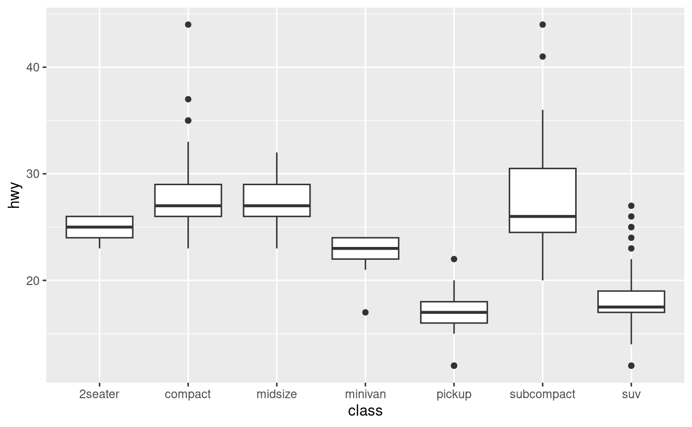

Per rendere la tendenza più facile da vedere, possiamo riordinare la `classe` in base al valore mediano di `hwy`:


```r
ggplot(data = mpg) +
  geom_boxplot(mapping = aes(x = reorder(class, hwy, FUN = median), y = hwy))
```

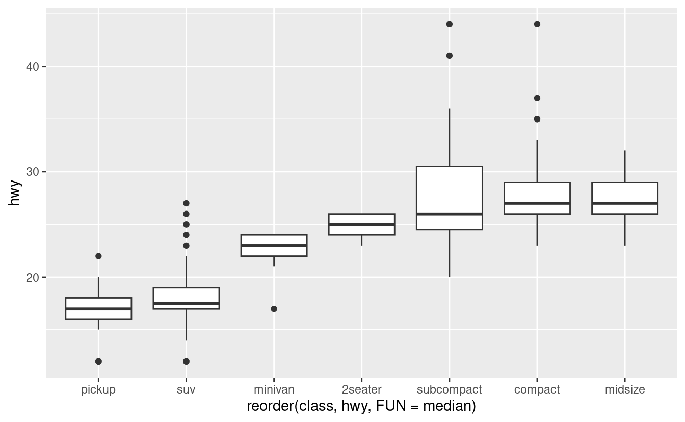

Se avete nomi di variabili lunghi, `geom_boxplot()` funzionerà meglio se lo capovolgete di 90°. Potete farlo con `coord_flip()`.


```r
ggplot(data = mpg) +
  geom_boxplot(mapping = aes(x = reorder(class, hwy, FUN = median), y = hwy)) +
  coord_flip()
```


#### Esercizi

1.  Usa ciò che hai imparato per migliorare la visualizzazione degli orari di partenza
    dei voli cancellati rispetto a quelli non cancellati.

1.  Quale variabile nel dataset dei diamanti è più importante per prevedere
    il prezzo di un diamante? Come è correlata questa variabile con il taglio?
    Perché la combinazione di queste due relazioni fa sì che i diamanti di qualità inferiore
    più costosi i diamanti di qualità inferiore?

1.  Installate il pacchetto ggstance e create un boxplot orizzontale.
    Come si confronta questo con l'uso di `coord_flip()`?

1.  Un problema con i boxplot è che sono stati sviluppati in un'era di 
    di insiemi di dati molto più piccoli e tendono a visualizzare un proibitivo
    un numero proibitivo di "valori anomali". Un approccio per rimediare a questo problema è
    il plot del valore delle lettere. Installate il pacchetto lvplot e provate ad usare
    `geom_lv()` per visualizzare la distribuzione del prezzo rispetto al taglio. Cosa
    imparate? Come interpretate i grafici?

1.  Confrontate e contrastate `geom_violin()` con un `geom_histogram()` sfaccettato,
    o un `geom_freqpoly()` colorato. Quali sono i pro e i contro di ciascun 
    metodo?

1.  Se avete un piccolo set di dati, a volte è utile usare `geom_jitter()`
    per vedere la relazione tra una variabile continua e una categorica.
    Il pacchetto ggbeeswarm fornisce una serie di metodi simili a 
    `geom_jitter()`. Elencateli e descrivete brevemente cosa fa ciascuno di essi.

### Due variabili categoriche

Per visualizzare la covariazione tra variabili categoriche, avrete bisogno di contare il numero di osservazioni per ogni combinazione. Un modo per farlo è affidarsi al built-in `geom_count()`:


```r
ggplot(data = diamonds) +
  geom_count(mapping = aes(x = cut, y = color))
```


La dimensione di ogni cerchio nel grafico mostra quante osservazioni si sono verificate per ogni combinazione di valori. La covariazione apparirà come una forte correlazione tra specifici valori x e specifici valori y.

Un altro approccio è quello di calcolare il conteggio con dplyr:


```r
diamonds %>% 
  count(color, cut)
#> # A tibble: 35 × 3
#>   color cut           n
#>   <ord> <ord>     <int>
#> 1 D     Fair        163
#> 2 D     Good        662
#> 3 D     Very Good  1513
#> 4 D     Premium    1603
#> 5 D     Ideal      2834
#> 6 E     Fair        224
#> # … with 29 more rows
```

Poi visualizzate con `geom_tile()` e il riempimento estetico:


```r
diamonds %>% 
  count(color, cut) %>%  
  ggplot(mapping = aes(x = color, y = cut)) +
    geom_tile(mapping = aes(fill = n))
```

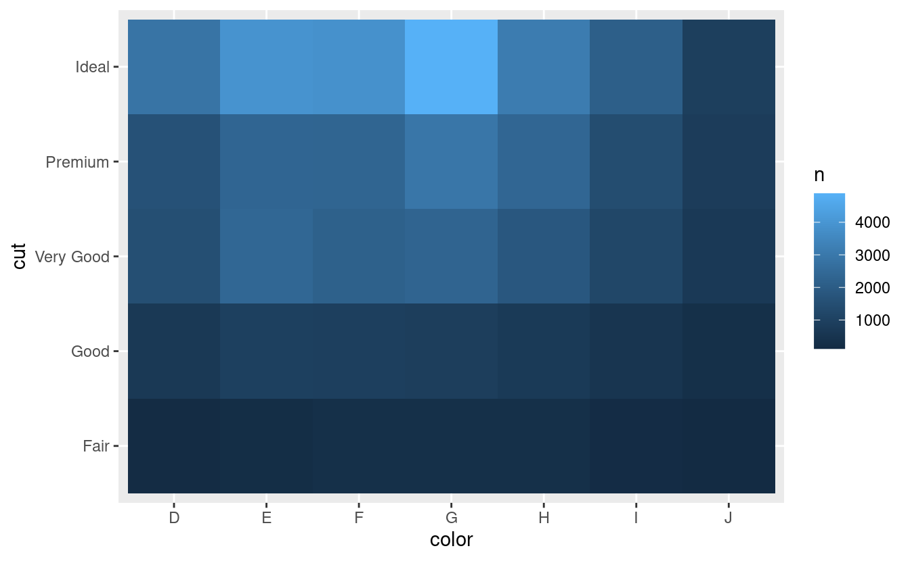

Se le variabili categoriche non sono ordinate, potreste voler usare il pacchetto seriation per riordinare simultaneamente le righe e le colonne in modo da rivelare più chiaramente i modelli interessanti. Per grafici più grandi, potreste provare i pacchetti d3heatmap o heatmaply, che creano grafici interattivi.

#### Esercizi

1.  Come potreste ridimensionare il dataset di conteggio di cui sopra per mostrare più chiaramente
    la distribuzione del taglio nel colore o del colore nel taglio?

1.  Usate `geom_tile()` insieme a dplyr per esplorare come i ritardi medi dei voli
    per la destinazione e il mese dell'anno.  Cosa rende il 
    difficile da leggere? Come potreste migliorarlo?

1.  Perché è leggermente meglio usare `aes(x = color, y = cut)` piuttosto che `aes(x = cut, y = color)` nell'esempio sopra?
    piuttosto che `aes(x = cut, y = color)` nell'esempio sopra?

### Due variabili continue

Avete già visto un ottimo modo per visualizzare la covariazione tra due variabili continue: disegnare uno scatterplot con `geom_point()`. Potete vedere la covariazione come un modello nei punti. Per esempio, potete vedere una relazione esponenziale tra la dimensione del carato e il prezzo di un diamante.


```r
ggplot(data = diamonds) +
  geom_point(mapping = aes(x = carat, y = price))
```


Gli scatterplot diventano meno utili man mano che la dimensione del tuo set di dati cresce, perché i punti cominciano a sovrapporsi e si accumulano in aree di nero uniforme (come sopra). Hai già visto un modo per risolvere il problema: usare l'estetica `alpha` per aggiungere trasparenza.


```r
ggplot(data = diamonds) + 
  geom_point(mapping = aes(x = carat, y = price), alpha = 1 / 100)
```


Ma usare la trasparenza può essere impegnativo per insiemi di dati molto grandi. Un'altra soluzione è usare bin. In precedenza avete usato `geom_histogram()` e `geom_freqpoly()` per 'binare' in una dimensione. Ora imparerete come usare `geom_bin2d()` e `geom_hex()` per 'binare' in due dimensioni.

`geom_bin2d()` e `geom_hex()` dividono il piano delle coordinate in bin 2d e poi usano un colore di riempimento per mostrare quanti punti rientrano in ogni bin. La funzione `geom_bin2d()` crea dei contenitori rettangolari. `geom_hex()` crea bin esagonali. Avrai bisogno di installare il pacchetto hexbin per usare `geom_hex()`.


```r
ggplot(data = smaller) +
  geom_bin2d(mapping = aes(x = carat, y = price))

# install.packages("hexbin")
ggplot(data = smaller) +
  geom_hex(mapping = aes(x = carat, y = price))
```

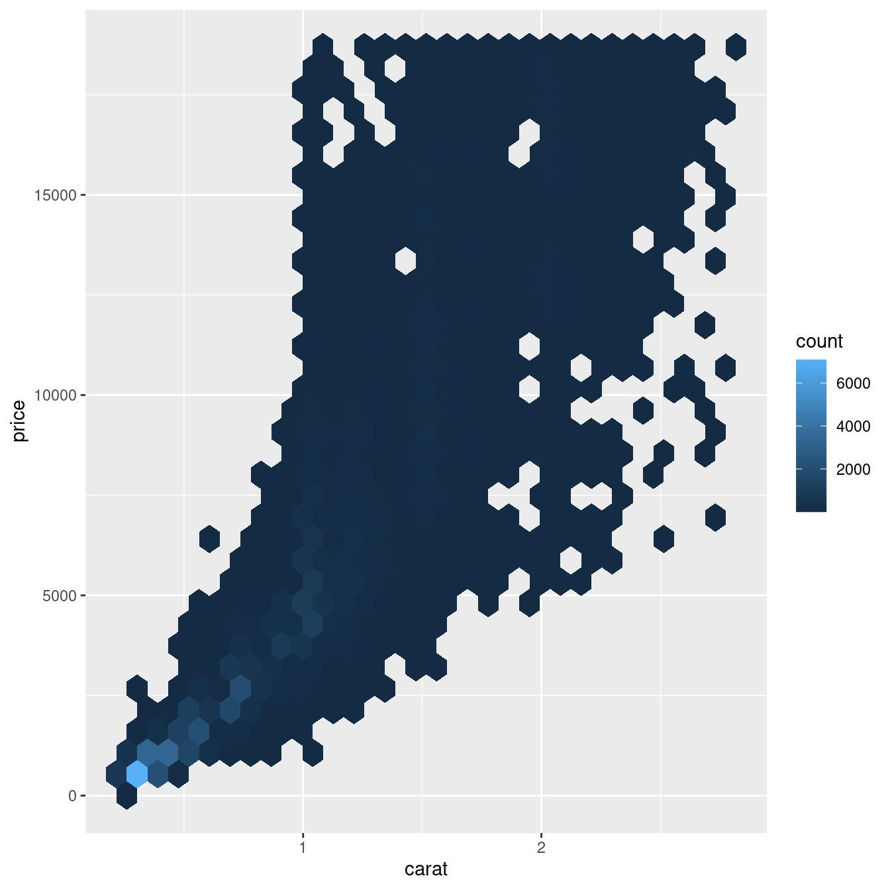

Un'altra opzione è quella di binare una variabile continua in modo che si comporti come una variabile categorica. Poi puoi usare una delle tecniche per visualizzare la combinazione di una variabile categorica e una continua che hai imparato. Per esempio, potreste classificare `carat` e poi, per ogni gruppo, visualizzare un boxplot:


```r
ggplot(data = smaller, mapping = aes(x = carat, y = price)) + 
  geom_boxplot(mapping = aes(group = cut_width(carat, 0.1)))
```


`cut_width(x, width)`, come usato sopra, divide `x` in bins di larghezza `width`. Per default, i boxplot hanno all'incirca lo stesso aspetto (a parte il numero di outlier) indipendentemente dal numero di osservazioni, quindi è difficile dire che ogni boxplot riassume un numero diverso di punti. Un modo per mostrarlo è rendere la larghezza del boxplot proporzionale al numero di punti con `varwidth = TRUE`.

Un altro approccio è quello di visualizzare approssimativamente lo stesso numero di punti in ogni bin. Questo è il compito di `cut_number()`:


```r
ggplot(data = smaller, mapping = aes(x = carat, y = price)) + 
  geom_boxplot(mapping = aes(group = cut_number(carat, 20)))
```

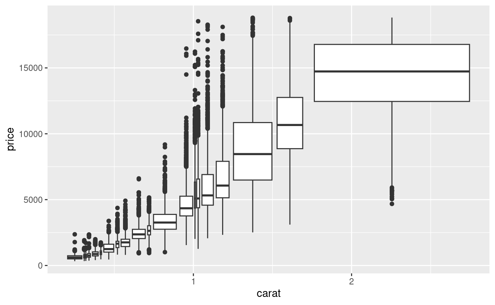

#### Esercizi

1.  Invece di riassumere la distribuzione condizionale con un boxplot, si
    potrebbe usare un poligono di frequenza. Cosa dovete considerare quando usate
    `cut_width()` vs `cut_number()`? Che impatto ha su una visualizzazione di
    la distribuzione 2d di `carat` e `price`?

1.  Visualizzate la distribuzione dei carati, suddivisa per prezzo.

1.  Come fa la distribuzione del prezzo dei diamanti molto grandi a paragonarsi ai piccoli diamanti? 
    diamanti piccoli? È come ti aspetti o ti sorprende?
    
1.  Combinate due delle tecniche che avete imparato per visualizzare la 
    distribuzione combinata di taglio, caratura e prezzo.

1. I grafici bidimensionali rivelano valori anomali che non sono visibili in quelli monodimensionali. 
   dimensionale. Per esempio, alcuni punti nel grafico sottostante hanno una 
   combinazione insolita di valori `x` e `y`, che rende i punti anomali 
   anche se i loro valori `x` e `y` sembrano normali se esaminati separatamente.
  
    
    ```r
    ggplot(data = diamonds) +
      geom_point(mapping = aes(x = x, y = y)) +
      coord_cartesian(xlim = c(4, 11), ylim = c(4, 11))
    ```
    
    
    
    Perché un grafico a dispersione è una visualizzazione migliore di un grafico a celle per questo caso?

## Schemi e modelli

Gli schemi nei tuoi dati forniscono indizi sulle relazioni. Se esiste una relazione sistematica tra due variabili, essa apparirà come un modello nei dati. Se individuate un modello, chiedetevi:

+ Questo modello potrebbe essere dovuto alla coincidenza (cioè al caso)?

+ Come puoi descrivere la relazione implicita nel modello?

+ Quanto è forte la relazione implicita nello schema?

+ Quali altre variabili potrebbero influenzare la relazione?

+ La relazione cambia se si guardano i singoli sottogruppi dei dati?

Un grafico a dispersione della lunghezza delle eruzioni dell'Old Faithful rispetto al tempo di attesa tra le eruzioni mostra un modello: tempi di attesa più lunghi sono associati a eruzioni più lunghe. Lo scatterplot mostra anche i due cluster che abbiamo notato sopra.


```r
ggplot(data = faithful) + 
  geom_point(mapping = aes(x = eruptions, y = waiting))
```


Gli schemi forniscono uno degli strumenti più utili per gli scienziati dei dati perché rivelano la covariazione. Se si pensa alla variazione come a un fenomeno che crea incertezza, la covariazione è un fenomeno che la riduce. Se due variabili covariano, puoi usare i valori di una variabile per fare previsioni migliori sui valori della seconda. Se la covariazione è dovuta a una relazione causale (un caso speciale), allora si può usare il valore di una variabile per controllare il valore della seconda.

I modelli sono uno strumento per estrarre modelli dai dati. Per esempio, considerate i dati sui diamanti. È difficile capire la relazione tra taglio e prezzo, perché taglio e carato, e carato e prezzo sono strettamente correlati. È possibile utilizzare un modello per rimuovere la relazione molto forte tra prezzo e carato in modo da poter esplorare le sottigliezze che rimangono. Il codice seguente adatta un modello che predice il `price` dal `carat` e poi calcola i residui (la differenza tra il valore predetto e il valore reale). I residui ci danno una visione del prezzo del diamante, una volta rimosso l'effetto della caratura. 


```r
library(modelr)

mod <- lm(log(price) ~ log(carat), data = diamonds)

diamonds2 <- diamonds %>% 
  add_residuals(mod) %>% 
  mutate(resid = exp(resid))

ggplot(data = diamonds2) + 
  geom_point(mapping = aes(x = carat, y = resid))
```

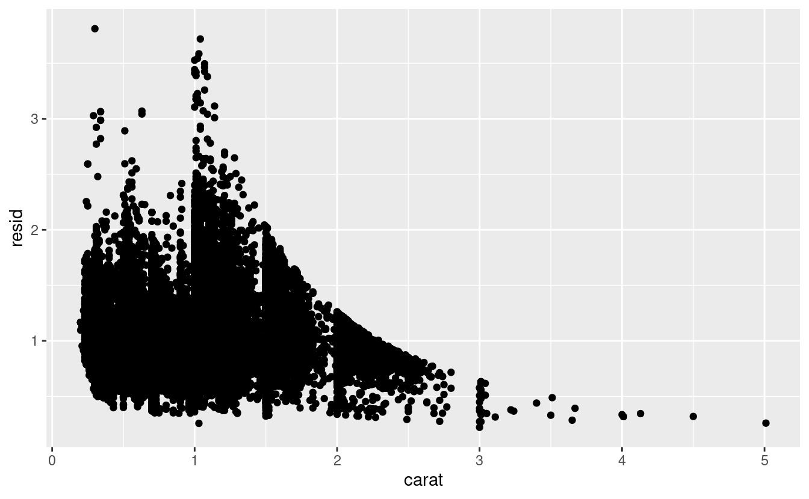

Una volta eliminata la forte relazione tra carati e prezzo, si può vedere ciò che ci si aspetta nella relazione tra taglio e prezzo: in relazione alle loro dimensioni, i diamanti di migliore qualità sono più costosi. 


```r
ggplot(data = diamonds2) + 
  geom_boxplot(mapping = aes(x = cut, y = resid))
```

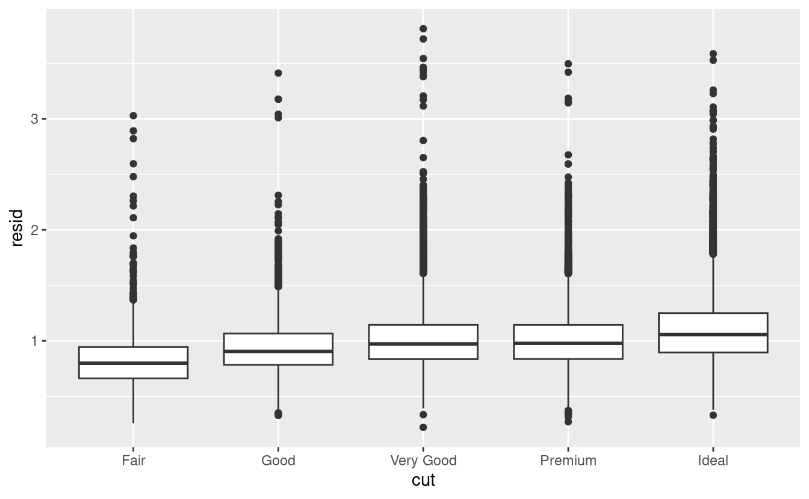

Imparerai come funzionano i modelli e il pacchetto modelr nella parte finale del libro, [modellare](#model-intro). Teniamo la modellazione per dopo perché capire cosa sono i modelli e come funzionano è più facile una volta che si hanno in mano gli strumenti di gestione dei dati e di programmazione.

## Chiamate ggplot2

Man mano che passeremo da questi capitoli introduttivi, passeremo ad un'espressione più concisa del codice ggplot2. Finora siamo stati molto espliciti, il che è utile quando si sta imparando:


```r
ggplot(data = faithful, mapping = aes(x = eruptions)) + 
  geom_freqpoly(binwidth = 0.25)
```

Tipicamente, i primi uno o due argomenti di una funzione sono così importanti che dovreste conoscerli a memoria. I primi due argomenti di `ggplot()` sono `data` e `mapping`, e i primi due argomenti di `aes()` sono `x` e `y`. Nel resto del libro, non forniremo questi nomi. Questo risparmia la digitazione e, riducendo la quantità di boilerplate, rende più facile vedere cosa c'è di diverso tra le trame. Questa è una preoccupazione di programmazione molto importante che torneremo in [funzioni].

Riscrivendo la trama precedente in modo più conciso si ottiene:


```r
ggplot(faithful, aes(eruptions)) + 
  geom_freqpoly(binwidth = 0.25)
```

A volte trasformeremo la fine di una pipeline di trasformazione dei dati in una trama. Fate attenzione alla transizione da `%>%` a `+`. Vorrei che questa transizione non fosse necessaria, ma sfortunatamente ggplot2 è stato creato prima che il tubo fosse scoperto.


```r
diamonds %>% 
  count(cut, clarity) %>% 
  ggplot(aes(clarity, cut, fill = n)) + 
    geom_tile()
```

## Per saperne di più

Se vuoi imparare di più sui meccanismi di ggplot2, ti consiglio vivamente di prendere una copia del libro ggplot2: <https://amzn.com/331924275X>. È stato recentemente aggiornato, quindi include il codice di dplyr e tidyr, e ha molto più spazio per esplorare tutte le sfaccettature della visualizzazione. Sfortunatamente il libro non è generalmente disponibile gratuitamente, ma se avete una connessione con un'università potete probabilmente ottenere una versione elettronica gratuita attraverso SpringerLink.

Un'altra risorsa utile è il [_R Graphics Cookbook_](https://amzn.com/1449316956) di Winston Chang. Gran parte dei contenuti sono disponibili online su <http://www.cookbook-r.com/Graphs/>.

Raccomando anche [_Graphical Data Analysis with R_](https://amzn.com/1498715230), di Antony Unwin. Questo è un libro di lunghezza simile al materiale trattato in questo capitolo, ma ha lo spazio per andare molto più in profondità.
