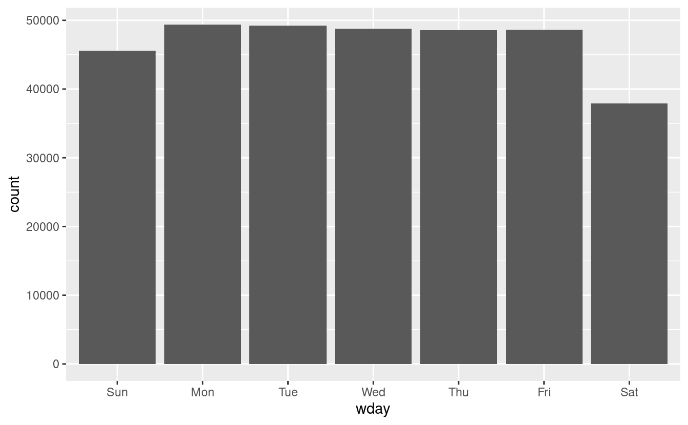
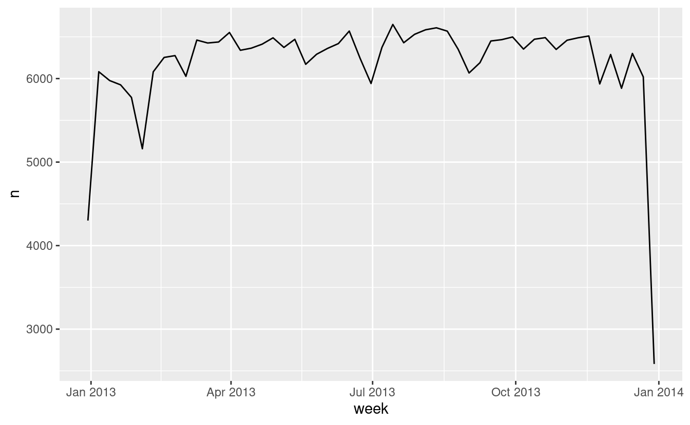
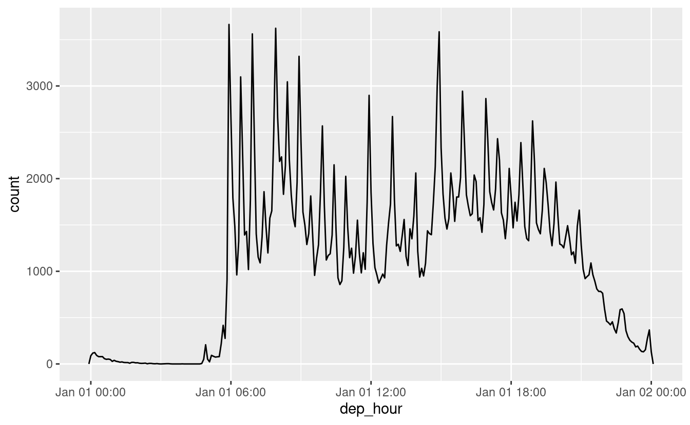

# Date e tempi

## Introduzione

Questo capitolo vi mostrerà come lavorare con date e orari in R. A prima vista, date e orari sembrano semplici. Li usate tutto il tempo nella vostra vita normale e non sembrano causare molta confusione. Tuttavia, più si impara su date e orari, più sembra che diventino complicati. Per scaldarti, prova queste tre domande apparentemente semplici:

* Ogni anno ha 365 giorni?
* Ogni giorno ha 24 ore?
* Ogni minuto ha 60 secondi?

Sono sicuro che sai che non tutti gli anni hanno 365 giorni, ma conosci la regola completa per determinare se un anno è bisestile? (Potresti aver ricordato che molte parti del mondo usano l'ora legale, per cui alcuni giorni hanno 23 ore e altri 25. Potresti non aver saputo che alcuni minuti hanno 61 secondi perché ogni tanto vengono aggiunti secondi bisestili perché la rotazione terrestre sta gradualmente rallentando.

Le date e gli orari sono difficili perché devono conciliare due fenomeni fisici (la rotazione della Terra e la sua orbita intorno al sole) con tutta una serie di fenomeni geopolitici tra cui i mesi, i fusi orari e l'ora legale. Questo capitolo non vi insegnerà ogni minimo dettaglio su date e orari, ma vi darà una solida base di abilità pratiche che vi aiuteranno nelle comuni sfide dell'analisi dei dati.

### Prerequisiti

Questo capitolo si concentrerà sul pacchetto __lubridate__, che rende più facile lavorare con le date e gli orari in R. lubridate non fa parte del core tidyverse perché ne avete bisogno solo quando lavorate con le date/gli orari. Avremo anche bisogno di nycflights13 per i dati di pratica.


```r
library(tidyverse)

library(lubridate)
library(nycflights13)
```

## Creare date/ore

Ci sono tre tipi di dati data/ora che si riferiscono ad un istante nel tempo:

* Un __date__. Tibbles lo stampa come `<date>`.

* Un __time__ all'interno di un giorno. Tibbles lo stampa come `<time>`.

* Un __date-time__ è una data più un'ora: identifica univocamente un
  istante nel tempo (tipicamente al secondo più vicino). Tibbles lo stampa
  come `<dttm>`. Altrove in R questi sono chiamati POSIXct, ma non credo
  che sia un nome molto utile.
  
In questo capitolo ci concentreremo solo su date e date-ora, poiché R non ha una classe nativa per la memorizzazione dei tempi. Se ne avete bisogno, potete usare il pacchetto __hms__.

Dovreste sempre usare il tipo di dati più semplice possibile che funzioni per le vostre esigenze. Questo significa che se potete usare una data invece di una data-ora, dovreste farlo. Le date-ora sono sostanzialmente più complicate a causa della necessità di gestire i fusi orari, su cui torneremo alla fine del capitolo.

Per ottenere la data o la data-ora corrente potete usare `today()` o `now()`:


```r
today()
#> [1] "2022-06-21"
now()
#> [1] "2022-06-21 21:32:37 UTC"
```

Altrimenti, ci sono tre modi per creare una data/ora:

* Da una stringa.
* Da componenti individuali di data/ora.
* Da un oggetto data/ora esistente.

Funzionano come segue.

### Da stringhe

I dati di data/ora spesso si presentano come stringhe. Hai visto un approccio per analizzare le stringhe in date-ora in [date-ore](#readr-datetimes). Un altro approccio è quello di usare gli helper forniti da lubridate. Essi elaborano automaticamente il formato una volta che si specifica l'ordine del componente. Per usarli, identificate l'ordine in cui anno, mese e giorno appaiono nelle vostre date, poi disponete "y", "m" e "d" nello stesso ordine. Questo vi dà il nome della funzione lubridate che analizzerà la vostra data. Per esempio:


```r
ymd("2017-01-31")
#> [1] "2017-01-31"
mdy("January 31st, 2017")
#> [1] "2017-01-31"
dmy("31-Jan-2017")
#> [1] "2017-01-31"
```

Queste funzioni accettano anche numeri non quotati. Questo è il modo più conciso per creare un singolo oggetto data/ora, come potrebbe essere necessario quando si filtrano dati data/ora. La funzione `ymd()` è breve e non ambigua:


```r
ymd(20170131)
#> [1] "2017-01-31"
```

`ymd()` e amici creano date. Per creare una data-ora, aggiungete un trattino basso e uno o più di "h", "m" e "s" al nome della funzione di analisi:


```r
ymd_hms("2017-01-31 20:11:59")
#> [1] "2017-01-31 20:11:59 UTC"
mdy_hm("01/31/2017 08:01")
#> [1] "2017-01-31 08:01:00 UTC"
```

Potete anche forzare la creazione di una data-ora da una data fornendo un fuso orario:


```r
ymd(20170131, tz = "UTC")
#> [1] "2017-01-31 UTC"
```

### Da componenti individuali

Invece di una singola stringa, a volte avrete i singoli componenti della data-ora sparsi su più colonne. Questo è quello che abbiamo nei dati dei voli:


```r
flights %>% 
  select(year, month, day, hour, minute)
#> # A tibble: 336,776 × 5
#>    year month   day  hour minute
#>   <int> <int> <int> <dbl>  <dbl>
#> 1  2013     1     1     5     15
#> 2  2013     1     1     5     29
#> 3  2013     1     1     5     40
#> 4  2013     1     1     5     45
#> 5  2013     1     1     6      0
#> 6  2013     1     1     5     58
#> # … with 336,770 more rows
```

Per creare una data/ora da questo tipo di input, usate `make_date()` per le date, o `make_datetime()` per le date-ora:


```r
flights %>% 
  select(year, month, day, hour, minute) %>% 
  mutate(departure = make_datetime(year, month, day, hour, minute))
#> # A tibble: 336,776 × 6
#>    year month   day  hour minute departure          
#>   <int> <int> <int> <dbl>  <dbl> <dttm>             
#> 1  2013     1     1     5     15 2013-01-01 05:15:00
#> 2  2013     1     1     5     29 2013-01-01 05:29:00
#> 3  2013     1     1     5     40 2013-01-01 05:40:00
#> 4  2013     1     1     5     45 2013-01-01 05:45:00
#> 5  2013     1     1     6      0 2013-01-01 06:00:00
#> 6  2013     1     1     5     58 2013-01-01 05:58:00
#> # … with 336,770 more rows
```

Facciamo la stessa cosa per ciascuna delle quattro colonne del tempo in `flights`. I tempi sono rappresentati in un formato un po' strano, quindi usiamo l'aritmetica dei moduli per estrarre le componenti di ore e minuti. Una volta create le variabili data-ora, mi concentro sulle variabili che esploreremo nel resto del capitolo.

```r
make_datetime_100 <- function(year, month, day, time) {
  make_datetime(year, month, day, time %/% 100, time %% 100)
}

flights_dt <- flights %>% 
  filter(!is.na(dep_time), !is.na(arr_time)) %>% 
  mutate(
    dep_time = make_datetime_100(year, month, day, dep_time),
    arr_time = make_datetime_100(year, month, day, arr_time),
    sched_dep_time = make_datetime_100(year, month, day, sched_dep_time),
    sched_arr_time = make_datetime_100(year, month, day, sched_arr_time)
  ) %>% 
  select(origin, dest, ends_with("delay"), ends_with("time"))

flights_dt
#> # A tibble: 328,063 × 9
#>   origin dest  dep_delay arr_delay dep_time            sched_dep_time     
#>   <chr>  <chr>     <dbl>     <dbl> <dttm>              <dttm>             
#> 1 EWR    IAH           2        11 2013-01-01 05:17:00 2013-01-01 05:15:00
#> 2 LGA    IAH           4        20 2013-01-01 05:33:00 2013-01-01 05:29:00
#> 3 JFK    MIA           2        33 2013-01-01 05:42:00 2013-01-01 05:40:00
#> 4 JFK    BQN          -1       -18 2013-01-01 05:44:00 2013-01-01 05:45:00
#> 5 LGA    ATL          -6       -25 2013-01-01 05:54:00 2013-01-01 06:00:00
#> 6 EWR    ORD          -4        12 2013-01-01 05:54:00 2013-01-01 05:58:00
#> # … with 328,057 more rows, and 3 more variables: arr_time <dttm>,
#> #   sched_arr_time <dttm>, air_time <dbl>
```

Con questi dati, posso visualizzare la distribuzione degli orari di partenza durante l'anno:


```r
flights_dt %>% 
  ggplot(aes(dep_time)) + 
  geom_freqpoly(binwidth = 86400) # 86400 secondi = 1 giorno
```


O in un solo giorno:


```r
flights_dt %>% 
  filter(dep_time < ymd(20130102)) %>% 
  ggplot(aes(dep_time)) + 
  geom_freqpoly(binwidth = 600) # 600 s = 10 minuti
```


Notate che quando usate date-ora in un contesto numerico (come in un istogramma), 1 significa 1 secondo, quindi una larghezza di banda di 86400 significa un giorno. Per le date, 1 significa 1 giorno.

### Da altri tipi

Potresti voler passare da una data-ora a una data. Questo è il lavoro di `as_datetime()` e `as_date()`:


```r
as_datetime(today())
#> [1] "2022-06-21 UTC"
as_date(now())
#> [1] "2022-06-21"
```

A volte otterrete data/ora come offset numerico dalla "Unix Epoch", 1970-01-01. Se l'offset è in secondi, usate `as_datetime()`; se è in giorni, usate `as_date()`.


```r
as_datetime(60 * 60 * 10)
#> [1] "1970-01-01 10:00:00 UTC"
as_date(365 * 10 + 2)
#> [1] "1980-01-01"
```

### Esercizi

1.  Cosa succede se analizzi una stringa che contiene date non valide?

    
    ```r
    ymd(c("2010-10-10", "bananas"))
    ```

1.  Cosa fa l'argomento `tzone` di `today()`? Perché è importante?

1.  Usa la funzione lubridate appropriata per analizzare ciascuna delle seguenti date:

    
    ```r
    d1 <- "January 1, 2010"
    d2 <- "2015-Mar-07"
    d3 <- "06-Jun-2017"
    d4 <- c("August 19 (2015)", "July 1 (2015)")
    d5 <- "12/30/14" # Dec 30, 2014
    ```

## Componenti data-ora

Ora che sapete come ottenere dati data-ora nelle strutture dati data-ora di R, esploriamo cosa potete fare con esse. Questa sezione si concentrerà sulle funzioni di accesso che vi permettono di ottenere e impostare componenti individuali. La prossima sezione esaminerà come funziona l'aritmetica con le date-ora.

### Ottenere componenti

Potete estrarre singole parti della data con le funzioni di accesso `year()`, `month()`, `mday()` (giorno del mese), `yday()` (giorno dell'anno), `wday()` (giorno della settimana), `hour()`, `minute()`, e `second()`.


```r
datetime <- ymd_hms("2016-07-08 12:34:56")

year(datetime)
#> [1] 2016
month(datetime)
#> [1] 7
mday(datetime)
#> [1] 8

yday(datetime)
#> [1] 190
wday(datetime)
#> [1] 6
```

Per `month()` e `day()` potete impostare `label = TRUE` per restituire il nome abbreviato del mese o del giorno della settimana. Impostate `abbr = FALSE` per restituire il nome completo.


```r
month(datetime, label = TRUE)
#> [1] Jul
#> 12 Levels: Jan < Feb < Mar < Apr < May < Jun < Jul < Aug < Sep < ... < Dec
wday(datetime, label = TRUE, abbr = FALSE)
#> [1] Friday
#> 7 Levels: Sunday < Monday < Tuesday < Wednesday < Thursday < ... < Saturday
```

Possiamo usare `wday()` per vedere che più voli partono durante la settimana che nel fine settimana:


```r
flights_dt %>% 
  mutate(wday = wday(dep_time, label = TRUE)) %>% 
  ggplot(aes(x = wday)) +
    geom_bar()
```



C'è un modello interessante se guardiamo il ritardo medio di partenza per minuto all'interno dell'ora. Sembra che i voli che partono nei minuti 20-30 e 50-60 abbiano ritardi molto più bassi rispetto al resto dell'ora!


```r
flights_dt %>% 
  mutate(minute = minute(dep_time)) %>% 
  group_by(minute) %>% 
  summarise(
    avg_delay = mean(arr_delay, na.rm = TRUE),
    n = n()) %>% 
  ggplot(aes(minute, avg_delay)) +
    geom_line()
```


È interessante notare che se guardiamo l'orario di partenza _programmato_ non vediamo un modello così forte:


```r
sched_dep <- flights_dt %>% 
  mutate(minute = minute(sched_dep_time)) %>% 
  group_by(minute) %>% 
  summarise(
    avg_delay = mean(arr_delay, na.rm = TRUE),
    n = n())

ggplot(sched_dep, aes(minute, avg_delay)) +
  geom_line()
```


Allora perché vediamo questo schema con gli orari di partenza effettivi? Beh, come molti dati raccolti da esseri umani, c'è un forte pregiudizio verso i voli che partono a orari di partenza "piacevoli". Fai sempre attenzione a questo tipo di schema ogni volta che lavori con dati che coinvolgono il giudizio umano!


```r
ggplot(sched_dep, aes(minute, n)) +
  geom_line()
```


### Arrotondamento

Un approccio alternativo al tracciamento di componenti individuali è quello di arrotondare la data ad un'unità di tempo vicina, con `floor_date()`, `round_date()`, e `ceiling_date()`. Ogni funzione prende un vettore di date da aggiustare e poi il nome dell'unità di arrotondamento per difetto (floor), per eccesso (ceiling), o per eccesso. Questo, per esempio, ci permette di tracciare il numero di voli per settimana:


```r
flights_dt %>% 
  count(week = floor_date(dep_time, "week")) %>% 
  ggplot(aes(week, n)) +
    geom_line()
```



Calcolare la differenza tra una data arrotondata e una non arrotondata può essere particolarmente utile.

### Impostazione dei componenti

Potete anche usare ogni funzione di accesso per impostare i componenti di una data/ora: 


```r
(datetime <- ymd_hms("2016-07-08 12:34:56"))
#> [1] "2016-07-08 12:34:56 UTC"

year(datetime) <- 2020
datetime
#> [1] "2020-07-08 12:34:56 UTC"
month(datetime) <- 01
datetime
#> [1] "2020-01-08 12:34:56 UTC"
hour(datetime) <- hour(datetime) + 1
datetime
#> [1] "2020-01-08 13:34:56 UTC"
```

In alternativa, piuttosto che modificare sul posto, potete creare una nuova data-ora con `update()`. Questo permette anche di impostare più valori in una volta.


```r
update(datetime, year = 2020, month = 2, mday = 2, hour = 2)
#> [1] "2020-02-02 02:34:56 UTC"
```

Se i valori sono troppo grandi, si ribaltano:


```r
ymd("2015-02-01") %>% 
  update(mday = 30)
#> [1] "2015-03-02"
ymd("2015-02-01") %>% 
  update(hour = 400)
#> [1] "2015-02-17 16:00:00 UTC"
```

Potete usare `update()` per mostrare la distribuzione dei voli nel corso della giornata per ogni giorno dell'anno:


```r
flights_dt %>% 
  mutate(dep_hour = update(dep_time, yday = 1)) %>% 
  ggplot(aes(dep_hour)) +
    geom_freqpoly(binwidth = 300)
```



Impostare le componenti più grandi di una data su una costante è una tecnica potente che permette di esplorare i modelli nelle componenti più piccole.

### Esercizi

1.  Come cambia la distribuzione dei tempi di volo in un giorno nel 
    corso dell'anno?
    
1.  Confronta `dep_time`, `sched_dep_time` e `dep_delay`. Sono coerenti?
    Spiega i tuoi risultati.

1.  Confronta `air_time` con la durata tra la partenza e l'arrivo.
    Spiega i tuoi risultati. (Suggerimento: considera la posizione dell'aeroporto).
    
1.  Come cambia il tempo medio di ritardo nel corso di una giornata?
    Dovresti usare `dep_time` o `sched_dep_time`? Perché?

1.  In quale giorno della settimana dovresti partire se vuoi minimizzare la
    la possibilità di un ritardo?

1.  Cosa rende la distribuzione di `diamonds$carat` e 
    `flights$sched_dep_time`?

1.  Confermate la mia ipotesi che le partenze anticipate dei voli nei minuti
    20-30 e 50-60 sono causate da voli di linea che partono in anticipo. 
    Suggerimento: create una variabile binaria che vi dica se un volo 
    è stato ritardato.

## Intervalli di tempo

Ora imparerete come funziona l'aritmetica con le date, incluse la sottrazione, l'addizione e la divisione. Lungo la strada, imparerete a conoscere tre importanti classi che rappresentano intervalli di tempo:

* __durations__, che rappresentano un numero esatto di secondi.
* __periodi__, che rappresentano unità umane come settimane e mesi.
* __intervalli__, che rappresentano un punto iniziale e uno finale.

### Durate

In R, quando si sottraggono due date, si ottiene un oggetto difftime:


```r
# How old is Hadley?
h_age <- today() - ymd(19791014)
h_age
#> Time difference of 15591 days
```

Un oggetto di classe difftime registra un intervallo di tempo di secondi, minuti, ore, giorni o settimane. Questa ambiguità può rendere difftime un po' doloroso lavorarci, così lubridate fornisce un'alternativa che usa sempre i secondi: la __durata__.


```r
as.duration(h_age)
#> [1] "1347062400s (~42.69 years)"
```

Le durate hanno un mucchio di costruttori convenienti:


```r
dseconds(15)
#> [1] "15s"
dminutes(10)
#> [1] "600s (~10 minutes)"
dhours(c(12, 24))
#> [1] "43200s (~12 hours)" "86400s (~1 days)"
ddays(0:5)
#> [1] "0s"                "86400s (~1 days)"  "172800s (~2 days)"
#> [4] "259200s (~3 days)" "345600s (~4 days)" "432000s (~5 days)"
dweeks(3)
#> [1] "1814400s (~3 weeks)"
dyears(1)
#> [1] "31557600s (~1 years)"
```

Le durate registrano sempre l'intervallo di tempo in secondi. Unità più grandi sono create convertendo minuti, ore, giorni, settimane e anni in secondi al tasso standard (60 secondi in un minuto, 60 minuti in un'ora, 24 ore in un giorno, 7 giorni in una settimana, 365 giorni in un anno).

È possibile aggiungere e moltiplicare le durate:


```r
2 * dyears(1)
#> [1] "63115200s (~2 years)"
dyears(1) + dweeks(12) + dhours(15)
#> [1] "38869200s (~1.23 years)"
```

È possibile aggiungere e sottrarre durate a e da giorni:


```r
tomorrow <- today() + ddays(1)
last_year <- today() - dyears(1)
```

Tuttavia, poiché le durate rappresentano un numero esatto di secondi, a volte si potrebbe ottenere un risultato inaspettato:


```r
one_pm <- ymd_hms("2016-03-12 13:00:00", tz = "America/New_York")

one_pm
#> [1] "2016-03-12 13:00:00 EST"
one_pm + ddays(1)
#> [1] "2016-03-13 14:00:00 EDT"
```

Perché un giorno dopo le 13 del 12 marzo ci sono le 14 del 13 marzo?! Se guardi attentamente la data potresti anche notare che i fusi orari sono cambiati. A causa del DST, il 12 marzo ha solo 23 ore, quindi se aggiungiamo un giorno intero di secondi ci ritroviamo con un orario diverso.

### Periodi

Per risolvere questo problema, lubridate fornisce __periodi__. I periodi sono intervalli di tempo ma non hanno una lunghezza fissa in secondi, invece lavorano con tempi "umani", come giorni e mesi. Questo permette loro di lavorare in modo più intuitivo:

```r
one_pm
#> [1] "2016-03-12 13:00:00 EST"
one_pm + days(1)
#> [1] "2016-03-13 13:00:00 EDT"
```

Come le durate, i periodi possono essere creati con un certo numero di funzioni costruttrici carine.


```r
seconds(15)
#> [1] "15S"
minutes(10)
#> [1] "10M 0S"
hours(c(12, 24))
#> [1] "12H 0M 0S" "24H 0M 0S"
days(7)
#> [1] "7d 0H 0M 0S"
months(1:6)
#> [1] "1m 0d 0H 0M 0S" "2m 0d 0H 0M 0S" "3m 0d 0H 0M 0S" "4m 0d 0H 0M 0S"
#> [5] "5m 0d 0H 0M 0S" "6m 0d 0H 0M 0S"
weeks(3)
#> [1] "21d 0H 0M 0S"
years(1)
#> [1] "1y 0m 0d 0H 0M 0S"
```

Puoi aggiungere e moltiplicare i periodi:


```r
10 * (months(6) + days(1))
#> [1] "60m 10d 0H 0M 0S"
days(50) + hours(25) + minutes(2)
#> [1] "50d 25H 2M 0S"
```

E, naturalmente, aggiungeteli alle date. Rispetto alle durate, i periodi hanno più probabilità di fare ciò che vi aspettate:


```r
# Un anno bisestile
ymd("2016-01-01") + dyears(1)
#> [1] "2016-12-31 06:00:00 UTC"
ymd("2016-01-01") + years(1)
#> [1] "2017-01-01"

# Ora legale
one_pm + ddays(1)
#> [1] "2016-03-13 14:00:00 EDT"
one_pm + days(1)
#> [1] "2016-03-13 13:00:00 EDT"
```

Usiamo i periodi per risolvere una stranezza legata alle date dei nostri voli. Alcuni aerei sembrano essere arrivati a destinazione _prima_ della loro partenza da New York City.


```r
flights_dt %>% 
  filter(arr_time < dep_time) 
#> # A tibble: 10,633 × 9
#>   origin dest  dep_delay arr_delay dep_time            sched_dep_time     
#>   <chr>  <chr>     <dbl>     <dbl> <dttm>              <dttm>             
#> 1 EWR    BQN           9        -4 2013-01-01 19:29:00 2013-01-01 19:20:00
#> 2 JFK    DFW          59        NA 2013-01-01 19:39:00 2013-01-01 18:40:00
#> 3 EWR    TPA          -2         9 2013-01-01 20:58:00 2013-01-01 21:00:00
#> 4 EWR    SJU          -6       -12 2013-01-01 21:02:00 2013-01-01 21:08:00
#> 5 EWR    SFO          11       -14 2013-01-01 21:08:00 2013-01-01 20:57:00
#> 6 LGA    FLL         -10        -2 2013-01-01 21:20:00 2013-01-01 21:30:00
#> # … with 10,627 more rows, and 3 more variables: arr_time <dttm>,
#> #   sched_arr_time <dttm>, air_time <dbl>
```
Questi sono voli notturni. Abbiamo usato le stesse informazioni sulla data sia per la partenza che per l'arrivo, ma questi voli sono arrivati il giorno successivo. Possiamo risolvere questo problema aggiungendo `days(1)` all'orario di arrivo di ogni volo notturno.


```r
flights_dt <- flights_dt %>% 
  mutate(
    overnight = arr_time < dep_time,
    arr_time = arr_time + days(overnight * 1),
    sched_arr_time = sched_arr_time + days(overnight * 1)
  )
```

Ora tutti i nostri voli obbediscono alle leggi della fisica.


```r
flights_dt %>% 
  filter(overnight, arr_time < dep_time) 
#> # A tibble: 0 × 10
#> # … with 10 variables: origin <chr>, dest <chr>, dep_delay <dbl>,
#> #   arr_delay <dbl>, dep_time <dttm>, sched_dep_time <dttm>, arr_time <dttm>,
#> #   sched_arr_time <dttm>, air_time <dbl>, overnight <lgl>
```

### Intervalli

È ovvio cosa dovrebbe restituire `dyears(1) / ddays(365)`: uno, perché le durate sono sempre rappresentate da un numero di secondi, e la durata di un anno è definita come 365 giorni di secondi.

Cosa dovrebbe restituire `years(1) / days(1)`? Beh, se l'anno fosse il 2015 dovrebbe restituire 365, ma se fosse il 2016, dovrebbe restituire 366! Non ci sono abbastanza informazioni per lubridate per dare una singola risposta chiara. Quello che fa invece è dare una stima, con un avvertimento:


```r
years(1) / days(1)
#> [1] 365.25
```

Se volete una misura più precisa, dovrete usare un __intervallo__. Un intervallo è una durata con un punto di partenza: questo lo rende preciso e ti permette di determinare esattamente la sua durata:


```r
next_year <- today() + years(1)
(today() %--% next_year) / ddays(1)
#> [1] 365
```

Per scoprire quanti periodi rientrano in un intervallo, è necessario utilizzare la divisione di interi:


```r
(today() %--% next_year) %/% days(1)
#> [1] 365
```

### Riassunto

Come scegliere tra durata, periodi e intervalli? Come sempre, scegliete la struttura dati più semplice che risolve il vostro problema. Se vi interessa solo il tempo fisico, usate una durata; se avete bisogno di aggiungere tempi umani, usate un periodo; se avete bisogno di capire quanto è lungo un intervallo in unità umane, usate un intervallo.

La figura \@ref(fig:dt-algebra) riassume le operazioni aritmetiche consentite tra i diversi tipi di dati.

<div class="figure" style="text-align: center">

<p class="caption">(\#fig:dt-algebra)The allowed arithmetic operations between pairs of date/time classes.</p>
</div>

### Esercizi

1.  Perché c'è `mesi()` ma non `mesi()`?

1.  Spiegate `days(overnight * 1)` a qualcuno che ha appena iniziato ad imparare R. Come funziona? 
    imparare R. Come funziona?

1.  Create un vettore di date che dia il primo giorno di ogni mese del 2015.
    2. Create un vettore di date che dia il primo giorno di ogni mese
    nell'anno _corrente_.

1.  Scrivi una funzione che, dato il tuo compleanno (come data), restituisca 
    quanti anni hai in anni.

1.  Perché non può `(oggi() %--% (oggi() + anni(1))) / mesi(1)` funziona?

## Fusi orari 

I fusi orari sono un argomento enormemente complicato a causa della loro interazione con entità geopolitiche. Fortunatamente non abbiamo bisogno di scavare in tutti i dettagli perché non sono tutti importanti per l'analisi dei dati, ma ci sono alcune sfide che dovremo affrontare di petto.

La prima sfida è che i nomi quotidiani dei fusi orari tendono ad essere ambigui. Per esempio, se sei americano probabilmente hai familiarità con EST, o Eastern Standard Time. Tuttavia, sia l'Australia che il Canada hanno anche EST! Per evitare confusione, R usa i fusi orari standard internazionali IANA. Questi usano uno schema di denominazione coerente "<area>/<località>", tipicamente nella forma "\<continente\>/<città\>" (ci sono alcune eccezioni perché non tutti i paesi si trovano su un continente). Gli esempi includono "America/New_York", "Europa/Parigi", e "Pacifico/Auckland".

Ci si potrebbe chiedere perché il fuso orario usa una città, quando tipicamente si pensa ai fusi orari come associati a un paese o a una regione all'interno di un paese. Questo perché il database IANA deve registrare decenni di regole sui fusi orari. Nel corso dei decenni, i paesi cambiano nome (o si separano) abbastanza frequentemente, ma i nomi delle città tendono a rimanere gli stessi. Un altro problema è che il nome deve riflettere non solo il comportamento attuale, ma anche la storia completa. Per esempio, ci sono fusi orari sia per "America/New_York" che per "America/Detroit". Queste città usano entrambe l'Eastern Standard Time, ma nel 1969-1972 il Michigan (lo stato in cui si trova Detroit), non seguiva il DST, quindi ha bisogno di un nome diverso. Vale la pena leggere il database grezzo dei fusi orari (disponibile a <http://www.iana.org/time-zones>) solo per leggere alcune di queste storie!

Potete scoprire quale R pensa che sia il vostro attuale fuso orario con `Sys.timezone()`:


```r
Sys.timezone()
#> [1] "UTC"
```

(Se R non lo sa, otterrai un `NA`).

E vedere la lista completa di tutti i nomi dei fusi orari con `OlsonNames()`:


```r
length(OlsonNames())
#> [1] 608
head(OlsonNames())
#> [1] "Africa/Abidjan"     "Africa/Accra"       "Africa/Addis_Ababa"
#> [4] "Africa/Algiers"     "Africa/Asmara"      "Africa/Asmera"
```

In R, il fuso orario è un attributo della data-ora che controlla solo la stampa. Per esempio, questi tre oggetti rappresentano lo stesso istante nel tempo:


```r
(x1 <- ymd_hms("2015-06-01 12:00:00", tz = "America/New_York"))
#> [1] "2015-06-01 12:00:00 EDT"
(x2 <- ymd_hms("2015-06-01 18:00:00", tz = "Europe/Copenhagen"))
#> [1] "2015-06-01 18:00:00 CEST"
(x3 <- ymd_hms("2015-06-02 04:00:00", tz = "Pacific/Auckland"))
#> [1] "2015-06-02 04:00:00 NZST"
```

Puoi verificare che sono lo stesso tempo usando la sottrazione:


```r
x1 - x2
#> Time difference of 0 secs
x1 - x3
#> Time difference of 0 secs
```

Se non diversamente specificato, lubridate usa sempre UTC. UTC (Coordinated Universal Time) è il fuso orario standard usato dalla comunità scientifica e approssimativamente equivalente al suo predecessore GMT (Greenwich Mean Time). Non ha DST, il che rende una rappresentazione conveniente per il calcolo. Le operazioni che combinano date-ora, come `c()`, spesso non includono il fuso orario. In questo caso, la data-ora sarà visualizzata nel tuo fuso orario locale:


```r
x4 <- c(x1, x2, x3)
x4
#> [1] "2015-06-01 12:00:00 EDT" "2015-06-01 12:00:00 EDT"
#> [3] "2015-06-01 12:00:00 EDT"
```

Puoi cambiare il fuso orario in due modi:

* Mantenere l'istante nel tempo lo stesso, e cambiare il modo in cui viene visualizzato. Utilizzare questo quando l'istante è corretto, ma si desidera una visualizzazione più naturale.
  
    
    ```r
    x4a <- with_tz(x4, tzone = "Australia/Lord_Howe")
    x4a
    #> [1] "2015-06-02 02:30:00 +1030" "2015-06-02 02:30:00 +1030"
    #> [3] "2015-06-02 02:30:00 +1030"
    x4a - x4
    #> Time differences in secs
    #> [1] 0 0 0
    ```
    
    (Questo illustra anche un'altra sfida dei fusi orari: non sono tutti sfasamenti orari interi!)

* Cambia l'istante sottostante nel tempo. Usalo quando hai un istante che è stato etichettato con un fuso orario errato, e hai bisogno di correggerlo.

    
    ```r
    x4b <- force_tz(x4, tzone = "Australia/Lord_Howe")
    x4b
    #> [1] "2015-06-01 12:00:00 +1030" "2015-06-01 12:00:00 +1030"
    #> [3] "2015-06-01 12:00:00 +1030"
    x4b - x4
    #> Time differences in hours
    #> [1] -14.5 -14.5 -14.5
    ```
