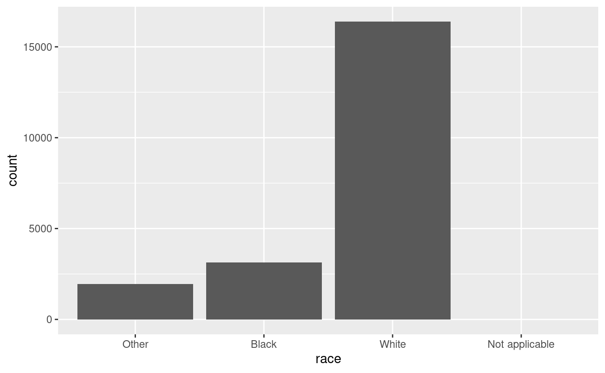
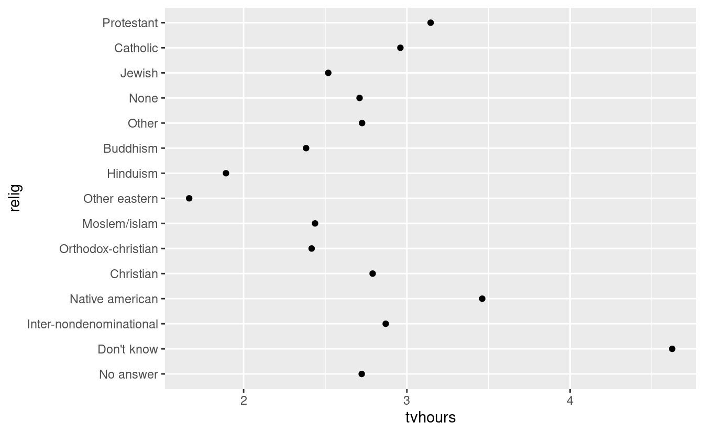
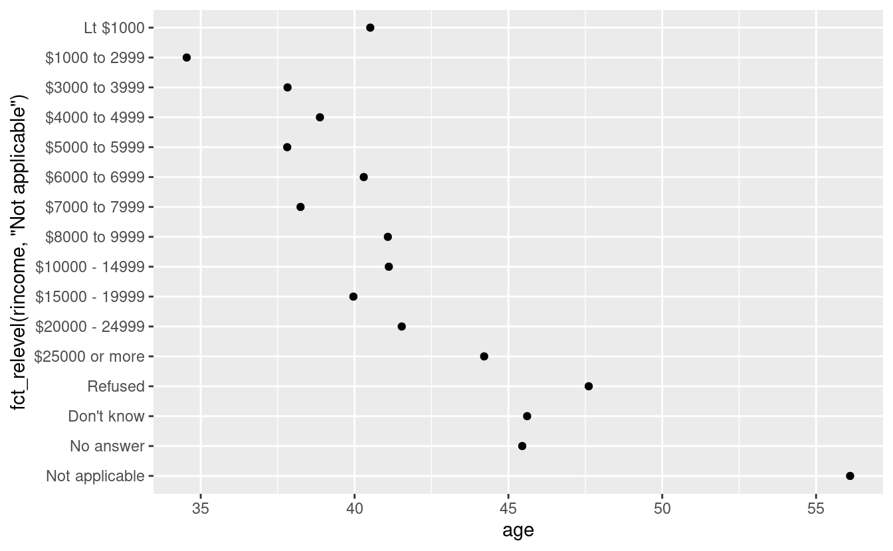
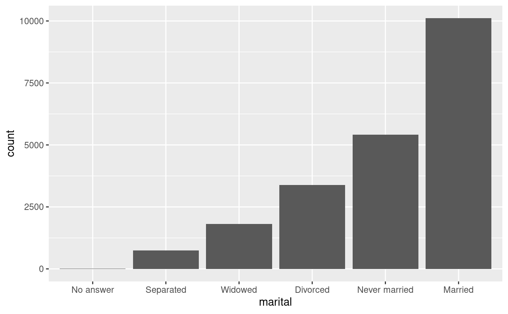

# Fattori

## Introduzione

In R, i fattori sono usati per lavorare con variabili categoriche, variabili che hanno un insieme fisso e noto di possibili valori. Sono anche utili quando si vogliono visualizzare vettori di caratteri in un ordine non alfabetico.

Storicamente, i fattori erano molto più facili da lavorare rispetto ai caratteri. Di conseguenza, molte delle funzioni in R base convertono automaticamente i caratteri in fattori. Questo significa che i fattori spesso compaiono in posti dove non sono effettivamente utili. Fortunatamente, non dovete preoccuparvi di questo nel tidyverse, e potete concentrarvi sulle situazioni in cui i fattori sono veramente utili.

### Prerequisiti

Per lavorare con i fattori, useremo il pacchetto __forcats__, che fa parte del nucleo del tidyverse. Fornisce strumenti per trattare con le variabili **cat**egoriche (ed è un anagramma di factors!) usando una vasta gamma di helper per lavorare con i fattori. 


```r
library(tidyverse)
```

### Imparare di più

Se volete saperne di più sui fattori, vi consiglio di leggere il documento di Amelia McNamara e Nicholas Horton, [_Wrangling categorical data in R_](https://peerj.com/preprints/3163/). Questo articolo espone parte della storia discussa in [_stringsAsFactors: An unauthorized biography_](http://simplystatistics.org/2015/07/24/stringsasfactors-an-unauthorized-biography/) e [_stringsAsFactors = \<sigh\>_](http://notstatschat.tumblr.com/post/124987394001/stringsasfactors-sigh), e confronta gli approcci ordinati ai dati categorici delineati in questo libro con i metodi base di R. Una prima versione dell'articolo ha aiutato a motivare e a dare un ambito al pacchetto forcats; grazie Amelia & Nick!

## Creazione di fattori

Immaginate di avere una variabile che registra il mese:


```r
x1 <- c("Dec", "Apr", "Jan", "Mar")
```

Usare una stringa per registrare questa variabile ha due problemi:

1.  Ci sono solo dodici mesi possibili, e non c'è niente che vi salvi
    dagli errori di battitura:
     
    
    ```r
    x2 <- c("Dec", "Apr", "Jam", "Mar")
    ```
    
1.  Non ordina in modo utile:

    
    ```r
    sort(x1)
    #> [1] "Apr" "Dec" "Jan" "Mar"
    ```

Potete risolvere entrambi questi problemi con un fattore. Per creare un fattore dovete iniziare creando una lista dei __livelli__ validi:


```r
month_levels <- c(
  "Jan", "Feb", "Mar", "Apr", "May", "Jun", 
  "Jul", "Aug", "Sep", "Oct", "Nov", "Dec"
)
```

Ora potete creare un fattore:


```r
y1 <- factor(x1, levels = month_levels)
y1
#> [1] Dec Apr Jan Mar
#> Levels: Jan Feb Mar Apr May Jun Jul Aug Sep Oct Nov Dec
sort(y1)
#> [1] Jan Mar Apr Dec
#> Levels: Jan Feb Mar Apr May Jun Jul Aug Sep Oct Nov Dec
```

E tutti i valori non presenti nel set saranno silenziosamente convertiti in NA:


```r
y2 <- factor(x2, levels = month_levels)
y2
#> [1] Dec  Apr  <NA> Mar 
#> Levels: Jan Feb Mar Apr May Jun Jul Aug Sep Oct Nov Dec
```

Se vuoi un avvertimento, puoi usare `readr::parse_factor()`:


```r
y2 <- parse_factor(x2, levels = month_levels)
#> Warning: 1 parsing failure.
#> row col           expected actual
#>   3  -- value in level set    Jam
```

Se ometti i livelli, saranno presi dai dati in ordine alfabetico:


```r
factor(x1)
#> [1] Dec Apr Jan Mar
#> Levels: Apr Dec Jan Mar
```

A volte si preferisce che l'ordine dei livelli corrisponda all'ordine della prima apparizione nei dati. Potete farlo quando create il fattore impostando i livelli su `unique(x)`, o dopo il fatto, con `fct_inorder()`:


```r
f1 <- factor(x1, levels = unique(x1))
f1
#> [1] Dec Apr Jan Mar
#> Levels: Dec Apr Jan Mar

f2 <- x1 %>% factor() %>% fct_inorder()
f2
#> [1] Dec Apr Jan Mar
#> Levels: Dec Apr Jan Mar
```

Se hai bisogno di accedere direttamente all'insieme dei livelli validi, puoi farlo con `levels()`:


```r
levels(f2)
#> [1] "Dec" "Apr" "Jan" "Mar"
```

## Indagine sociale generale

Per il resto di questo capitolo, ci concentreremo su `forcats::gss_cat`. Si tratta di un campione di dati dal [General Social Survey](http://gss.norc.org), che è un sondaggio di lunga data negli Stati Uniti condotto dall'organizzazione di ricerca indipendente NORC dell'Università di Chicago. Il sondaggio ha migliaia di domande, quindi in `gss_cat` ne ho selezionate alcune che illustrano alcune sfide comuni che incontrerete quando lavorate con i fattori.


```r
gss_cat
#> # A tibble: 21,483 × 9
#>    year marital         age race  rincome        partyid     relig denom tvhours
#>   <int> <fct>         <int> <fct> <fct>          <fct>       <fct> <fct>   <int>
#> 1  2000 Never married    26 White $8000 to 9999  Ind,near r… Prot… Sout…      12
#> 2  2000 Divorced         48 White $8000 to 9999  Not str re… Prot… Bapt…      NA
#> 3  2000 Widowed          67 White Not applicable Independent Prot… No d…       2
#> 4  2000 Never married    39 White Not applicable Ind,near r… Orth… Not …       4
#> 5  2000 Divorced         25 White Not applicable Not str de… None  Not …       1
#> 6  2000 Married          25 White $20000 - 24999 Strong dem… Prot… Sout…      NA
#> # … with 21,477 more rows
```

(Ricorda, poiché questo set di dati è fornito da un pacchetto, puoi ottenere maggiori informazioni sulle variabili con `?gss_cat`).

Quando i fattori sono memorizzati in una tibble, non puoi vedere i loro livelli così facilmente. Un modo per vederli è con `count()`:


```r
gss_cat %>%
  count(race)
#> # A tibble: 3 × 2
#>   race      n
#>   <fct> <int>
#> 1 Other  1959
#> 2 Black  3129
#> 3 White 16395
```

O con un grafico a barre:


```r
ggplot(gss_cat, aes(race)) +
  geom_bar()
```


Per impostazione predefinita, ggplot2 elimina i livelli che non hanno alcun valore. Potete forzarne la visualizzazione con:


```r
ggplot(gss_cat, aes(race)) +
  geom_bar() +
  scale_x_discrete(drop = FALSE)
```



Questi livelli rappresentano valori validi che semplicemente non si sono verificati in questo set di dati. Sfortunatamente, dplyr non ha ancora un'opzione `drop`, ma la avrà in futuro.

Quando si lavora con i fattori, le due operazioni più comuni sono cambiare l'ordine dei livelli e cambiare i valori dei livelli. Queste operazioni sono descritte nelle sezioni seguenti.

### Esercizio

1.  Esplora la distribuzione del `reddito` (reddito dichiarato). Cosa rende il
    grafico a barre predefinito difficile da capire? Come potresti migliorare il grafico?

1.  Qual è il `relig` più comune in questo sondaggio? Qual è il più
    comune `partyid`?

1.  2. A quale `relig` si applica il `denom` (denominazione)? Come puoi scoprirlo
    con una tabella? Come puoi scoprirlo con una visualizzazione?

## Modificare l'ordine dei fattori

Spesso è utile cambiare l'ordine dei livelli dei fattori in una visualizzazione. Per esempio, immaginate di voler esplorare il numero medio di ore trascorse a guardare la TV al giorno nelle varie religioni:


```r
relig_summary <- gss_cat %>%
  group_by(relig) %>%
  summarise(
    age = mean(age, na.rm = TRUE),
    tvhours = mean(tvhours, na.rm = TRUE),
    n = n()
  )

ggplot(relig_summary, aes(tvhours, relig)) + geom_point()
```



È difficile interpretare questo grafico perché non c'è uno schema generale. Possiamo migliorarlo riordinando i livelli di `relig` usando `fct_reorder()`. `fct_reorder()` prende tre argomenti:

* `f`, il fattore di cui volete modificare i livelli.
* `x`, un vettore numerico che volete usare per riordinare i livelli.
* Opzionalmente, `fun`, una funzione che viene usata se ci sono più valori di
  `x` per ogni valore di `f`. Il valore predefinito è `median`.


```r
ggplot(relig_summary, aes(tvhours, fct_reorder(relig, tvhours))) +
  geom_point()
```


Riordinare la religione rende molto più facile vedere che le persone nella categoria "Non so" guardano molta più TV, e l'Induismo e altre religioni orientali ne guardano molto meno.

Quando cominciate a fare trasformazioni più complicate, vi consiglio di spostarle fuori da `aes()` e in un passo separato `mutate()`. Per esempio, potreste riscrivere il grafico di cui sopra come:


```r
relig_summary %>%
  mutate(relig = fct_reorder(relig, tvhours)) %>%
  ggplot(aes(tvhours, relig)) +
    geom_point()
```
E se creassimo un grafico simile guardando come l'età media varia a seconda del livello di reddito dichiarato?


```r
rincome_summary <- gss_cat %>%
  group_by(rincome) %>%
  summarise(
    age = mean(age, na.rm = TRUE),
    tvhours = mean(tvhours, na.rm = TRUE),
    n = n()
  )

ggplot(rincome_summary, aes(age, fct_reorder(rincome, age))) + geom_point()
```


Qui, riordinare arbitrariamente i livelli non è una buona idea! Questo perché `rincome` ha già un ordine di principio con cui non dovremmo scherzare. Riservate `fct_reorder()` ai fattori i cui livelli sono ordinati arbitrariamente.

Tuttavia, ha senso mettere "Non applicabile" davanti agli altri livelli speciali. Potete usare `fct_relevel()`. Prende un fattore, `f`, e poi un qualsiasi numero di livelli che volete spostare all'inizio della riga.


```r
ggplot(rincome_summary, aes(age, fct_relevel(rincome, "Not applicable"))) +
  geom_point()
```



Perché pensi che l'età media per "Non applicabile" sia così alta?

Un altro tipo di riordino è utile quando si colorano le linee di un grafico. `fct_reorder2()` riordina il fattore in base ai valori `y` associati ai valori `x` più grandi. Questo rende il grafico più facile da leggere perché i colori delle linee si allineano alla legenda.


```r
by_age <- gss_cat %>%
  filter(!is.na(age)) %>%
  count(age, marital) %>%
  group_by(age) %>%
  mutate(prop = n / sum(n))

ggplot(by_age, aes(age, prop, colour = marital)) +
  geom_line(na.rm = TRUE)

ggplot(by_age, aes(age, prop, colour = fct_reorder2(marital, age, prop))) +
  geom_line() +
  labs(colour = "marital")
```


Infine, per i grafici a barre, puoi usare `fct_infreq()` per ordinare i livelli in frequenza crescente: questo è il tipo più semplice di riordino perché non ha bisogno di variabili extra. Potreste volerlo combinare con `fct_rev()`.


```r
gss_cat %>%
  mutate(marital = marital %>% fct_infreq() %>% fct_rev()) %>%
  ggplot(aes(marital)) +
    geom_bar()
```



### Esercizi

1.  Ci sono alcuni numeri sospettosamente alti in `tvhours`. La media è un buon
    riassunto?

1.  Per ogni fattore in `gss_cat` identifica se l'ordine dei livelli è
    arbitrario o di principio.

1.  Perché lo spostamento di "Non applicabile" all'inizio dei livelli lo ha spostato in
    in fondo al grafico?

## Modificare i livelli dei fattori

Più potente che cambiare l'ordine dei livelli è cambiare i loro valori. Questo ti permette di chiarire le etichette per la pubblicazione e di far collassare i livelli per visualizzazioni di alto livello. Lo strumento più generale e potente è `fct_recode()`. Ti permette di ricodificare, o cambiare, il valore di ogni livello. Per esempio, prendete il `gss_cat$partyid`:


```r
gss_cat %>% count(partyid)
#> # A tibble: 10 × 2
#>   partyid                n
#>   <fct>              <int>
#> 1 No answer            154
#> 2 Don't know             1
#> 3 Other party          393
#> 4 Strong republican   2314
#> 5 Not str republican  3032
#> 6 Ind,near rep        1791
#> # … with 4 more rows
```

I livelli sono concisi e incoerenti. Modifichiamoli per essere più lunghi e usare una costruzione parallela.


```r
gss_cat %>%
  mutate(partyid = fct_recode(partyid,
    "Republican, strong"    = "Strong republican",
    "Republican, weak"      = "Not str republican",
    "Independent, near rep" = "Ind,near rep",
    "Independent, near dem" = "Ind,near dem",
    "Democrat, weak"        = "Not str democrat",
    "Democrat, strong"      = "Strong democrat"
  )) %>%
  count(partyid)
#> # A tibble: 10 × 2
#>   partyid                   n
#>   <fct>                 <int>
#> 1 No answer               154
#> 2 Don't know                1
#> 3 Other party             393
#> 4 Republican, strong     2314
#> 5 Republican, weak       3032
#> 6 Independent, near rep  1791
#> # … with 4 more rows
```

`fct_recode()` lascerà i livelli che non sono esplicitamente menzionati così come sono, e ti avvertirà se accidentalmente fai riferimento ad un livello che non esiste.

Per combinare i gruppi, puoi assegnare più livelli vecchi allo stesso livello nuovo:


```r
gss_cat %>%
  mutate(partyid = fct_recode(partyid,
    "Republican, strong"    = "Strong republican",
    "Republican, weak"      = "Not str republican",
    "Independent, near rep" = "Ind,near rep",
    "Independent, near dem" = "Ind,near dem",
    "Democrat, weak"        = "Not str democrat",
    "Democrat, strong"      = "Strong democrat",
    "Other"                 = "No answer",
    "Other"                 = "Don't know",
    "Other"                 = "Other party"
  )) %>%
  count(partyid)
#> # A tibble: 8 × 2
#>   partyid                   n
#>   <fct>                 <int>
#> 1 Other                   548
#> 2 Republican, strong     2314
#> 3 Republican, weak       3032
#> 4 Independent, near rep  1791
#> 5 Independent            4119
#> 6 Independent, near dem  2499
#> # … with 2 more rows
```

Dovete usare questa tecnica con attenzione: se raggruppate insieme categorie che sono veramente diverse finirete per ottenere risultati fuorvianti.

Se volete collassare molti livelli, `fct_collapse()` è un'utile variante di `fct_recode()`. Per ogni nuova variabile, potete fornire un vettore di vecchi livelli:


```r
gss_cat %>%
  mutate(partyid = fct_collapse(partyid,
    other = c("No answer", "Don't know", "Other party"),
    rep = c("Strong republican", "Not str republican"),
    ind = c("Ind,near rep", "Independent", "Ind,near dem"),
    dem = c("Not str democrat", "Strong democrat")
  )) %>%
  count(partyid)
#> # A tibble: 4 × 2
#>   partyid     n
#>   <fct>   <int>
#> 1 other     548
#> 2 rep      5346
#> 3 ind      8409
#> 4 dem      7180
```
A volte si vuole semplicemente mettere insieme tutti i piccoli gruppi per rendere più semplice un grafico o una tabella. Questo è il compito di `fct_lump()`:


```r
gss_cat %>%
  mutate(relig = fct_lump(relig)) %>%
  count(relig)
#> # A tibble: 2 × 2
#>   relig          n
#>   <fct>      <int>
#> 1 Protestant 10846
#> 2 Other      10637
```

Il comportamento predefinito è quello di raggruppare progressivamente i gruppi più piccoli, assicurandosi che l'aggregato sia ancora il gruppo più piccolo. In questo caso non è molto utile: è vero che la maggioranza degli americani in questo sondaggio sono protestanti, ma probabilmente abbiamo esagerato.

Invece, possiamo usare il parametro `n` per specificare quanti gruppi (esclusi gli altri) vogliamo mantenere:


```r
gss_cat %>%
  mutate(relig = fct_lump(relig, n = 10)) %>%
  count(relig, sort = TRUE) %>%
  print(n = Inf)
#> # A tibble: 10 × 2
#>    relig                       n
#>    <fct>                   <int>
#>  1 Protestant              10846
#>  2 Catholic                 5124
#>  3 None                     3523
#>  4 Christian                 689
#>  5 Other                     458
#>  6 Jewish                    388
#>  7 Buddhism                  147
#>  8 Inter-nondenominational   109
#>  9 Moslem/islam              104
#> 10 Orthodox-christian         95
```

### Esercizi

1.  Come sono cambiate nel tempo le proporzioni di persone che si identificano come Democratici, Repubblicani e
    indipendenti sono cambiate nel tempo?

1.  2. Come si può far collassare il "reddito" in un piccolo insieme di categorie?
