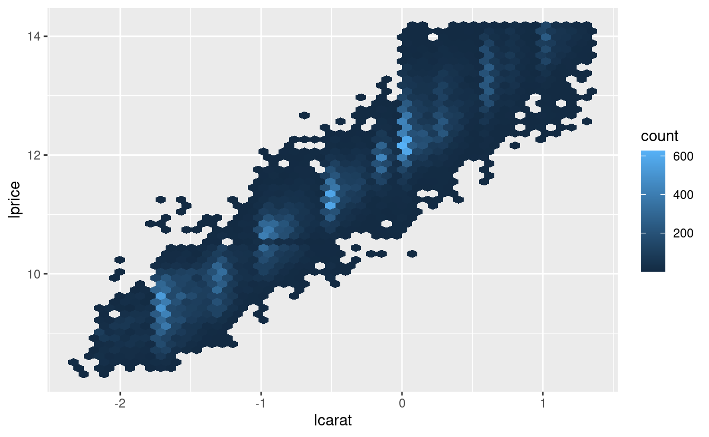
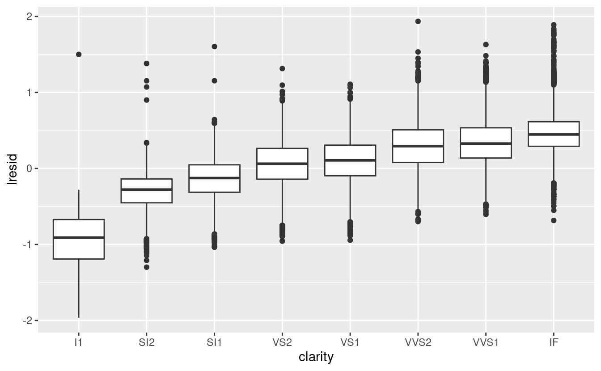
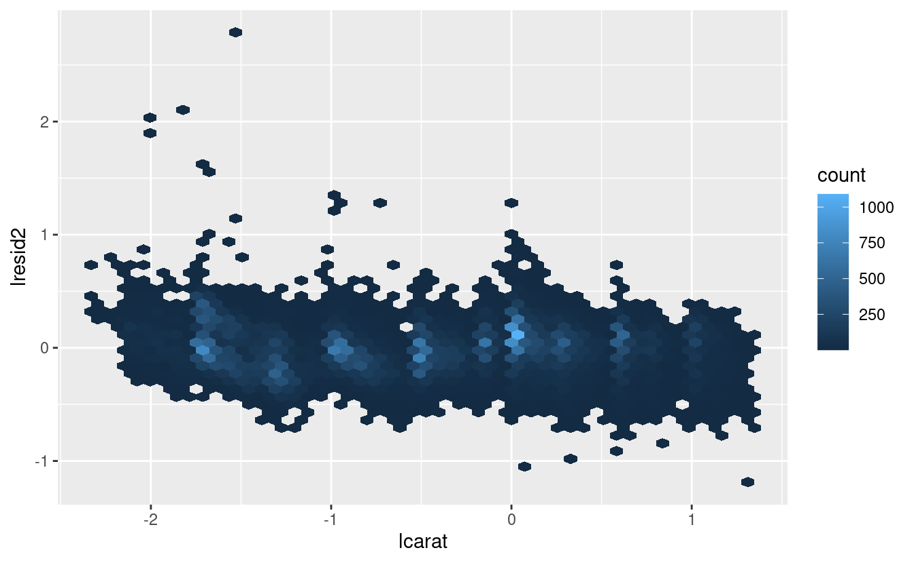
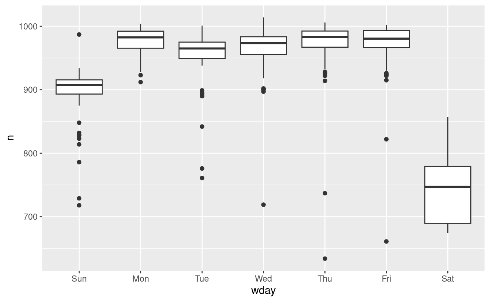
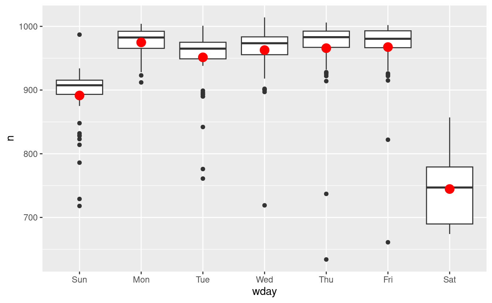
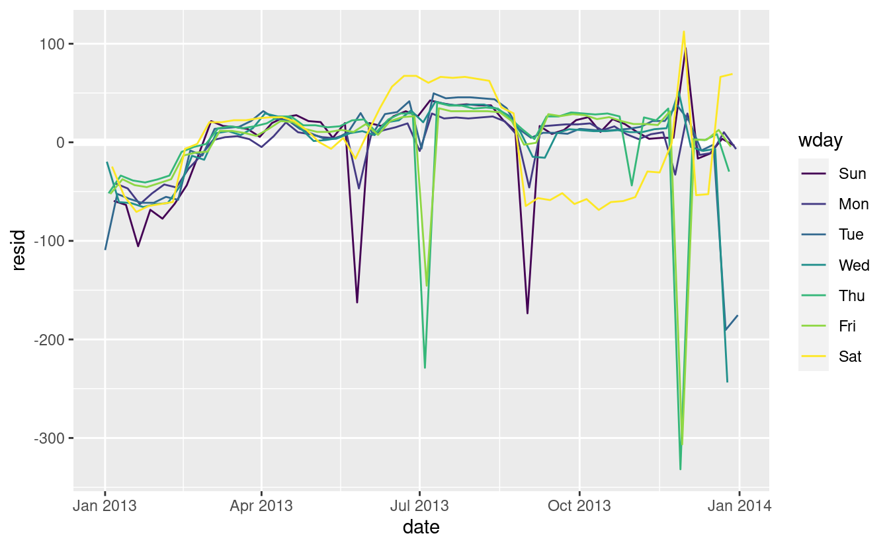
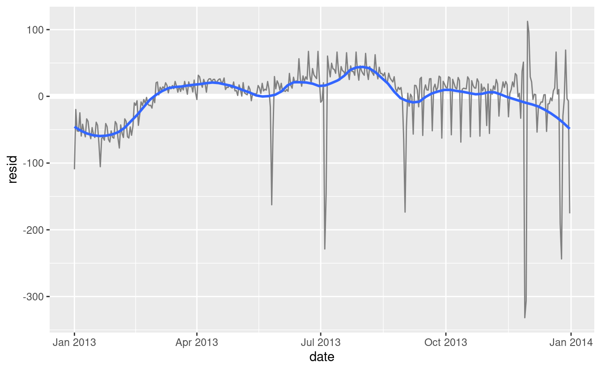
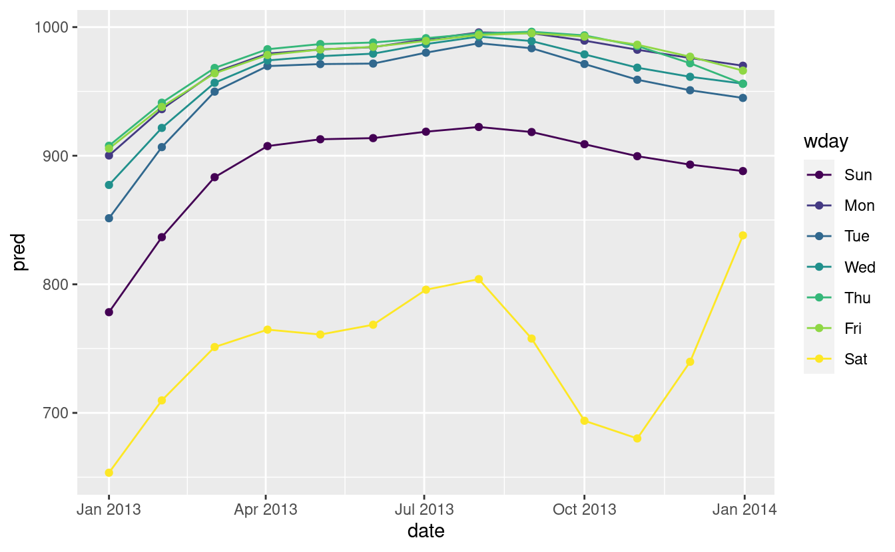

# Costruire modelli

## Introduzione

Nel capitolo precedente avete imparato come funzionano i modelli lineari e avete appreso alcuni strumenti di base per capire cosa vi dice un modello sui vostri dati. Il capitolo precedente si è concentrato su serie di dati simulati. Questo capitolo si concentrerà su dati reali, mostrandovi come potete costruire progressivamente un modello per aiutare la vostra comprensione dei dati.

Sfrutteremo il fatto che potete pensare ad un modello che partiziona i vostri dati in pattern e residui. Troveremo i modelli con la visualizzazione, poi li renderemo concreti e precisi con un modello. Poi ripeteremo il processo, ma sostituendo la vecchia variabile di risposta con i residui del modello. L'obiettivo è quello di passare dalla conoscenza implicita nei dati e nella tua testa alla conoscenza esplicita in un modello quantitativo. Questo la rende più facile da applicare a nuovi domini, e più facile da usare per gli altri. 

Per serie di dati molto grandi e complesse questo sarà un sacco di lavoro. Ci sono certamente approcci alternativi - un approccio più da machine learning è semplicemente concentrarsi sulla capacità predittiva del modello. Questi approcci tendono a produrre scatole nere: il modello fa un ottimo lavoro nel generare previsioni, ma non si sa perché. Questo è un approccio del tutto ragionevole, ma rende difficile applicare la vostra conoscenza del mondo reale al modello. Questo, a sua volta, rende difficile valutare se il modello continuerà a funzionare a lungo termine, quando i fondamentali cambieranno. Per la maggior parte dei modelli reali, mi aspetto che usiate una combinazione di questo approccio e un approccio automatico più classico.

È una sfida sapere quando fermarsi. Devi capire quando il tuo modello è abbastanza buono e quando è improbabile che un ulteriore investimento paghi. Mi piace particolarmente questa citazione dall'utente di reddit Broseidon241: 

> Molto tempo fa, al corso d'arte, il mio insegnante mi disse: "Un artista deve sapere 
> quando un pezzo è finito. Non puoi ritoccare qualcosa fino alla perfezione - incartapecorisce. 
> Se non ti piace, rifallo. Altrimenti inizia qualcosa di nuovo". Più tardi
> nella vita, ho sentito: "Una povera sarta fa molti errori. Una buona sarta 
> lavora duramente per correggere quegli errori. Una grande sarta non ha paura di 
> buttare l'indumento e ricominciare da capo".
> 
> -- Broseidon241, <https://www.reddit.com/r/datascience/comments/4irajq>

### Prerequisiti

Useremo gli stessi strumenti del capitolo precedente, ma aggiungeremo alcuni set di dati reali: `diamonds` da ggplot2, e `flights` da nycflights13.  Avremo anche bisogno di lubridate per lavorare con la data/ora in `flights`.


```r
library(tidyverse)
library(modelr)
options(na.action = na.warn)

library(nycflights13)
library(lubridate)
```

## Perché i diamanti di bassa qualità sono più cari? {#diamond-prices}

Nei capitoli precedenti abbiamo visto una relazione sorprendente tra la qualità dei diamanti e il loro prezzo: i diamanti di bassa qualità (tagli poveri, colori scadenti e purezza inferiore) hanno prezzi più alti.


```r
ggplot(diamonds, aes(cut, price)) + geom_boxplot()
ggplot(diamonds, aes(color, price)) + geom_boxplot()
ggplot(diamonds, aes(clarity, price)) + geom_boxplot()
```


Si noti che il peggior colore del diamante è J (leggermente giallo), e la peggiore purezza è I1 (inclusioni visibili a occhio nudo).

### Prezzo e caratura

Sembra che i diamanti di qualità inferiore abbiano prezzi più alti perché c'è un'importante variabile di confusione: il peso (`carat`) del diamante. Il peso del diamante è il singolo fattore più importante per determinare il prezzo del diamante, e i diamanti di qualità inferiore tendono ad essere più grandi.


```r
ggplot(diamonds, aes(carat, price)) + 
  geom_hex(bins = 50)
```


Possiamo rendere più facile vedere come gli altri attributi di un diamante influenzano il suo `price` (prezzo) relativo adattando un modello per separare l'effetto della `carat`(caratura). Ma prima, facciamo un paio di modifiche al dataset dei diamanti per renderlo più facile da lavorare:

1. Concentrarsi sui diamanti più piccoli di 2,5 carati (99,7% dei dati) 1. 2. Log-transformare le variabili carati e prezzo.


```r
diamonds2 <- diamonds %>% 
  filter(carat <= 2.5) %>% 
  mutate(lprice = log2(price), lcarat = log2(carat))
```

Insieme, questi cambiamenti rendono più facile vedere la relazione tra `carat` e `price`:


```r
ggplot(diamonds2, aes(lcarat, lprice)) + 
  geom_hex(bins = 50)
```



La trasformazione logaritmica è particolarmente utile qui perché rende il modello lineare, e i modelli lineari sono i più facili da lavorare. Facciamo il passo successivo e rimuoviamo questo forte modello lineare. Per prima cosa rendiamo il modello esplicito adattando un modello:


```r
mod_diamond <- lm(lprice ~ lcarat, data = diamonds2)
```

Poi guardiamo cosa ci dice il modello sui dati. Notate che ho ritrasformato le previsioni, annullando la trasformazione logaritmica, in modo da poter sovrapporre le previsioni ai dati grezzi:


```r
grid <- diamonds2 %>% 
  data_grid(carat = seq_range(carat, 20)) %>% 
  mutate(lcarat = log2(carat)) %>% 
  add_predictions(mod_diamond, "lprice") %>% 
  mutate(price = 2 ^ lprice)

ggplot(diamonds2, aes(carat, price)) + 
  geom_hex(bins = 50) + 
  geom_line(data = grid, colour = "red", size = 1)
```


Questo ci dice qualcosa di interessante sui nostri dati. Se crediamo al nostro modello, allora i grandi diamanti sono molto più economici del previsto. Questo probabilmente perché nessun diamante in questo set di dati costa più di 19.000 dollari.

Ora possiamo guardare i residui, il che verifica che abbiamo rimosso con successo il forte modello lineare:


```r
diamonds2 <- diamonds2 %>% 
  add_residuals(mod_diamond, "lresid")

ggplot(diamonds2, aes(lcarat, lresid)) + 
  geom_hex(bins = 50)
```


È importante che ora possiamo rifare i nostri grafici motivanti usando questi residui invece di `price`. 


```r
ggplot(diamonds2, aes(cut, lresid)) + geom_boxplot()
ggplot(diamonds2, aes(color, lresid)) + geom_boxplot()
ggplot(diamonds2, aes(clarity, lresid)) + geom_boxplot()
```



Ora vediamo la relazione che ci aspettiamo: man mano che la qualità del diamante aumenta, aumenta anche il suo prezzo relativo. Per interpretare l'asse `y`, dobbiamo pensare a cosa ci dicono i residui e su quale scala si trovano. Un residuo di -1 indica che `lprice` è stato 1 unità più basso di una previsione basata solo sul suo peso. $2^{-1}$ è 1/2, i punti con un valore di -1 sono la metà del prezzo previsto, e i residui con valore 1 sono il doppio del prezzo previsto.

### Un modello più complicato

Se volessimo, potremmo continuare a costruire il nostro modello, spostando gli effetti che abbiamo osservato nel modello per renderli espliciti. Per esempio, potremmo includere "color", "cut" e "clarity" nel modello in modo da rendere esplicito anche l'effetto di queste tre variabili categoriche:


```r
mod_diamond2 <- lm(lprice ~ lcarat + color + cut + clarity, data = diamonds2)
```

Questo modello ora include quattro predittori, quindi sta diventando più difficile da visualizzare. Fortunatamente, attualmente sono tutti indipendenti, il che significa che possiamo tracciarli individualmente in quattro grafici. Per rendere il processo un po' più semplice, useremo l'argomento `.model` in `data_grid`:


```r
grid <- diamonds2 %>% 
  data_grid(cut, .model = mod_diamond2) %>% 
  add_predictions(mod_diamond2)
grid
#> # A tibble: 5 × 5
#>   cut       lcarat color clarity  pred
#>   <ord>      <dbl> <chr> <chr>   <dbl>
#> 1 Fair      -0.515 G     VS2      11.2
#> 2 Good      -0.515 G     VS2      11.3
#> 3 Very Good -0.515 G     VS2      11.4
#> 4 Premium   -0.515 G     VS2      11.4
#> 5 Ideal     -0.515 G     VS2      11.4

ggplot(grid, aes(cut, pred)) + 
  geom_point()
```


Se il modello ha bisogno di variabili che non sono state esplicitamente fornite, `data_grid()` le riempirà automaticamente con il valore "tipico". Per le variabili continue, usa la mediana, e per le variabili categoriche usa il valore più comune (o i valori, se c'è un pareggio).


```r
diamonds2 <- diamonds2 %>% 
  add_residuals(mod_diamond2, "lresid2")

ggplot(diamonds2, aes(lcarat, lresid2)) + 
  geom_hex(bins = 50)
```



Questo grafico indica che ci sono alcuni diamanti con residui abbastanza grandi - ricorda che un residuo di 2 indica che il diamante è 4 volte il prezzo che ci aspettavamo. Spesso è utile guardare i valori insoliti singolarmente:


```r
diamonds2 %>% 
  filter(abs(lresid2) > 1) %>% 
  add_predictions(mod_diamond2) %>% 
  mutate(pred = round(2 ^ pred)) %>% 
  select(price, pred, carat:table, x:z) %>% 
  arrange(price)
#> # A tibble: 16 × 11
#>   price  pred carat cut     color clarity depth table     x     y     z
#>   <int> <dbl> <dbl> <ord>   <ord> <ord>   <dbl> <dbl> <dbl> <dbl> <dbl>
#> 1  1013   264  0.25 Fair    F     SI2      54.4    64  4.3   4.23  2.32
#> 2  1186   284  0.25 Premium G     SI2      59      60  5.33  5.28  3.12
#> 3  1186   284  0.25 Premium G     SI2      58.8    60  5.33  5.28  3.12
#> 4  1262  2644  1.03 Fair    E     I1       78.2    54  5.72  5.59  4.42
#> 5  1415   639  0.35 Fair    G     VS2      65.9    54  5.57  5.53  3.66
#> 6  1415   639  0.35 Fair    G     VS2      65.9    54  5.57  5.53  3.66
#> # … with 10 more rows
```

Non c'è niente che mi salti all'occhio, ma probabilmente vale la pena spendere del tempo per considerare se questo indica un problema con il nostro modello, o se ci sono errori nei dati. Se ci sono errori nei dati, questa potrebbe essere un'opportunità per comprare diamanti che sono stati valutati male.

### Esercizi

1.  Nel grafico di `lcarat` vs. `lprice`, ci sono alcune strisce verticali luminose. Cosa rappresentano?

1.  Se `log(price) = a_0 + a_1 * log(carat)`, cosa dice questo sulla relazione tra `price` e `carat`?
    
1.  Estrai i diamanti che hanno residui molto alti e molto bassi. 
    C'è qualcosa di insolito in questi diamanti? Sono particolarmente cattivi o buoni, o pensate che si tratti di errori di prezzo?

1.  Il modello finale, `mod_diamond2`, fa un buon lavoro di previsione dei prezzi dei diamanti? Vi fidereste di esso per dirvi quanto spendere se doveste comprare un diamante?

## Cosa influenza il numero di voli giornalieri?

Lavoriamo attraverso un processo simile per un set di dati che sembra ancora più semplice a prima vista: il numero di voli che lasciano NYC al giorno. Questo è un dataset davvero piccolo --- solo 365 righe e 2 colonne --- e non finiremo con un modello completamente realizzato, ma come vedrete, i passi lungo il percorso ci aiuteranno a capire meglio i dati. Iniziamo contando il numero di voli al giorno e visualizzandolo con ggplot2.


```r
daily <- flights %>% 
  mutate(date = make_date(year, month, day)) %>% 
  group_by(date) %>% 
  summarise(n = n())
daily
#> # A tibble: 365 × 2
#>   date           n
#>   <date>     <int>
#> 1 2013-01-01   842
#> 2 2013-01-02   943
#> 3 2013-01-03   914
#> 4 2013-01-04   915
#> 5 2013-01-05   720
#> 6 2013-01-06   832
#> # … with 359 more rows

ggplot(daily, aes(date, n)) + 
  geom_line()
```


### Giorno della settimana

Capire la tendenza a lungo termine è difficile perché c'è un effetto giorno della settimana molto forte che domina i modelli più sottili. Cominciamo a guardare la distribuzione del numero di voli per giorno della settimana:


```r
daily <- daily %>% 
  mutate(wday = wday(date, label = TRUE))
ggplot(daily, aes(wday, n)) + 
  geom_boxplot()
```



Ci sono meno voli nei fine settimana perché la maggior parte dei viaggi è per affari. L'effetto è particolarmente pronunciato il sabato: si potrebbe a volte partire la domenica per una riunione del lunedì mattina, ma è molto raro che si parta il sabato perché si preferisce stare a casa con la propria famiglia.

Un modo per rimuovere questo forte schema è usare un modello. Per prima cosa, adattiamo il modello e mostriamo le sue previsioni sovrapposte ai dati originali:


```r
mod <- lm(n ~ wday, data = daily)

grid <- daily %>% 
  data_grid(wday) %>% 
  add_predictions(mod, "n")

ggplot(daily, aes(wday, n)) + 
  geom_boxplot() +
  geom_point(data = grid, colour = "red", size = 4)
```



Poi calcoliamo e visualizziamo i residui:


```r
daily <- daily %>% 
  add_residuals(mod)
daily %>% 
  ggplot(aes(date, resid)) + 
  geom_ref_line(h = 0) + 
  geom_line()
```


    Notate il cambiamento nell'asse y: ora stiamo vedendo la deviazione dal numero previsto di voli, dato il giorno della settimana. Questo grafico è utile perché ora che abbiamo rimosso gran parte del grande effetto del giorno della settimana, possiamo vedere alcuni dei modelli più sottili che rimangono:

1.  Il nostro modello sembra fallire a partire da giugno: si può ancora vedere un forte modello regolare che il nostro modello non ha catturato. Disegnare un grafico con una linea per ogni giorno della settimana rende la causa più facile da vedere:

    
    ```r
    ggplot(daily, aes(date, resid, colour = wday)) + 
      geom_ref_line(h = 0) + 
      geom_line()
    ```
    
    
   
    Il nostro modello non riesce a prevedere accuratamente il numero di voli del sabato: durante l'estate ci sono più voli di quanto ci aspettiamo, e durante l'autunno ce ne sono meno. Vedremo come possiamo fare meglio per catturare questo modello nella prossima sezione.

1.  Ci sono alcuni giorni con molti meno voli del previsto:

    
    ```r
    daily %>% 
      filter(resid < -100)
    #> # A tibble: 11 × 4
    #>   date           n wday  resid
    #>   <date>     <int> <ord> <dbl>
    #> 1 2013-01-01   842 Tue   -109.
    #> 2 2013-01-20   786 Sun   -105.
    #> 3 2013-05-26   729 Sun   -162.
    #> 4 2013-07-04   737 Thu   -229.
    #> 5 2013-07-05   822 Fri   -145.
    #> 6 2013-09-01   718 Sun   -173.
    #> # … with 5 more rows
    ```

    Se avete familiarità con le festività americane, potreste individuare il Capodanno 
    4 luglio, il Ringraziamento e il Natale. Ce ne sono altri che non 
    sembrano corrispondere ai giorni festivi. Lavorerai su quelle in uno 
    degli esercizi.
    
1.  Sembra che ci sia una tendenza a lungo termine più morbida nel corso di un anno.
    Possiamo evidenziare questa tendenza con `geom_smooth()`:

    
    ```r
    daily %>% 
      ggplot(aes(date, resid)) + 
      geom_ref_line(h = 0) + 
      geom_line(colour = "grey50") + 
      geom_smooth(se = FALSE, span = 0.20)
    #> `geom_smooth()` using method = 'loess' and formula 'y ~ x'
    ```
    
    

    Ci sono meno voli a gennaio (e dicembre), e più in estate 
    (maggio-settembre). Non possiamo fare molto con questo modello quantitativamente, perché 
    abbiamo solo un anno di dati. Ma possiamo usare la nostra conoscenza del dominio per 
    per trovare delle potenziali spiegazioni.

### Effetto stagionale del sabato

Affrontiamo prima il nostro fallimento nel prevedere accuratamente il numero di voli di sabato. Un buon punto di partenza è tornare ai numeri grezzi, concentrandosi sul sabato:


```r
daily %>% 
  filter(wday == "Sat") %>% 
  ggplot(aes(date, n)) + 
    geom_point() + 
    geom_line() +
    scale_x_date(NULL, date_breaks = "1 month", date_labels = "%b")
```


(Ho usato sia punti che linee per rendere più chiaro cosa sono i dati e cosa l'interpolazione).

Sospetto che questo modello sia causato dalle vacanze estive: molte persone vanno in vacanza in estate, e alla gente non dispiace viaggiare di sabato per le vacanze. Guardando questo grafico, potremmo indovinare che le vacanze estive vanno da inizio giugno a fine agosto. Questo sembra allinearsi abbastanza bene con i [termini scolastici dello stato] (http://schools.nyc.gov/Calendar/2013-2014+School+Year+Calendars.htm): la pausa estiva nel 2013 era 26 giugno - 9 settembre.

Perché ci sono più voli di sabato in primavera che in autunno? Ho chiesto ad alcuni amici americani e mi hanno suggerito che è meno comune pianificare le vacanze in famiglia durante l'autunno a causa delle grandi vacanze del Ringraziamento e di Natale. Non abbiamo i dati per saperlo con certezza, ma sembra un'ipotesi di lavoro plausibile.

Creiamo una variabile "termine" che catturi approssimativamente i tre termini scolastici, e controlliamo il nostro lavoro con un grafico:


```r
term <- function(date) {
  cut(date, 
    breaks = ymd(20130101, 20130605, 20130825, 20140101),
    labels = c("spring", "summer", "fall") 
  )
}

daily <- daily %>% 
  mutate(term = term(date)) 

daily %>% 
  filter(wday == "Sat") %>% 
  ggplot(aes(date, n, colour = term)) +
  geom_point(alpha = 1/3) + 
  geom_line() +
  scale_x_date(NULL, date_breaks = "1 month", date_labels = "%b")
```


(Ho modificato manualmente le date per ottenere delle belle pause nel grafico. Usare una visualizzazione per aiutarvi a capire cosa sta facendo la vostra funzione è una tecnica davvero potente e generale).

È utile vedere come questa nuova variabile influenza gli altri giorni della settimana:


```r
daily %>% 
  ggplot(aes(wday, n, colour = term)) +
    geom_boxplot()
```


Sembra che ci sia una variazione significativa tra i termini, quindi è ragionevole inserire un effetto separato del giorno della settimana per ogni termine. Questo migliora il nostro modello, ma non così tanto come potremmo sperare:


```r
mod1 <- lm(n ~ wday, data = daily)
mod2 <- lm(n ~ wday * term, data = daily)

daily %>% 
  gather_residuals(without_term = mod1, with_term = mod2) %>% 
  ggplot(aes(date, resid, colour = model)) +
    geom_line(alpha = 0.75)
```


Possiamo vedere il problema sovrapponendo le previsioni del modello ai dati grezzi:


```r
grid <- daily %>% 
  data_grid(wday, term) %>% 
  add_predictions(mod2, "n")

ggplot(daily, aes(wday, n)) +
  geom_boxplot() + 
  geom_point(data = grid, colour = "red") + 
  facet_wrap(~ term)
```


Il nostro modello sta trovando l'effetto _mean_, ma abbiamo molti grandi outlier, quindi la media tende ad essere molto lontana dal valore tipico. Possiamo alleviare questo problema usando un modello che è robusto all'effetto degli outlier: `MASS::rlm()`. Questo riduce notevolmente l'impatto degli outlier sulle nostre stime e fornisce un modello che fa un buon lavoro per rimuovere il modello del giorno della settimana:


```r
mod3 <- MASS::rlm(n ~ wday * term, data = daily)

daily %>% 
  add_residuals(mod3, "resid") %>% 
  ggplot(aes(date, resid)) + 
  geom_hline(yintercept = 0, size = 2, colour = "white") + 
  geom_line()
```


Ora è molto più facile vedere la tendenza a lungo termine e gli outlier positivi e negativi.


### Variabili calcolate

Se state sperimentando molti modelli e molte visualizzazioni, è una buona idea raggruppare la creazione delle variabili in una funzione in modo che non ci sia la possibilità di applicare accidentalmente una trasformazione diversa in posti diversi. Per esempio, potremmo scrivere


```r
compute_vars <- function(data) {
  data %>% 
    mutate(
      term = term(date), 
      wday = wday(date, label = TRUE)
    )
}
```

Un'altra opzione è quella di mettere le trasformazioni direttamente nella formula del modello:


```r
wday2 <- function(x) wday(x, label = TRUE)
mod3 <- lm(n ~ wday2(date) * term(date), data = daily)
```

Entrambi gli approcci sono ragionevoli. Rendere esplicita la variabile trasformata è utile se vuoi controllare il tuo lavoro, o usarla in una visualizzazione. Ma non si possono usare facilmente trasformazioni (come le spline) che restituiscono colonne multiple. Includere le trasformazioni nella funzione del modello rende la vita un po' più facile quando si lavora con molti set di dati diversi, perché il modello è autonomo.

### Tempo dell'anno: un approccio alternativo

Nella sezione precedente abbiamo usato la nostra conoscenza del dominio (come il periodo scolastico negli Stati Uniti influenza i viaggi) per migliorare il modello. Un'alternativa all'uso esplicito della nostra conoscenza nel modello è quella di dare ai dati più spazio per parlare. Potremmo usare un modello più flessibile e permettergli di catturare il modello che ci interessa. Una semplice tendenza lineare non è adeguata, quindi potremmo provare a usare una spline naturale per adattare una curva liscia attraverso l'anno:


```r
library(splines)
mod <- MASS::rlm(n ~ wday * ns(date, 5), data = daily)

daily %>% 
  data_grid(wday, date = seq_range(date, n = 13)) %>% 
  add_predictions(mod) %>% 
  ggplot(aes(date, pred, colour = wday)) + 
    geom_line() +
    geom_point()
```



Vediamo un forte schema nel numero di voli del sabato. Questo è rassicurante, perché abbiamo visto questo schema anche nei dati grezzi. È un buon segno quando si ottiene lo stesso segnale da approcci diversi.


### Esercizi

1.  Usate le vostre abilità di investigazione su Google per capire perché ci sono stati meno voli del previsto il 20 gennaio, il 26 maggio e il 1° settembre. (Suggerimento: hanno tutti la stessa spiegazione.) Come si possono generalizzare questi giorni ad un altro anno?

1.  Cosa rappresentano i tre giorni con alti residui positivi? Come si possono generalizzare questi giorni ad un altro anno?


    
    ```r
    daily %>% 
      slice_max(n = 3, resid)
    #> # A tibble: 3 × 5
    #>   date           n wday  resid term 
    #>   <date>     <int> <ord> <dbl> <fct>
    #> 1 2013-11-30   857 Sat   112.  fall 
    #> 2 2013-12-01   987 Sun    95.5 fall 
    #> 3 2013-12-28   814 Sat    69.4 fall
    ```

1.  Creare una nuova variabile che divide la variabile `wday` in termini, ma solo
    per i sabati, cioè dovrebbe avere `Thurs`, `Fri`, ma `Sat-summer`, 
    `Sat-spring`, `Sat-fall`. Come si confronta questo modello con il modello con 
    ogni combinazione di `wday` e `term`?
    
1.  Crea una nuova variabile `wday` che combina il giorno della settimana, il termine 
    (per il sabato) e i giorni festivi. Come appaiono i residui di 
    questo modello?

1.  Cosa succede se inserite un effetto del giorno della settimana che varia in base al mese 
    (cioè `n ~ wday * month`)? Perché questo non è molto utile? 

1.  Come vi aspettate che sia il modello `n ~ wday + ns(date, 5)`?
    Sapendo quello che sai sui dati, perché ti aspetteresti che non sia
    non particolarmente efficace?

1.  Abbiamo ipotizzato che le persone che partono di domenica hanno più probabilità di essere 
    viaggiatori d'affari che devono essere da qualche parte il lunedì. Esplora questa 
    ipotesi vedendo come si scompone in base alla distanza e al tempo: se 
    è vero, ci si aspetterebbe di vedere più voli di domenica sera verso luoghi che 
    sono lontani.

1.  È un po' frustrante che la domenica e il sabato siano su estremità separate
    del grafico. Scrivete una piccola funzione per impostare i livelli del 
    fattore in modo che la settimana inizi il lunedì.

## Imparare di più sui modelli

Abbiamo solo scalfito la superficie assoluta della modellazione, ma speriamo che abbiate acquisito alcuni strumenti semplici, ma di uso generale, che potete usare per migliorare le vostre analisi dei dati. Va bene iniziare in modo semplice! Come avete visto, anche modelli molto semplici possono fare una grande differenza nella vostra capacità di individuare le interazioni tra le variabili.

Questi capitoli sulla modellazione sono ancora più ricchi di opinioni rispetto al resto del libro. Mi avvicino alla modellazione da una prospettiva un po' diversa dalla maggior parte degli altri, e c'è relativamente poco spazio dedicato ad essa. La modellazione merita davvero un libro a sé, quindi vi consiglio vivamente di leggere almeno uno di questi tre libri:

*Statistical Modeling: A Fresh Approach* di Danny Kaplan,
  <http://project-mosaic-books.com/?page_id=13>. Questo libro fornisce 
  un'introduzione gentile alla modellazione, dove si costruisce la propria intuizione,
  strumenti matematici e competenze R in parallelo. Il libro sostituisce un tradizionale
  corso di "introduzione alla statistica", fornendo un curriculum che è aggiornato 
  e rilevante per la scienza dei dati.

*An Introduction to Statistical Learning* di Gareth James, Daniela Witten, 
  Trevor Hastie, e Robert Tibshirani, <http://www-bcf.usc.edu/~gareth/ISL/> 
  (disponibile online gratuitamente). Questo libro presenta una famiglia di moderne tecniche di modellazione
  tecniche di modellazione note collettivamente come apprendimento statistico.  Per una comprensione ancora più profonda
  comprensione della matematica dietro i modelli, leggete il classico 
  *Elements of Statistical Learning* di Trevor Hastie, Robert Tibshirani, e
  Jerome Friedman, <https://web.stanford.edu/~hastie/Papers/ESLII.pdf> (disponibile anche
  disponibile online gratuitamente).

*Applied Predictive Modeling* di Max Kuhn e Kjell Johnson, 
  <http://appliedpredictivemodeling.com>. Questo libro è un compagno del pacchetto 
  __caret__ e fornisce strumenti pratici per affrontare la vita reale
  reali di modellazione predittiva.
