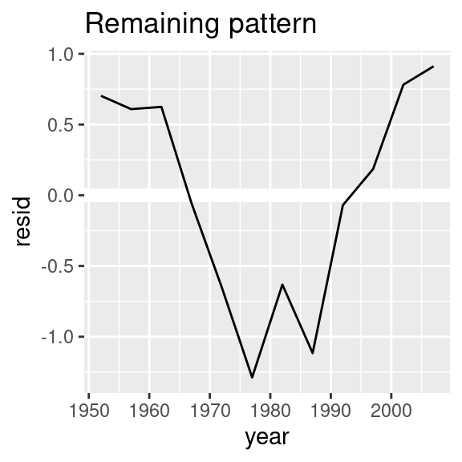
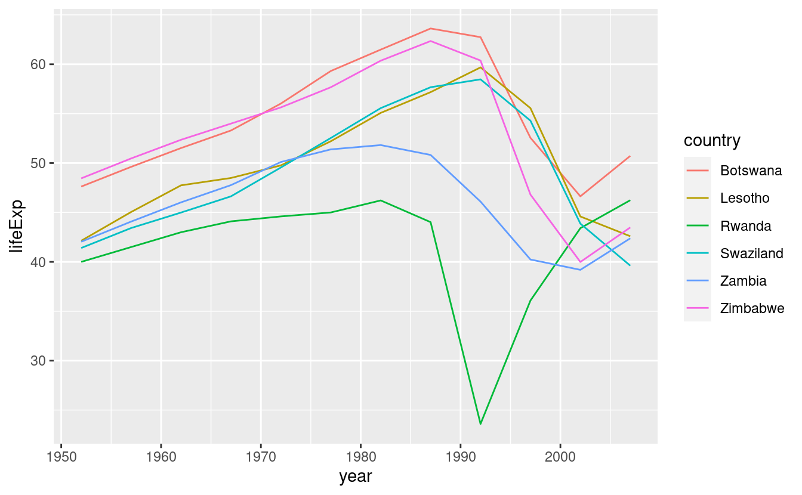

# Molti modelli

## Introduzione

In questo capitolo imparerete tre potenti idee che vi aiuteranno a lavorare con un gran numero di modelli con facilità:

1.  Usare molti modelli semplici per capire meglio insiemi di dati complessi.

1.  Usare liste-colonne per memorizzare strutture di dati arbitrarie in un frame di dati.
    Per esempio, questo vi permetterà di avere una colonna che contiene modelli 
    modelli lineari.
   
1.  Usare il pacchetto __broom__, di David Robinson, per trasformare i modelli in dati 
    dati ordinati. Questa è una tecnica potente per lavorare con un gran numero di modelli
    perché una volta che avete dati ordinati, potete applicare tutte le tecniche che 
    avete imparato in precedenza nel libro.

Inizieremo con un esempio motivante utilizzando i dati sull'aspettativa di vita nel mondo. Si tratta di un piccolo set di dati, ma illustra quanto sia importante la modellazione per migliorare le vostre visualizzazioni. Useremo un gran numero di modelli semplici per separare alcuni dei segnali più forti in modo da poter vedere i segnali più sottili che rimangono. Vedremo anche come le sintesi dei modelli possono aiutarci a individuare i valori anomali e le tendenze insolite.

Le sezioni seguenti si immergeranno in maggiori dettagli sulle singole tecniche:

1. In [list-columns], imparerai di più sulla struttura dati list-columns ('colonne-elenco'),
   e perché ha senso mettere le liste nei frame di dati.
   
1. In [creare list-columns], imparerai i tre modi principali in cui
   creare liste-colonne.
   
1. In [semplificare le list-columns] imparerai come convertire le list-columns
   in vettori atomici regolari (o insiemi di vettori atomici) in modo da poter lavorare
   con loro più facilmente.
   
1. In [rendere ordinati i dati con broom], imparerai a conoscere il set completo di strumenti
   forniti da broom e vedrai come possono essere applicati ad altri tipi di 
   strutture dati.

Questo capitolo è in qualche modo aspirazionale: se questo libro è la vostra prima introduzione a R, questo capitolo sarà probabilmente una lotta. Richiede che abbiate idee profondamente interiorizzate su modellazione, strutture di dati e iterazione. Quindi non preoccupatevi se non lo capite --- mettete da parte questo capitolo per qualche mese, e tornate quando vorrete ampliare il vostro cervello. 

### Prerequisiti

Lavorare con molti modelli richiede molti dei pacchetti del tidyverse (per l'esplorazione dei dati, il wrangling e la programmazione) e modelr per facilitare la modellazione.


```r
library(modelr)
library(tidyverse)
```

## gapminder

Per motivare la potenza di molti modelli semplici, esamineremo i dati "gapminder". Questi dati sono stati resi popolari da Hans Rosling, un medico e statistico svedese. Se non avete mai sentito parlare di lui, smettete subito di leggere questo capitolo e andate a guardare uno dei suoi video! È un fantastico presentatore di dati e illustra come è possibile utilizzare i dati per presentare una storia convincente. Un buon punto di partenza è questo breve video girato insieme alla BBC: <https://www.youtube.com/watch?v=jbkSRLYSojo>.

I dati di gapminder riassumono la progressione dei paesi nel tempo, guardando statistiche come l'aspettativa di vita e il PIL. I dati sono facilmente accessibili in R, grazie a Jenny Bryan che ha creato il pacchetto gapminder:


```r
library(gapminder)
gapminder
#> # A tibble: 1,704 × 6
#>   country     continent  year lifeExp      pop gdpPercap
#>   <fct>       <fct>     <int>   <dbl>    <int>     <dbl>
#> 1 Afghanistan Asia       1952    28.8  8425333      779.
#> 2 Afghanistan Asia       1957    30.3  9240934      821.
#> 3 Afghanistan Asia       1962    32.0 10267083      853.
#> 4 Afghanistan Asia       1967    34.0 11537966      836.
#> 5 Afghanistan Asia       1972    36.1 13079460      740.
#> 6 Afghanistan Asia       1977    38.4 14880372      786.
#> # … with 1,698 more rows
```

In questo caso di studio, ci concentreremo solo su tre variabili per rispondere alla domanda "Come cambia l'aspettativa di vita (`lifeExp`) nel tempo (`year`) per ogni paese (`country`)? Un buon punto di partenza è un grafico:


```r
gapminder %>% 
  ggplot(aes(year, lifeExp, group = country)) +
    geom_line(alpha = 1/3)
```


Questo è un piccolo dataset: ha solo ~1.700 osservazioni e 3 variabili. Ma è ancora difficile vedere cosa sta succedendo! Nel complesso, sembra che l'aspettativa di vita sia migliorata costantemente. Tuttavia, se si guarda da vicino, si possono notare alcuni paesi che non seguono questo schema. Come possiamo rendere questi paesi più facili da vedere?

Un modo è usare lo stesso approccio dell'ultimo capitolo: c'è un segnale forte (la crescita lineare complessiva) che rende difficile vedere tendenze più sottili. Distingueremo questi fattori adattando un modello con una tendenza lineare. Il modello cattura la crescita costante nel tempo, e i residui mostreranno ciò che rimane.

Sapete già come farlo se avessimo un singolo paese:


```r
nz <- filter(gapminder, country == "New Zealand")
nz %>% 
  ggplot(aes(year, lifeExp)) + 
  geom_line() + 
  ggtitle("Full data = ")

nz_mod <- lm(lifeExp ~ year, data = nz)
nz %>% 
  add_predictions(nz_mod) %>%
  ggplot(aes(year, pred)) + 
  geom_line() + 
  ggtitle("Linear trend + ")

nz %>% 
  add_residuals(nz_mod) %>% 
  ggplot(aes(year, resid)) + 
  geom_hline(yintercept = 0, colour = "white", size = 3) + 
  geom_line() + 
  ggtitle("Remaining pattern")
```



Come possiamo facilmente adattare questo modello ad ogni paese?

### Dati annidati

Potresti immaginare di copiare e incollare quel codice più volte; ma hai già imparato un modo migliore! Estrai il codice comune con una funzione e ripeti usando una funzione di mappa da purrr. Questo problema è strutturato un po' diversamente da quello che hai visto prima. Invece di ripetere un'azione per ogni variabile, vogliamo ripetere un'azione per ogni paese, un sottoinsieme di righe. Per farlo, abbiamo bisogno di una nuova struttura di dati: il __data frame annidato__ (nested data frame). Per creare un data frame annidato, iniziamo con un data frame raggruppato e lo annidiamo:


```r
by_country <- gapminder %>% 
  group_by(country, continent) %>% 
  nest()

by_country
#> # A tibble: 142 × 3
#> # Groups:   country, continent [142]
#>   country     continent data             
#>   <fct>       <fct>     <list>           
#> 1 Afghanistan Asia      <tibble [12 × 4]>
#> 2 Albania     Europe    <tibble [12 × 4]>
#> 3 Algeria     Africa    <tibble [12 × 4]>
#> 4 Angola      Africa    <tibble [12 × 4]>
#> 5 Argentina   Americas  <tibble [12 × 4]>
#> 6 Australia   Oceania   <tibble [12 × 4]>
#> # … with 136 more rows
```

(Sto imbrogliando un po' raggruppando sia il `continent` che il `country`. Dato il `country`, il `continente` è fisso, quindi questo non aggiunge altri gruppi, ma è un modo semplice per portare con sé una variabile extra).

Questo crea un frame di dati che ha una riga per gruppo (per paese) e una colonna piuttosto insolita: `data`. `data` è una lista di data frame (o tibbie, per essere precisi).  Sembra un'idea folle: abbiamo un data frame con una colonna che è una lista di altri data frame! Spiegherò brevemente perché penso che sia una buona idea.

La colonna `data` è un po' difficile da guardare perché è una lista moderatamente complicata, e stiamo ancora lavorando su buoni strumenti per esplorare questi oggetti. Sfortunatamente l'uso di `str()` non è raccomandato perché spesso produce un output molto lungo. Ma se si estrae un singolo elemento dalla colonna `data` si vedrà che contiene tutti i dati per quel paese (in questo caso, Afghanistan).


```r
by_country$data[[1]]
#> # A tibble: 12 × 4
#>    year lifeExp      pop gdpPercap
#>   <int>   <dbl>    <int>     <dbl>
#> 1  1952    28.8  8425333      779.
#> 2  1957    30.3  9240934      821.
#> 3  1962    32.0 10267083      853.
#> 4  1967    34.0 11537966      836.
#> 5  1972    36.1 13079460      740.
#> 6  1977    38.4 14880372      786.
#> # … with 6 more rows
```

Notate la differenza tra un data frame standard raggruppato e un data frame annidato: in un data frame raggruppato, ogni riga è un'osservazione; in un data frame annidato, ogni riga è un gruppo. Un altro modo di pensare a un dataset annidato è che ora abbiamo una meta-osservazione: una riga che rappresenta l'intero corso del tempo per un paese, piuttosto che un singolo punto nel tempo.

### List-columns

Ora che abbiamo il nostro dataset annidato, siamo in una buona posizione per adattare alcuni modelli. Abbiamo una funzione di adattamento del modello:


```r
country_model <- function(df) {
  lm(lifeExp ~ year, data = df)
}
```

E vogliamo applicarlo ad ogni frame di dati. I frame di dati sono in una lista, quindi possiamo usare `purrr::map()` per applicare `country_model` ad ogni elemento:


```r
models <- map(by_country$data, country_model)
```

Tuttavia, piuttosto che lasciare l'elenco dei modelli come un oggetto fluttuante, penso che sia meglio memorizzarlo come una colonna nel frame di dati `by_country`. Memorizzare oggetti correlati in colonne è una parte fondamentale del valore dei data frame, e il motivo per cui penso che le colonne-elenco siano una buona idea. Nel corso del lavoro con questi paesi, avremo molte liste dove abbiamo un elemento per paese. Quindi perché non memorizzarli tutti insieme in un unico frame di dati?

In altre parole, invece di creare un nuovo oggetto nell'ambiente globale, creeremo una nuova variabile nel data frame `by_country`. Questo è un lavoro per `dplyr::mutate()`:


```r
by_country <- by_country %>% 
  mutate(model = map(data, country_model))
by_country
#> # A tibble: 142 × 4
#> # Groups:   country, continent [142]
#>   country     continent data              model 
#>   <fct>       <fct>     <list>            <list>
#> 1 Afghanistan Asia      <tibble [12 × 4]> <lm>  
#> 2 Albania     Europe    <tibble [12 × 4]> <lm>  
#> 3 Algeria     Africa    <tibble [12 × 4]> <lm>  
#> 4 Angola      Africa    <tibble [12 × 4]> <lm>  
#> 5 Argentina   Americas  <tibble [12 × 4]> <lm>  
#> 6 Australia   Oceania   <tibble [12 × 4]> <lm>  
#> # … with 136 more rows
```

Questo ha un grande vantaggio: poiché tutti gli oggetti correlati sono memorizzati insieme, non è necessario mantenerli manualmente sincronizzati quando si filtra o si organizza. La semantica del data frame se ne occupa per voi:


```r
by_country %>% 
  filter(continent == "Europe")
#> # A tibble: 30 × 4
#> # Groups:   country, continent [30]
#>   country                continent data              model 
#>   <fct>                  <fct>     <list>            <list>
#> 1 Albania                Europe    <tibble [12 × 4]> <lm>  
#> 2 Austria                Europe    <tibble [12 × 4]> <lm>  
#> 3 Belgium                Europe    <tibble [12 × 4]> <lm>  
#> 4 Bosnia and Herzegovina Europe    <tibble [12 × 4]> <lm>  
#> 5 Bulgaria               Europe    <tibble [12 × 4]> <lm>  
#> 6 Croatia                Europe    <tibble [12 × 4]> <lm>  
#> # … with 24 more rows
by_country %>% 
  arrange(continent, country)
#> # A tibble: 142 × 4
#> # Groups:   country, continent [142]
#>   country      continent data              model 
#>   <fct>        <fct>     <list>            <list>
#> 1 Algeria      Africa    <tibble [12 × 4]> <lm>  
#> 2 Angola       Africa    <tibble [12 × 4]> <lm>  
#> 3 Benin        Africa    <tibble [12 × 4]> <lm>  
#> 4 Botswana     Africa    <tibble [12 × 4]> <lm>  
#> 5 Burkina Faso Africa    <tibble [12 × 4]> <lm>  
#> 6 Burundi      Africa    <tibble [12 × 4]> <lm>  
#> # … with 136 more rows
```

Se la vostra lista di data frame e la lista di modelli fossero oggetti separati, dovete ricordarvi che ogni volta che riordinate o sotto-ordinate un vettore, dovete ri-ordinare o sotto-ordinare tutti gli altri per tenerli sincronizzati. Se lo dimenticate, il vostro codice continuerà a funzionare, ma darà la risposta sbagliata!

### Disannidare (unnesting)

In precedenza abbiamo calcolato i residui di un singolo modello con un singolo set di dati. Ora abbiamo 142 frame di dati e 142 modelli. Per calcolare i residui, dobbiamo chiamare `add_residuals()` con ogni coppia modello-dati:


```r
by_country <- by_country %>% 
  mutate(
    resids = map2(data, model, add_residuals)
  )
by_country
#> # A tibble: 142 × 5
#> # Groups:   country, continent [142]
#>   country     continent data              model  resids           
#>   <fct>       <fct>     <list>            <list> <list>           
#> 1 Afghanistan Asia      <tibble [12 × 4]> <lm>   <tibble [12 × 5]>
#> 2 Albania     Europe    <tibble [12 × 4]> <lm>   <tibble [12 × 5]>
#> 3 Algeria     Africa    <tibble [12 × 4]> <lm>   <tibble [12 × 5]>
#> 4 Angola      Africa    <tibble [12 × 4]> <lm>   <tibble [12 × 5]>
#> 5 Argentina   Americas  <tibble [12 × 4]> <lm>   <tibble [12 × 5]>
#> 6 Australia   Oceania   <tibble [12 × 4]> <lm>   <tibble [12 × 5]>
#> # … with 136 more rows
```

Ma come si può tracciare una lista di frame di dati? Invece di lottare per rispondere a questa domanda, trasformiamo di nuovo la lista di data frame in un normale data frame. In precedenza abbiamo usato `nest()` per trasformare un data frame regolare in un data frame annidato, e ora facciamo il contrario con `unnest()`:


```r
resids <- unnest(by_country, resids)
resids
#> # A tibble: 1,704 × 9
#> # Groups:   country, continent [142]
#>   country     continent data       model   year lifeExp    pop gdpPercap   resid
#>   <fct>       <fct>     <list>     <list> <int>   <dbl>  <int>     <dbl>   <dbl>
#> 1 Afghanistan Asia      <tibble [… <lm>    1952    28.8 8.43e6      779. -1.11  
#> 2 Afghanistan Asia      <tibble [… <lm>    1957    30.3 9.24e6      821. -0.952 
#> 3 Afghanistan Asia      <tibble [… <lm>    1962    32.0 1.03e7      853. -0.664 
#> 4 Afghanistan Asia      <tibble [… <lm>    1967    34.0 1.15e7      836. -0.0172
#> 5 Afghanistan Asia      <tibble [… <lm>    1972    36.1 1.31e7      740.  0.674 
#> 6 Afghanistan Asia      <tibble [… <lm>    1977    38.4 1.49e7      786.  1.65  
#> # … with 1,698 more rows
```

Si noti che ogni colonna regolare è ripetuta una volta per ogni riga della tibla annidata.

Ora che abbiamo una struttura di dati regolare, possiamo tracciare i residui:


```r
resids %>% 
  ggplot(aes(year, resid)) +
    geom_line(aes(group = country), alpha = 1 / 3) + 
    geom_smooth(se = FALSE)
#> `geom_smooth()` using method = 'gam' and formula 'y ~ s(x, bs = "cs")'
```


La sfaccettatura per continente è particolarmente rivelatrice:
 

```r
resids %>% 
  ggplot(aes(year, resid, group = country)) +
    geom_line(alpha = 1 / 3) + 
    facet_wrap(~continent)
```


Sembra che ci siamo persi alcuni schemi leggeri. C'è anche qualcosa di interessante in Africa: vediamo alcuni residui molto grandi che suggeriscono che il nostro modello non si adatta così bene lì. Esploreremo meglio questo aspetto nella prossima sezione, attaccandolo da un'angolazione leggermente diversa.

### Qualità del modello

Invece di guardare i residui del modello, potremmo guardare alcune misure generali della qualità del modello. Avete imparato come calcolare alcune misure specifiche nel capitolo precedente. Qui mostreremo un approccio diverso usando il pacchetto broom. Il pacchetto broom fornisce un insieme generale di funzioni per trasformare i modelli in dati ordinati. Qui useremo `broom::glance()` per estrarre alcune metriche di qualità del modello. Se lo applichiamo a un modello, otteniamo un frame di dati con una sola riga:


```r
broom::glance(nz_mod)
#> # A tibble: 1 × 12
#>   r.squared adj.r.squared sigma statistic      p.value    df logLik   AIC   BIC
#>       <dbl>         <dbl> <dbl>     <dbl>        <dbl> <dbl>  <dbl> <dbl> <dbl>
#> 1     0.954         0.949 0.804      205. 0.0000000541     1  -13.3  32.6  34.1
#> # … with 3 more variables: deviance <dbl>, df.residual <int>, nobs <int>
```

Possiamo usare `mutate()` e `unnest()` per creare un frame di dati con una riga per ogni paese:


```r
by_country %>% 
  mutate(glance = map(model, broom::glance)) %>% 
  unnest(glance)
#> # A tibble: 142 × 17
#> # Groups:   country, continent [142]
#>   country  continent data   model resids r.squared adj.r.squared sigma statistic
#>   <fct>    <fct>     <list> <lis> <list>     <dbl>         <dbl> <dbl>     <dbl>
#> 1 Afghani… Asia      <tibb… <lm>  <tibb…     0.948         0.942 1.22      181. 
#> 2 Albania  Europe    <tibb… <lm>  <tibb…     0.911         0.902 1.98      102. 
#> 3 Algeria  Africa    <tibb… <lm>  <tibb…     0.985         0.984 1.32      662. 
#> 4 Angola   Africa    <tibb… <lm>  <tibb…     0.888         0.877 1.41       79.1
#> 5 Argenti… Americas  <tibb… <lm>  <tibb…     0.996         0.995 0.292    2246. 
#> 6 Austral… Oceania   <tibb… <lm>  <tibb…     0.980         0.978 0.621     481. 
#> # … with 136 more rows, and 8 more variables: p.value <dbl>, df <dbl>,
#> #   logLik <dbl>, AIC <dbl>, BIC <dbl>, deviance <dbl>, df.residual <int>,
#> #   nobs <int>
```

Questo non è esattamente l'output che vogliamo, perché include ancora tutte le colonne della lista. Questo è il comportamento predefinito quando `unnest()` lavora su frame di dati a riga singola. Per sopprimere queste colonne usiamo `.drop = TRUE`:


```r
glance <- by_country %>% 
  mutate(glance = map(model, broom::glance)) %>% 
  unnest(glance, .drop = TRUE)
#> Warning: The `.drop` argument of `unnest()` is deprecated as of tidyr 1.0.0.
#> All list-columns are now preserved.
#> This warning is displayed once every 8 hours.
#> Call `lifecycle::last_lifecycle_warnings()` to see where this warning was generated.
glance
#> # A tibble: 142 × 17
#> # Groups:   country, continent [142]
#>   country  continent data   model resids r.squared adj.r.squared sigma statistic
#>   <fct>    <fct>     <list> <lis> <list>     <dbl>         <dbl> <dbl>     <dbl>
#> 1 Afghani… Asia      <tibb… <lm>  <tibb…     0.948         0.942 1.22      181. 
#> 2 Albania  Europe    <tibb… <lm>  <tibb…     0.911         0.902 1.98      102. 
#> 3 Algeria  Africa    <tibb… <lm>  <tibb…     0.985         0.984 1.32      662. 
#> 4 Angola   Africa    <tibb… <lm>  <tibb…     0.888         0.877 1.41       79.1
#> 5 Argenti… Americas  <tibb… <lm>  <tibb…     0.996         0.995 0.292    2246. 
#> 6 Austral… Oceania   <tibb… <lm>  <tibb…     0.980         0.978 0.621     481. 
#> # … with 136 more rows, and 8 more variables: p.value <dbl>, df <dbl>,
#> #   logLik <dbl>, AIC <dbl>, BIC <dbl>, deviance <dbl>, df.residual <int>,
#> #   nobs <int>
```

(Fate attenzione alle variabili che non sono stampate: c'è un sacco di roba utile lì).

Con questo quadro di dati in mano, possiamo iniziare a cercare i modelli che non si adattano bene:


```r
glance %>% 
  arrange(r.squared)
#> # A tibble: 142 × 17
#> # Groups:   country, continent [142]
#>   country   continent data  model resids r.squared adj.r.squared sigma statistic
#>   <fct>     <fct>     <lis> <lis> <list>     <dbl>         <dbl> <dbl>     <dbl>
#> 1 Rwanda    Africa    <tib… <lm>  <tibb…    0.0172      -0.0811   6.56     0.175
#> 2 Botswana  Africa    <tib… <lm>  <tibb…    0.0340      -0.0626   6.11     0.352
#> 3 Zimbabwe  Africa    <tib… <lm>  <tibb…    0.0562      -0.0381   7.21     0.596
#> 4 Zambia    Africa    <tib… <lm>  <tibb…    0.0598      -0.0342   4.53     0.636
#> 5 Swaziland Africa    <tib… <lm>  <tibb…    0.0682      -0.0250   6.64     0.732
#> 6 Lesotho   Africa    <tib… <lm>  <tibb…    0.0849      -0.00666  5.93     0.927
#> # … with 136 more rows, and 8 more variables: p.value <dbl>, df <dbl>,
#> #   logLik <dbl>, AIC <dbl>, BIC <dbl>, deviance <dbl>, df.residual <int>,
#> #   nobs <int>
```

I modelli peggiori sembrano essere tutti in Africa. Ricontrolliamo questo con un grafico. Qui abbiamo un numero relativamente piccolo di osservazioni e una variabile discreta, quindi `geom_jitter()` è efficace:


```r
glance %>% 
  ggplot(aes(continent, r.squared)) + 
    geom_jitter(width = 0.5)
```


Potremmo estrarre i paesi con $R^2$ particolarmente cattivi e tracciare i dati:


```r
bad_fit <- filter(glance, r.squared < 0.25)

gapminder %>% 
  semi_join(bad_fit, by = "country") %>% 
  ggplot(aes(year, lifeExp, colour = country)) +
    geom_line()
```



Qui vediamo due effetti principali: le tragedie dell'epidemia di HIV/AIDS e il genocidio del Ruanda.

### Esercizi

1.  Una tendenza lineare sembra essere un po' troppo semplice per la tendenza generale.
    Puoi fare meglio con un polinomio quadratico? Come potete interpretare
    i coefficienti della quadratica? (Suggerimento: potreste voler trasformare
    anno` in modo che abbia media zero).

1.  Esplorate altri metodi per visualizzare la distribuzione di $R^2$ per
    continente. Potreste provare il pacchetto ggbeeswarm, che fornisce 
    metodi simili per evitare sovrapposizioni come il jitter, ma usa metodi deterministici
    deterministici.

1.  Per creare l'ultimo grafico (che mostra i dati per i paesi con il
    peggiori modelli di adattamento), abbiamo avuto bisogno di due passaggi: abbiamo creato un frame di dati con
    una riga per paese e poi lo abbiamo semi-unito al dataset originale.
    È possibile evitare questa unione se usiamo `unnest()` invece di 
    `unnest(.drop = TRUE)`. Come?

## List-columns

Ora che avete visto un flusso di lavoro di base per la gestione di molti modelli, rituffiamoci in alcuni dettagli. In questa sezione, esploreremo la struttura dati delle liste-colonne un po' più in dettaglio. È solo di recente che ho veramente apprezzato l'idea della colonna-elenco. Le liste-colonne sono implicite nella definizione del data frame: un data frame è una lista nominata di vettori di uguale lunghezza. Una lista è un vettore, quindi è sempre stato legittimo usare una lista come colonna di un data frame. Tuttavia, R di base non rende facile la creazione di liste-colonne, e `data.frame()` tratta una lista come una lista di colonne:.


```r
data.frame(x = list(1:3, 3:5))
#>   x.1.3 x.3.5
#> 1     1     3
#> 2     2     4
#> 3     3     5
```

Potete evitare che `data.frame()` faccia questo con `I()`, ma il risultato non viene stampato particolarmente bene:


```r
data.frame(
  x = I(list(1:3, 3:5)), 
  y = c("1, 2", "3, 4, 5")
)
#>         x       y
#> 1 1, 2, 3    1, 2
#> 2 3, 4, 5 3, 4, 5
```

Tibble allevia questo problema essendo più pigro (`tibble()` non modifica i suoi input) e fornendo un metodo di stampa migliore:


```r
tibble(
  x = list(1:3, 3:5), 
  y = c("1, 2", "3, 4, 5")
)
#> # A tibble: 2 × 2
#>   x         y      
#>   <list>    <chr>  
#> 1 <int [3]> 1, 2   
#> 2 <int [3]> 3, 4, 5
```

È ancora più facile con `tribble()` in quanto può capire automaticamente che avete bisogno di una lista:


```r
tribble(
   ~x, ~y,
  1:3, "1, 2",
  3:5, "3, 4, 5"
)
#> # A tibble: 2 × 2
#>   x         y      
#>   <list>    <chr>  
#> 1 <int [3]> 1, 2   
#> 2 <int [3]> 3, 4, 5
```

Le colonne-elenco sono spesso molto utili come struttura dati intermedia. Sono difficili da lavorare direttamente, perché la maggior parte delle funzioni di R lavora con vettori atomici o frame di dati, ma il vantaggio di tenere insieme elementi correlati in un frame di dati vale un po' di fastidio.

Generalmente ci sono tre parti di una efficace pipeline lista-colonna:

1.  Si crea la lista-colonna usando uno dei metodi `nest()`, `summarise()` + `list()`,
    o `mutate()` + una funzione di mappa, come descritto in [Creare liste-colonne].

1.  Si creano altre colonne-elenco intermedie trasformando le colonne-elenco esistenti con
    colonne della lista con `map()`, `map2()` o `pmap()`. Per esempio, 
    nel caso di studio precedente, abbiamo creato una lista-colonna di modelli trasformando
    una colonna-elenco di frame di dati.
    
1.  Si semplifica la lista-colonna riducendola a un data frame o a un vettore atomico,
    come descritto in [Simplifying list-columns].

## Creazione di list-columns

Tipicamente, non si creano colonne-elenco con `tibble()`. Invece, le creerai da colonne regolari, usando uno dei tre metodi: 

1.  Con `tidyr::nest()` per convertire un data frame raggruppato in un data frame annidato 
    in un frame di dati annidato in cui si ha una lista-colonna di frame di dati.
    
1.  2. Con `mutate()` e funzioni vettoriali che restituiscono una lista.

1.  Con `summarise()` e le funzioni di riepilogo che restituiscono più risultati. 

In alternativa, potreste crearli da una lista nominata, usando `tibble::enframe()`.

Generalmente, quando si creano colonne di liste, ci si dovrebbe assicurare che siano omogenee: ogni elemento dovrebbe contenere lo stesso tipo di cose. Non ci sono controlli per assicurarsi che questo sia vero, ma se usate purrr e ricordate ciò che avete imparato sulle funzioni type-stable, dovreste scoprire che ciò avviene naturalmente.

### Con l'annidamento

`nest()` crea un data frame annidato, che è un data frame con una lista-colonna di data frame. In un data frame annidato ogni riga è una meta-osservazione: le altre colonne danno le variabili che definiscono l'osservazione (come il paese e il continente sopra), e la lista-colonna di data frame dà le singole osservazioni che compongono la meta-osservazione.

Ci sono due modi per usare `nest()`. Finora avete visto come usarlo con un frame di dati raggruppato. Quando viene applicato ad un frame di dati raggruppati, `nest()` mantiene le colonne di raggruppamento così come sono, e raggruppa tutto il resto nella lista-colonna:


```r
gapminder %>% 
  group_by(country, continent) %>% 
  nest()
#> # A tibble: 142 × 3
#> # Groups:   country, continent [142]
#>   country     continent data             
#>   <fct>       <fct>     <list>           
#> 1 Afghanistan Asia      <tibble [12 × 4]>
#> 2 Albania     Europe    <tibble [12 × 4]>
#> 3 Algeria     Africa    <tibble [12 × 4]>
#> 4 Angola      Africa    <tibble [12 × 4]>
#> 5 Argentina   Americas  <tibble [12 × 4]>
#> 6 Australia   Oceania   <tibble [12 × 4]>
#> # … with 136 more rows
```

Potete anche usarlo su un frame di dati non raggruppato, specificando quali colonne volete annidare:


```r
gapminder %>% 
  nest(data = c(year:gdpPercap))
#> # A tibble: 142 × 3
#>   country     continent data             
#>   <fct>       <fct>     <list>           
#> 1 Afghanistan Asia      <tibble [12 × 4]>
#> 2 Albania     Europe    <tibble [12 × 4]>
#> 3 Algeria     Africa    <tibble [12 × 4]>
#> 4 Angola      Africa    <tibble [12 × 4]>
#> 5 Argentina   Americas  <tibble [12 × 4]>
#> 6 Australia   Oceania   <tibble [12 × 4]>
#> # … with 136 more rows
```

### Dalle funzioni vettoriali

Alcune funzioni utili prendono un vettore atomico e restituiscono una lista. Per esempio, in [strings] avete imparato a conoscere `stringr::str_split()` che prende un vettore di caratteri e restituisce una lista di vettori di caratteri. Se lo usi dentro mutate, otterrai una lista-colonna:


```r
df <- tribble(
  ~x1,
  "a,b,c", 
  "d,e,f,g"
) 

df %>% 
  mutate(x2 = stringr::str_split(x1, ","))
#> # A tibble: 2 × 2
#>   x1      x2       
#>   <chr>   <list>   
#> 1 a,b,c   <chr [3]>
#> 2 d,e,f,g <chr [4]>
```

`unnest()` sa come gestire queste liste di vettori:


```r
df %>% 
  mutate(x2 = stringr::str_split(x1, ",")) %>% 
  unnest(x2)
#> # A tibble: 7 × 2
#>   x1      x2   
#>   <chr>   <chr>
#> 1 a,b,c   a    
#> 2 a,b,c   b    
#> 3 a,b,c   c    
#> 4 d,e,f,g d    
#> 5 d,e,f,g e    
#> 6 d,e,f,g f    
#> # … with 1 more row
```

(Se vi trovate ad usare spesso questo schema, assicuratevi di controllare `tidyr::separate_rows()` che è un wrapper intorno a questo schema comune).

Un altro esempio di questo pattern è l'uso di `map()`, `map2()`, `pmap()` da purrr. Per esempio, potremmo prendere l'esempio finale da [Invoking different functions] e riscriverlo per usare `mutate()`:


```r
sim <- tribble(
  ~f,      ~params,
  "runif", list(min = -1, max = 1),
  "rnorm", list(sd = 5),
  "rpois", list(lambda = 10)
)

sim %>%
  mutate(sims = invoke_map(f, params, n = 10))
#> # A tibble: 3 × 3
#>   f     params           sims      
#>   <chr> <list>           <list>    
#> 1 runif <named list [2]> <dbl [10]>
#> 2 rnorm <named list [1]> <dbl [10]>
#> 3 rpois <named list [1]> <int [10]>
```

Notate che tecnicamente `sim` non è omogeneo perché contiene sia vettori doppi che interi. Tuttavia, è improbabile che questo causi molti problemi, dato che interi e doppi sono entrambi vettori numerici.

### Dai sommari multivalutati

Una restrizione di `summarise()` è che funziona solo con funzioni di riepilogo che restituiscono un singolo valore. Ciò significa che non potete usarla con funzioni come `quantile()` che restituiscono un vettore di lunghezza arbitraria:


```r
mtcars %>% 
  group_by(cyl) %>% 
  summarise(q = quantile(mpg))
#> `summarise()` has grouped output by 'cyl'. You can override using the `.groups` argument.
#> # A tibble: 15 × 2
#> # Groups:   cyl [3]
#>     cyl     q
#>   <dbl> <dbl>
#> 1     4  21.4
#> 2     4  22.8
#> 3     4  26  
#> 4     4  30.4
#> 5     4  33.9
#> 6     6  17.8
#> # … with 9 more rows
```

Potete però avvolgere il risultato in una lista! Questo obbedisce al contratto di `summarise()`, perché ogni sommario è ora una lista (un vettore) di lunghezza 1.

```r
mtcars %>% 
  group_by(cyl) %>% 
  summarise(q = list(quantile(mpg)))
#> # A tibble: 3 × 2
#>     cyl q        
#>   <dbl> <list>   
#> 1     4 <dbl [5]>
#> 2     6 <dbl [5]>
#> 3     8 <dbl [5]>
```

Per ottenere risultati utili con unnest, dovrete anche catturare le probabilità:

```r
probs <- c(0.01, 0.25, 0.5, 0.75, 0.99)
mtcars %>% 
  group_by(cyl) %>% 
  summarise(p = list(probs), q = list(quantile(mpg, probs))) %>% 
  unnest(c(p, q))
#> # A tibble: 15 × 3
#>     cyl     p     q
#>   <dbl> <dbl> <dbl>
#> 1     4  0.01  21.4
#> 2     4  0.25  22.8
#> 3     4  0.5   26  
#> 4     4  0.75  30.4
#> 5     4  0.99  33.8
#> 6     6  0.01  17.8
#> # … with 9 more rows
```

### Da un elenco con nome

I data frame con colonne di liste forniscono una soluzione ad un problema comune: cosa fare se si vuole iterare sia il contenuto di una lista che i suoi elementi? Invece di cercare di incastrare tutto in un solo oggetto, è spesso più facile fare un data frame: una colonna può contenere gli elementi, e una colonna può contenere la lista.  Un modo semplice per creare un tale data frame da una lista è `tibble::enframe()`. 


```r
x <- list(
  a = 1:5,
  b = 3:4, 
  c = 5:6
) 

df <- enframe(x)
df
#> # A tibble: 3 × 2
#>   name  value    
#>   <chr> <list>   
#> 1 a     <int [5]>
#> 2 b     <int [2]>
#> 3 c     <int [2]>
```

Il vantaggio di questa struttura è che si generalizza in modo diretto - i nomi sono utili se avete un vettore di metadati a carattere, ma non aiutano se avete altri tipi di dati, o vettori multipli.

Ora, se volete iterare su nomi e valori in parallelo, potete usare `map2()`:


```r
df %>% 
  mutate(
    smry = map2_chr(name, value, ~ stringr::str_c(.x, ": ", .y[1]))
  )
#> # A tibble: 3 × 3
#>   name  value     smry 
#>   <chr> <list>    <chr>
#> 1 a     <int [5]> a: 1 
#> 2 b     <int [2]> b: 3 
#> 3 c     <int [2]> c: 5
```

### Esercizi

1.  Elenca tutte le funzioni che ti vengono in mente che prendono un vettore atomico e 
    restituire una lista.
    
1.  Inventa utili funzioni di riepilogo che, come la `quantile()`, restituiscono
    valori multipli.
    
1.  Cosa manca nel seguente data frame? Come fa la funzione `quantile()` a restituire
    quel pezzo mancante? Perché non è utile in questo caso?

    
    ```r
    mtcars %>% 
      group_by(cyl) %>% 
      summarise(q = list(quantile(mpg))) %>% 
      unnest(q)
    #> # A tibble: 15 × 2
    #>     cyl     q
    #>   <dbl> <dbl>
    #> 1     4  21.4
    #> 2     4  22.8
    #> 3     4  26  
    #> 4     4  30.4
    #> 5     4  33.9
    #> 6     6  17.8
    #> # … with 9 more rows
    ```

1.  Cosa fa questo codice? Perché potrebbe essere utile?

    
    ```r
    mtcars %>% 
      group_by(cyl) %>% 
      summarise_all(list(list))
    ```

## Semplificare le list-columns

Per applicare le tecniche di manipolazione e visualizzazione dei dati che hai imparato in questo libro, avrai bisogno di semplificare la lista-colonna a una colonna regolare (un vettore atomico), o un insieme di colonne. La tecnica che userete per ridurla ad una struttura più semplice dipende dal fatto che vogliate un singolo valore per elemento o più valori:

1.  Se volete un singolo valore, usate `mutate()` con `map_lgl()`, 
    `map_int()`, `map_dbl()`, e `map_chr()` per creare un vettore atomico.
    
1.  Se volete molti valori, usate `unnest()` per convertire le colonne della lista
    a colonne regolari, ripetendo le righe tante volte quanto necessario.

Questi sono descritti più in dettaglio qui di seguito.

### Da lista a vettore

Se si può ridurre la colonna della lista ad un vettore atomico, allora sarà una colonna regolare. Per esempio, potete sempre riassumere un oggetto con il suo tipo e la sua lunghezza, quindi questo codice funzionerà indipendentemente dal tipo di colonna elenco che avete:


```r
df <- tribble(
  ~x,
  letters[1:5],
  1:3,
  runif(5)
)
  
df %>% mutate(
  type = map_chr(x, typeof),
  length = map_int(x, length)
)
#> # A tibble: 3 × 3
#>   x         type      length
#>   <list>    <chr>      <int>
#> 1 <chr [5]> character      5
#> 2 <int [3]> integer        3
#> 3 <dbl [5]> double         5
```

Queste sono le stesse informazioni di base che si ottengono dal metodo di stampa predefinito di tbl, ma ora si possono usare per filtrare. Questa è una tecnica utile se avete una lista eterogenea e volete filtrare le parti che non funzionano.

Non dimenticate le scorciatoie `map_*()` - potete usare `map_chr(x, "apple")` per estrarre la stringa memorizzata in `apple` per ogni elemento di `x`. Questo è utile per estrarre liste annidate in colonne regolari. Usate l'argomento `.null` per fornire un valore da usare se l'elemento manca (invece di restituire `NULL`):


```r
df <- tribble(
  ~x,
  list(a = 1, b = 2),
  list(a = 2, c = 4)
)
df %>% mutate(
  a = map_dbl(x, "a"),
  b = map_dbl(x, "b", .null = NA_real_)
)
#> # A tibble: 2 × 3
#>   x                    a     b
#>   <list>           <dbl> <dbl>
#> 1 <named list [2]>     1     2
#> 2 <named list [2]>     2    NA
```

### Unnesting

`unnest()` funziona ripetendo le colonne regolari una volta per ogni elemento della lista-colonna. Per esempio, nel seguente esempio molto semplice ripetiamo la prima riga 4 volte (perché lì il primo elemento di `y` ha lunghezza quattro), e la seconda riga una volta:


```r
tibble(x = 1:2, y = list(1:4, 1)) %>% unnest(y)
#> # A tibble: 5 × 2
#>       x     y
#>   <int> <dbl>
#> 1     1     1
#> 2     1     2
#> 3     1     3
#> 4     1     4
#> 5     2     1
```

Questo significa che non si può contemporaneamente snidare due colonne che contengono un numero diverso di elementi:


```r
# Ok, perché y e z hanno lo stesso numero di elementi in 
# ogni riga
df1 <- tribble(
  ~x, ~y,           ~z,
   1, c("a", "b"), 1:2,
   2, "c",           3
)
df1
#> # A tibble: 2 × 3
#>       x y         z        
#>   <dbl> <list>    <list>   
#> 1     1 <chr [2]> <int [2]>
#> 2     2 <chr [1]> <dbl [1]>
df1 %>% unnest(c(y, z))
#> # A tibble: 3 × 3
#>       x y         z
#>   <dbl> <chr> <dbl>
#> 1     1 a         1
#> 2     1 b         2
#> 3     2 c         3

# Non funziona perché y e z hanno un numero diverso di elementi
df2 <- tribble(
  ~x, ~y,           ~z,
   1, "a",         1:2,  
   2, c("b", "c"),   3
)
df2
#> # A tibble: 2 × 3
#>       x y         z        
#>   <dbl> <list>    <list>   
#> 1     1 <chr [1]> <int [2]>
#> 2     2 <chr [2]> <dbl [1]>
df2 %>% unnest(c(y, z))
#> # A tibble: 4 × 3
#>       x y         z
#>   <dbl> <chr> <dbl>
#> 1     1 a         1
#> 2     1 a         2
#> 3     2 b         3
#> 4     2 c         3
```

Lo stesso principio si applica quando si unnestano le colonne dell'elenco dei frame di dati. Potete unnestare più colonne-elenco finché tutti i frame di dati in ogni riga hanno lo stesso numero di righe.

### Esercizi

1.  Perché la funzione `lengths()` potrebbe essere utile per creare colonne
    colonne vettoriali da colonne-elenco?
    
1.  Elencare i tipi più comuni di vettore che si trovano in un data frame. Cosa rende
    diverse le liste?

## Rendere ordinati i dati con broom

Il pacchetto broom fornisce tre strumenti generali per trasformare i modelli in frame di dati ordinati:

1.  `broom::glance(model)` restituisce una riga per ogni modello. Ogni colonna fornisce un 
    riepilogo del modello: o una misura della qualità del modello, o della complessità, o una 
    combinazione dei due.
   
1.  1. `broom::tidy(model)` restituisce una riga per ogni coefficiente nel modello. Ogni 
    colonna fornisce informazioni sulla stima o sulla sua variabilità.
    
1.  1. `broom::augment(model, data)` restituisce una riga per ogni riga in `data`, aggiungendo
    valori extra come i residui e le statistiche di influenza.
