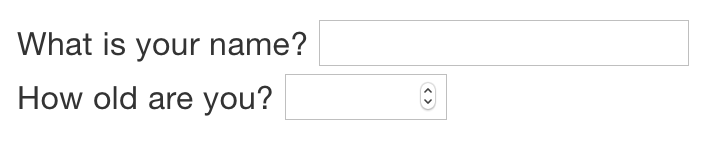

# Formati di R Markdown

## Introduzione

Finora abbiamo visto R Markdown utilizzato per produrre documenti HTML. Questo capitolo offre una breve panoramica di alcuni dei molti altri tipi di output che si possono produrre con R Markdown. Esistono due modi per impostare l'output di un documento:

1.  In modo permanente, modificando l'intestazione YAML: 
    
    ```yaml
    title: "Viridis Demo"
    output: html_document
    ```
    
1.  In modo transitorio, chiamando manualmente `rmarkdown::render()`:
    
    
    ```r
    rmarkdown::render("diamond-sizes.Rmd", output_format = "word_document")
    ```
    
    Questo è utile se si desidera produrre programmaticamente più tipi di output.

Il pulsante knit di RStudio esegue il rendering di un file nel primo formato elencato nel campo `output`. È possibile eseguire il rendering in altri formati facendo clic sul menu a discesa accanto al pulsante knit.


## Opzioni di output

A ogni formato di output è associata una funzione R. Si può scrivere `foo` o `pkg::foo`. Se si omette `pkg`, si assume come predefinito rmarkdown. È importante conoscere il nome della funzione che produce l'output, perché è da lì che si ottiene aiuto. Per esempio, per capire quali parametri si possono impostare con `html_document`, si può consultare `?rmarkdown::html_document`.

Per sovrascrivere i valori predefiniti dei parametri, è necessario utilizzare un campo `output` espanso. Per esempio, se si volesse rendere un `html_document` con un indice fluttuante, si userebbe:

```yaml
output:
  html_document:
    toc: true
    toc_float: true
```

È anche possibile eseguire il rendering su più output fornendo un elenco di formati:

```yaml
output:
  html_document:
    toc: true
    toc_float: true
  pdf_document: default
```

Si noti la sintassi speciale se non si vuole sovrascrivere nessuna delle opzioni predefinite.

## Documenti

Il capitolo precedente si è concentrato sull'output predefinito `html_document`. Esistono diverse variazioni di base su questo tema, che generano diversi tipi di documenti:

* `pdf_document` crea un PDF con LaTeX (un sistema di impaginazione di documenti open source), che è necessario installare. 
    LaTeX (un sistema open source di impaginazione dei documenti), che è necessario installare. RStudio lo richiederà se 
    non l'avete già.
  
* `word_document` per i documenti Microsoft Word (`.docx`).
  
* `odt_document` per i documenti OpenDocument Text (`.odt`).
  
* `rtf_document` per i documenti Rich Text Format (`.rtf`).
  
* `md_document` per un documento Markdown. In genere non è utile di per sé, ma 
    di per sé, ma si potrebbe usare se, per esempio, il CMS aziendale o il wiki del laboratorio
    wiki del laboratorio utilizza markdown.
    
* `github_document`: si tratta di una versione adattata di `md_document` 
    pensata per la condivisione su GitHub. 

Ricordate che quando si genera un documento da condividere con i decisori, è possibile disattivare la visualizzazione predefinita del codice impostando le opzioni globali nel chunk di setup:


```r
knitr::opts_chunk$set(echo = FALSE)
```

Per gli `html_document` un'altra opzione è quella di rendere i pezzi di codice nascosti per impostazione predefinita, ma visibili con un clic:

```yaml
output:
  html_document:
    code_folding: hide
```

## Quaderni

Un quaderno, `html_notebook`, è una variante di un `html_document`. I risultati resi sono molto simili, ma lo scopo è diverso. Un `html_document` è focalizzato sulla comunicazione con i decisori, mentre un notebook è focalizzato sulla collaborazione con altri data scientist. Questi scopi diversi portano a utilizzare l'output HTML in modi diversi. Entrambi gli output HTML contengono l'output completamente renderizzato, ma il blocco note contiene anche il codice sorgente completo. Ciò significa che è possibile utilizzare il file `.nb.html` generato dal blocco note in due modi:

1. È possibile visualizzarlo in un browser Web e vedere l'output renderizzato. A differenza di
   `html_document`, questo rendering comprende sempre una copia incorporata del 
   del codice sorgente che lo ha generato.

1. È possibile modificarlo in RStudio. Quando si apre un file `.nb.html`, RStudio ricrea automaticamente il file `.Rmd`.
   ricreerà automaticamente il file `.Rmd` che lo ha generato. In futuro, sarà possibile 
   in futuro sarà possibile includere anche file di supporto (ad esempio file di dati `.csv`), che verranno estratti automaticamente quando necessario. 
   saranno estratti automaticamente quando necessario. 

L'invio di file `.nb.html` via e-mail è un modo semplice per condividere le analisi con i colleghi. Ma le cose si faranno dolorose non appena vorranno apportare delle modifiche. Se ciò inizia a verificarsi, è il momento di imparare Git e GitHub. Imparare Git e GitHub è sicuramente doloroso all'inizio, ma i vantaggi della collaborazione sono enormi. Come accennato in precedenza, Git e GitHub esulano dallo scopo del libro, ma c'è un suggerimento utile se li si sta già usando: utilizzare entrambi gli output `html_notebook` e `github_document`:

```yaml
output:
  html_notebook: default
  github_document: default
```

`html_notebook` fornisce un'anteprima locale e un file da condividere via e-mail. `github_document` crea un file md minimo che può essere inserito in git. Si può facilmente vedere come i risultati dell'analisi (non solo il codice) cambiano nel tempo e GitHub li renderà online.

## Presentazioni

È anche possibile utilizzare R Markdown per produrre presentazioni. Il controllo visivo è minore rispetto a strumenti come Keynote o PowerPoint, ma l'inserimento automatico dei risultati del codice R in una presentazione può far risparmiare moltissimo tempo. Le presentazioni funzionano dividendo il contenuto in diapositive, con una nuova diapositiva che inizia a ogni intestazione di primo (`#`) o secondo (`##`) livello. È anche possibile inserire una regola orizzontale (`***`) per creare una nuova diapositiva senza intestazione. 

R Markdown è dotato di tre formati di presentazione integrati:

1.  `ioslides_presentation` - Presentazione HTML con ioslides

1.  `slidy_presentation` - presentazione HTML con W3C Slidy

1.  `beamer_presentation` - Presentazione PDF con LaTeX Beamer.

Altri due formati popolari sono forniti da pacchetti:

1.  `revealjs::revealjs_presentation` - Presentazione HTML con reveal.js. 
    Richiede il pacchetto __revealjs__.

1.  __rmdshower__, <https://github.com/MangoTheCat/rmdshower>, fornisce un 
    wrapper attorno a __shower__, <https://github.com/shower/shower>, 
    motore di presentazione

## Cruscotti

I cruscotti sono un modo utile per comunicare grandi quantità di informazioni in modo visivo e veloce. Flexdashboard rende particolarmente facile la creazione di cruscotti usando R Markdown e una convenzione per il modo in cui le intestazioni influenzano il layout:

* Ogni intestazione di livello 1 (`#`) inizia una nuova pagina del dashboard.
* Ogni intestazione di livello 2 (`##`) inizia una nuova colonna.
* Ogni intestazione di livello 3 (`###`) inizia una nuova riga.

Ad esempio, è possibile produrre questo dashboard:


Utilizzando questo codice:


````
---
title: "Diamonds distribution dashboard"
output: flexdashboard::flex_dashboard
---

```{r setup, include = FALSE}
library(ggplot2)
library(dplyr)
knitr::opts_chunk$set(fig.width = 5, fig.asp = 1/3)
```

## Column 1

### Carat

```{r}
ggplot(diamonds, aes(carat)) + geom_histogram(binwidth = 0.1)
```

### Cut

```{r}
ggplot(diamonds, aes(cut)) + geom_bar()
```

### Colour

```{r}
ggplot(diamonds, aes(color)) + geom_bar()
```

## Column 2

### The largest diamonds

```{r}
diamonds %>% 
  arrange(desc(carat)) %>% 
  head(100) %>% 
  select(carat, cut, color, price) %>% 
  DT::datatable()
```
````

Flexdashboard fornisce anche semplici strumenti per la creazione di barre laterali, tabset, caselle di valore e indicatori. Per saperne di più su flexdashboard visitate <http://rmarkdown.rstudio.com/flexdashboard/>.

## Interattività

Qualsiasi formato HTML (documento, blocco note, presentazione o dashboard) può contenere componenti interattivi.

### htmlwidgets

L'HTML è un formato interattivo e si può sfruttare questa interattività con __htmlwidgets__, funzioni di R che producono visualizzazioni HTML interattive. Per esempio, prendete la mappa __leaflet__ qui sotto. Se state visualizzando questa pagina sul web, potete trascinare la mappa, ingrandirla e rimpicciolirla, ecc. Ovviamente non è possibile farlo in un libro, quindi rmarkdown inserisce automaticamente una schermata statica.


```r
library(leaflet)
leaflet() %>%
  setView(174.764, -36.877, zoom = 16) %>% 
  addTiles() %>%
  addMarkers(174.764, -36.877, popup = "Maungawhau") 
```

```{=html}
<div id="htmlwidget-ac96cb3ee4656e2e9ec3" style="width:70%;height:415.296px;" class="leaflet html-widget"></div>
<script type="application/json" data-for="htmlwidget-ac96cb3ee4656e2e9ec3">{"x":{"options":{"crs":{"crsClass":"L.CRS.EPSG3857","code":null,"proj4def":null,"projectedBounds":null,"options":{}}},"setView":[[-36.877,174.764],16,[]],"calls":[{"method":"addTiles","args":["//{s}.tile.openstreetmap.org/{z}/{x}/{y}.png",null,null,{"minZoom":0,"maxZoom":18,"tileSize":256,"subdomains":"abc","errorTileUrl":"","tms":false,"noWrap":false,"zoomOffset":0,"zoomReverse":false,"opacity":1,"zIndex":1,"detectRetina":false,"attribution":"&copy; <a href=\"http://openstreetmap.org\">OpenStreetMap<\/a> contributors, <a href=\"http://creativecommons.org/licenses/by-sa/2.0/\">CC-BY-SA<\/a>"}]},{"method":"addMarkers","args":[-36.877,174.764,null,null,null,{"interactive":true,"draggable":false,"keyboard":true,"title":"","alt":"","zIndexOffset":0,"opacity":1,"riseOnHover":false,"riseOffset":250},"Maungawhau",null,null,null,null,{"interactive":false,"permanent":false,"direction":"auto","opacity":1,"offset":[0,0],"textsize":"10px","textOnly":false,"className":"","sticky":true},null]}],"limits":{"lat":[-36.877,-36.877],"lng":[174.764,174.764]}},"evals":[],"jsHooks":[]}</script>
```

Il bello di htmlwidgets è che non è necessario conoscere nulla di HTML o JavaScript per utilizzarli. Tutti i dettagli sono racchiusi all'interno del pacchetto, quindi non c'è bisogno di preoccuparsi.  

Esistono molti pacchetti che forniscono htmlwidget, tra cui:

* __dygraphs__, <http://rstudio.github.io/dygraphs/>, per la visualizzazione interattiva di serie temporali. 
  serie temporali interattive.

* __DT__, <http://rstudio.github.io/DT/>, per tabelle interattive.

* __threejs__, <https://github.com/bwlewis/rthreejs>, per grafici 3d interattivi.

* __DiagrammeR__, <http://rich-iannone.github.io/DiagrammeR/> per diagrammi (come diagrammi di flusso e semplici diagrammi a nodi).
  (come diagrammi di flusso e semplici diagrammi di collegamento tra nodi).

Per saperne di più sugli htmlwidget e per vedere un elenco più completo dei pacchetti che li forniscono, visitate <http://www.htmlwidgets.org/>.

### Shiny

Gli htmlwidget forniscono l'interattività __client-side__ --- tutta l'interattività avviene nel browser, indipendentemente da R. Da un lato, questo è ottimo perché si può distribuire il file HTML senza alcuna connessione a R. Tuttavia, questo limita fondamentalmente ciò che si può fare alle cose che sono state implementate in HTML e JavaScript.  Un approccio alternativo è quello di utilizzare __shiny__, un pacchetto che consente di creare interattività utilizzando codice R, non JavaScript.

Per richiamare il codice Shiny da un documento R Markdown, aggiungere `runtime: shiny` all'intestazione:

```yaml
title: "Shiny Web App"
output: html_document
runtime: shiny
```

Quindi è possibile utilizzare le funzioni di "input" per aggiungere componenti interattivi al documento:


```r
library(shiny)

textInput("name", "Come ti chiami?")
numericInput("age", "Quanti anni hai?", NA, min = 0, max = 150)
```

È quindi possibile fare riferimento ai valori con `input$name` e `input$age`, e il codice che li utilizza verrà automaticamente rieseguito ogni volta che cambiano. 

Non posso mostrarvi un'applicazione shiny dal vivo perché le interazioni di shiny avvengono sul __lato server__. Ciò significa che è possibile scrivere applicazioni interattive senza conoscere JavaScript, ma è necessario un server su cui eseguirle. Questo introduce un problema logistico: Le applicazioni Shiny hanno bisogno di un server Shiny per essere eseguite online. Quando si eseguono le app shiny sul proprio computer, shiny configura automaticamente un server shiny per l'utente, ma è necessario un server shiny pubblico se si vuole pubblicare questo tipo di interattività online. Questo è il compromesso fondamentale di shiny: in un documento shiny si può fare tutto ciò che si può fare in R, ma è necessario che qualcuno utilizzi R.

Per saperne di più su Shiny, consultare <http://shiny.rstudio.com/>.

## Siti web

Con una piccola infrastruttura aggiuntiva è possibile utilizzare R Markdown per generare un sito web completo:

* Mettere i file `.Rmd` in una singola directory. `index.Rmd` diventerà la 
    la pagina iniziale.

* Aggiungere un file YAML chiamato `_site.yml` che fornisca la navigazione del sito.
    Per esempio:

    
    ```
    name: "my-website"
    navbar:
      title: "My Website"
      left:
        - text: "Home"
          href: index.html
        - text: "Viridis Colors"
          href: 1-example.html
        - text: "Terrain Colors"
          href: 3-inline.html
    ```

Eseguire `rmarkdown::render_site()` per costruire `_site`, una cartella di file pronta per essere distribuita come sito web statico autonomo, o se si usa un progetto RStudio per la cartella del sito web. RStudio aggiungerà una scheda Build all'IDE che si può usare per costruire e visualizzare in anteprima il sito. 

Per saperne di più: <http://rmarkdown.rstudio.com/rmarkdown_websites.html>.

## Altri formati

Altri pacchetti forniscono altri formati di output:

* Il pacchetto __bookdown__, <https://github.com/rstudio/bookdown>, 
    semplifica la scrittura di libri, come questo. Per saperne di più, leggere 
    [_Authoring Books with R Markdown_](https://bookdown.org/yihui/bookdown/),
    di Yihui Xie, che ovviamente è scritto in bookdown. Visitate
    <http://www.bookdown.org> per vedere altri libri in bookdown scritti dalla comunità 
    comunità di R.

* Il pacchetto __prettydoc__, <https://github.com/yixuan/prettydoc/>, 
    fornisce formati di documenti leggeri con una serie di
    temi accattivanti.

* Il pacchetto __rticles__, <https://github.com/rstudio/rticles>, compila una selezione di formati
    una selezione di formati adatti a specifiche riviste scientifiche.

Vedere <http://rmarkdown.rstudio.com/formats.html> per un elenco di altri formati.  È anche possibile crearne uno proprio seguendo le istruzioni di <http://rmarkdown.rstudio.com/developer_custom_formats.html>.

## Imparare di più

Per saperne di più sulla comunicazione efficace in questi diversi formati, vi consiglio le seguenti risorse:

* Per migliorare le vostre capacità di presentazione, vi consiglio 
  [_Presentation Patterns_](https://amzn.com/0321820800), di Neal Ford,
  Matthew McCollough e Nathaniel Schutta. Fornisce una serie di modelli
  efficaci (sia di basso che di alto livello) da applicare per migliorare le vostre presentazioni. 
  presentazioni.
  
* Se tenete conferenze accademiche, vi consiglio di leggere la [_Guida del gruppo Leek
  to giving talks_](https://github.com/jtleek/talkguide).
  
* Non l'ho seguito personalmente, ma ho sentito parlare bene del corso online di Matt 
  McGarrity sul parlare in pubblico: 
  <https://www.coursera.org/learn/public-speaking>.

* Se state creando molti cruscotti, assicuratevi di leggere Stephen Few's
  [Progettazione di cruscotti informativi: La comunicazione visiva efficace dei dati 
  of Data](https://amzn.com/0596100167). Vi aiuterà a creare cruscotti
  che siano veramente utili, non solo belli da vedere.

* Comunicare in modo efficace le proprie idee spesso si avvantaggia di qualche
  conoscenza del design grafico. Il libro [_Il design per non designer
  Book_](http://amzn.com/0133966151) è un ottimo punto di partenza.

