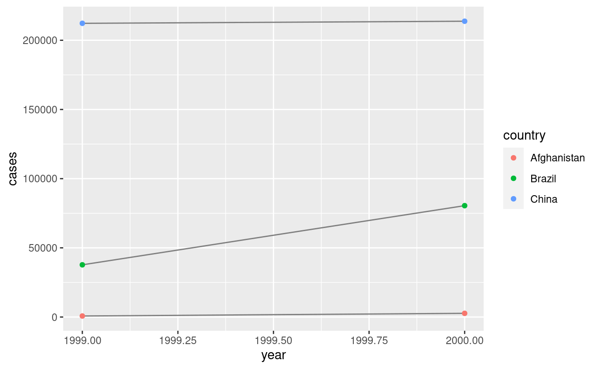

# Tidy data

## Introduzione

> "Le famiglie felici sono tutte uguali; ogni famiglia infelice è infelice a modo suo". --- Leo Tolstoy

> "Le serie di dati ordinate sono tutte uguali, ma ogni serie di dati disordinata è disordinata a modo suo". --- Hadley Wickham

In questo capitolo, imparerete un modo coerente per organizzare i vostri dati in R, un'organizzazione chiamata __tidy data__. Mettere i vostri dati in questo formato richiede un po' di lavoro iniziale, ma questo lavoro ripaga nel lungo termine. Una volta che avete dati ordinati e gli strumenti ordinati forniti dai pacchetti del tidyverse, passerete molto meno tempo a mescolare i dati da una rappresentazione all'altra, permettendovi di dedicare più tempo alle domande analitiche che avete a disposizione.

Questo capitolo vi darà un'introduzione pratica ai 'tidy data'(dati ordinati, organizzati) e agli strumenti di accompagnamento nel pacchetto __tidyr__. Se volete saperne di più sulla teoria sottostante, potreste apprezzare il documento *Tidy Data* pubblicato nel Journal of Statistical Software, <http://www.jstatsoft.org/v59/i10/paper>.

### Prerequisiti

In questo capitolo ci concentreremo su tidyr, un pacchetto che fornisce una serie di strumenti per aiutare a riordinare i vostri insiemi di dati disordinati. tidyr è un membro del core tidyverse.


```r
library(tidyverse)
```

## Tidy data

È possibile rappresentare gli stessi dati sottostanti in più modi. L'esempio qui sotto mostra gli stessi dati organizzati in quattro modi diversi. Ogni set di dati mostra gli stessi valori di quattro variabili *paese*, *anno*, *popolazione*, e *casi*, ma ogni set di dati organizza i valori in un modo diverso.


```r
table1
#> # A tibble: 6 × 4
#>   country      year  cases population
#>   <chr>       <int>  <int>      <int>
#> 1 Afghanistan  1999    745   19987071
#> 2 Afghanistan  2000   2666   20595360
#> 3 Brazil       1999  37737  172006362
#> 4 Brazil       2000  80488  174504898
#> 5 China        1999 212258 1272915272
#> 6 China        2000 213766 1280428583
table2
#> # A tibble: 12 × 4
#>   country      year type           count
#>   <chr>       <int> <chr>          <int>
#> 1 Afghanistan  1999 cases            745
#> 2 Afghanistan  1999 population  19987071
#> 3 Afghanistan  2000 cases           2666
#> 4 Afghanistan  2000 population  20595360
#> 5 Brazil       1999 cases          37737
#> 6 Brazil       1999 population 172006362
#> # … with 6 more rows
table3
#> # A tibble: 6 × 3
#>   country      year rate             
#> * <chr>       <int> <chr>            
#> 1 Afghanistan  1999 745/19987071     
#> 2 Afghanistan  2000 2666/20595360    
#> 3 Brazil       1999 37737/172006362  
#> 4 Brazil       2000 80488/174504898  
#> 5 China        1999 212258/1272915272
#> 6 China        2000 213766/1280428583

# Distribuito su due tibble
table4a  # casi
#> # A tibble: 3 × 3
#>   country     `1999` `2000`
#> * <chr>        <int>  <int>
#> 1 Afghanistan    745   2666
#> 2 Brazil       37737  80488
#> 3 China       212258 213766
table4b  # popolazione
#> # A tibble: 3 × 3
#>   country         `1999`     `2000`
#> * <chr>            <int>      <int>
#> 1 Afghanistan   19987071   20595360
#> 2 Brazil       172006362  174504898
#> 3 China       1272915272 1280428583
```

Sono tutte rappresentazioni degli stessi dati sottostanti, ma non sono ugualmente facili da usare. Un dataset, il dataset ordinato, sarà molto più facile da lavorare all'interno del tidyverse. 

Ci sono tre regole correlate che rendono un dataset ordinato:

1.  Ogni variabile deve avere la propria colonna.
1.  Ogni osservazione deve avere la sua riga.
1.  Ogni valore deve avere la propria cella.

La figura \@ref(fig:tidy-structure) mostra visivamente le regole.

<div class="figure" style="text-align: center">

<p class="caption">(\#fig:tidy-structure)Seguire tre regole rende un set di dati ordinato: le variabili sono nelle colonne, le osservazioni sono nelle righe e i valori sono nelle celle.</p>
</div>

Queste tre regole sono interrelate perché è impossibile soddisfare solo due delle tre. Questa interrelazione porta ad un insieme ancora più semplice di istruzioni pratiche:

1.  Metti ogni set di dati in una tibble.
1.  Metti ogni variabile in una colonna.

In questo esempio, solo la `table1` è ordinata. È l'unica rappresentazione in cui ogni colonna è una variabile.

Perché assicurarsi che i dati siano ordinati? Ci sono due vantaggi principali:

1.  C'è un vantaggio generale nel scegliere un modo coerente di memorizzare
    dati. Se hai una struttura di dati coerente, è più facile imparare gli
    strumenti che lavorano con essa perché hanno un'uniformità di fondo.
    
1.  C'è un vantaggio specifico nel mettere le variabili in colonne perché
    permette alla natura vettoriale di R di brillare. Come avete imparato in
    [mutate](#mutate-funs) e [riassunti raggruppati](#summary-funs), la maggior parte 
    funzioni built-in di R lavorano con vettori di valori. Questo rende la trasformazione 
    dati ordinati in modo particolarmente naturale.

dplyr, ggplot2 e tutti gli altri pacchetti del tidyverse sono progettati per lavorare con dati ordinati. Ecco un paio di piccoli esempi che mostrano come potreste lavorare con `table1`.

```r
# Calcolare il tasso per 10.000
table1 %>% 
  mutate(rate = cases / population * 10000)
#> # A tibble: 6 × 5
#>   country      year  cases population  rate
#>   <chr>       <int>  <int>      <int> <dbl>
#> 1 Afghanistan  1999    745   19987071 0.373
#> 2 Afghanistan  2000   2666   20595360 1.29 
#> 3 Brazil       1999  37737  172006362 2.19 
#> 4 Brazil       2000  80488  174504898 4.61 
#> 5 China        1999 212258 1272915272 1.67 
#> 6 China        2000 213766 1280428583 1.67

# Calcolare i casi per anno
table1 %>% 
  count(year, wt = cases)
#> # A tibble: 2 × 2
#>    year      n
#>   <int>  <int>
#> 1  1999 250740
#> 2  2000 296920

# Visualizzare i cambiamenti nel tempo
library(ggplot2)
ggplot(table1, aes(year, cases)) + 
  geom_line(aes(group = country), colour = "grey50") + 
  geom_point(aes(colour = country))
```



### Esercizi

1.  Usando la prosa, descrivete come sono organizzate le variabili e le osservazioni in
    ciascuna delle tabelle di esempio.

1.  Calcola il `rate` per la `table2`, e la `table4a` + `table4b`. 
    Dovrai eseguire quattro operazioni:

    1.  Estrarre il numero di casi di TBC per paese e per anno.
    1.  Estrarre la popolazione corrispondente per paese e per anno.
    1.  Dividere i casi per la popolazione e moltiplicare per 10000.
    1.  Memorizzare di nuovo nel posto appropriato.
    
    Quale rappresentazione è più facile da lavorare? Qual è la più difficile? Perché?

1.  Ricreate il grafico che mostra il cambiamento dei casi nel tempo usando la `tabella2
    invece di `table1`. Cosa devi fare per prima cosa?

## Pivoting

I principi dei tidy data sembrano così ovvi che potreste chiedervi se incontrerete mai un set di dati che non sia ordinato. Sfortunatamente, però, la maggior parte dei dati che incontrerete saranno disordinati. Ci sono due ragioni principali:

1.  La maggior parte delle persone non ha familiarità con i principi dei dati ordinati, ed è difficile
    ricavarli da soli, a meno che non si passi molto tempo a lavorare con i dati.
    
1.  I dati sono spesso organizzati per facilitare qualche uso diverso dall'analisi. Per 
    esempio, i dati sono spesso organizzati per rendere l'inserimento il più facile possibile.
    
Questo significa che per la maggior parte delle analisi reali, dovrete fare un po' di ordine. Il primo passo è sempre quello di capire quali sono le variabili e le osservazioni. A volte questo è facile; altre volte avrete bisogno di consultare le persone che hanno originariamente generato i dati. 
Il secondo passo è quello di risolvere uno dei due problemi comuni:

1. Una variabile potrebbe essere distribuita su più colonne.

1. Un'osservazione potrebbe essere sparsa su più righe.

Tipicamente un set di dati soffrirà solo di uno di questi problemi; soffrirà di entrambi solo se siete davvero sfortunati! Per risolvere questi problemi, avrete bisogno delle due funzioni più importanti di tidyr: `pivot_longer()` e `pivot_wider()`.

### Longer

Un problema comune è un dataset dove alcuni dei nomi delle colonne non sono nomi di variabili, ma _valori_ di una variabile. Prendete la `table4a`: i nomi delle colonne `1999` e `2000` rappresentano i valori della variabile `year`, i valori nelle colonne `1999` e `2000` rappresentano i valori della variabile `cases`, e ogni riga rappresenta due osservazioni, non una.


```r
table4a
#> # A tibble: 3 × 3
#>   country     `1999` `2000`
#> * <chr>        <int>  <int>
#> 1 Afghanistan    745   2666
#> 2 Brazil       37737  80488
#> 3 China       212258 213766
```

Per riordinare un set di dati come questo, abbiamo bisogno di __pivot__ le colonne offensive in una nuova coppia di variabili. Per descrivere questa operazione abbiamo bisogno di tre parametri:

* L'insieme delle colonne i cui nomi sono valori, non variabili. In questo esempio, 
  queste sono le colonne `1999` e `2000`.

* Il nome della variabile in cui spostare i nomi delle colonne. Qui è `year`.

* Il nome della variabile in cui spostare i valori della colonna. Qui è `case`.
  
Insieme questi parametri generano la chiamata a `pivot_longer()`:


```r
table4a %>% 
  pivot_longer(c(`1999`, `2000`), names_to = "year", values_to = "cases")
#> # A tibble: 6 × 3
#>   country     year   cases
#>   <chr>       <chr>  <int>
#> 1 Afghanistan 1999     745
#> 2 Afghanistan 2000    2666
#> 3 Brazil      1999   37737
#> 4 Brazil      2000   80488
#> 5 China       1999  212258
#> 6 China       2000  213766
```

Le colonne per fare il pivot sono specificate con la notazione in stile `dplyr::select()`. Qui ci sono solo due colonne, quindi le elenchiamo singolarmente. Notate che "1999" e "2000" sono nomi non sintattici (perché non iniziano con una lettera), quindi dobbiamo circondarli di backtick. Per rinfrescarti la memoria sugli altri modi di selezionare le colonne, vedi [select](#select).

`year` e `cases` non esistono in `table4a` quindi mettiamo i loro nomi tra virgolette.

<div class="figure" style="text-align: center">

<p class="caption">(\#fig:tidy-gather)Pivot di `table4` in forma 'long' e ordinata.</p>
</div>

Nel risultato finale, le colonne pivotate vengono eliminate e si ottengono nuove colonne `year` e `cases`. Altrimenti, le relazioni tra le variabili originali sono conservate. Visivamente, questo è mostrato nella figura \@ref(fig:tidy-gather).

La funzione `pivot_longer()` rende i set di dati più lunghi aumentando il numero di righe e diminuendo il numero di colonne. Non credo che abbia senso descrivere un set di dati come se fosse in "forma lunga". La lunghezza è un termine relativo, e si può solo dire (per esempio) che il dataset A è più lungo del dataset B.

Possiamo usare `pivot_longer()` per riordinare `table4b` in modo simile. L'unica differenza è la variabile memorizzata nei valori delle celle:


```r
table4b %>% 
  pivot_longer(c(`1999`, `2000`), names_to = "year", values_to = "population")
#> # A tibble: 6 × 3
#>   country     year  population
#>   <chr>       <chr>      <int>
#> 1 Afghanistan 1999    19987071
#> 2 Afghanistan 2000    20595360
#> 3 Brazil      1999   172006362
#> 4 Brazil      2000   174504898
#> 5 China       1999  1272915272
#> 6 China       2000  1280428583
```

Per combinare le versioni riordinate di `table4a` e `table4b` in una singola tibble, dobbiamo usare `dplyr::left_join()`, che imparerai in [dati relazionali].


```r
tidy4a <- table4a %>% 
  pivot_longer(c(`1999`, `2000`), names_to = "year", values_to = "cases")
tidy4b <- table4b %>% 
  pivot_longer(c(`1999`, `2000`), names_to = "year", values_to = "population")
left_join(tidy4a, tidy4b)
#> Joining, by = c("country", "year")
#> # A tibble: 6 × 4
#>   country     year   cases population
#>   <chr>       <chr>  <int>      <int>
#> 1 Afghanistan 1999     745   19987071
#> 2 Afghanistan 2000    2666   20595360
#> 3 Brazil      1999   37737  172006362
#> 4 Brazil      2000   80488  174504898
#> 5 China       1999  212258 1272915272
#> 6 China       2000  213766 1280428583
```

### Wider

`pivot_wider()` è l'opposto di `pivot_longer()`. Si usa quando un'osservazione è sparsa su più righe. Per esempio, prendete la `table2`: un'osservazione è un paese in un anno, ma ogni osservazione è sparsa su due righe.


```r
table2
#> # A tibble: 12 × 4
#>   country      year type           count
#>   <chr>       <int> <chr>          <int>
#> 1 Afghanistan  1999 cases            745
#> 2 Afghanistan  1999 population  19987071
#> 3 Afghanistan  2000 cases           2666
#> 4 Afghanistan  2000 population  20595360
#> 5 Brazil       1999 cases          37737
#> 6 Brazil       1999 population 172006362
#> # … with 6 more rows
```

Per riordinare il tutto, analizziamo prima la rappresentazione in modo simile a `pivot_longer()`. Questa volta, però, abbiamo bisogno solo di due parametri:

* La colonna da cui prendere i nomi delle variabili. Qui è `type`.

* La colonna da cui prendere i valori. Qui è `count`.

Una volta capito questo, possiamo usare `pivot_wider()`, come mostrato programmaticamente qui sotto, e visivamente nella figura \@ref(fig:tidy-spread).


```r
table2 %>%
    pivot_wider(names_from = type, values_from = count)
#> # A tibble: 6 × 4
#>   country      year  cases population
#>   <chr>       <int>  <int>      <int>
#> 1 Afghanistan  1999    745   19987071
#> 2 Afghanistan  2000   2666   20595360
#> 3 Brazil       1999  37737  172006362
#> 4 Brazil       2000  80488  174504898
#> 5 China        1999 212258 1272915272
#> 6 China        2000 213766 1280428583
```

<div class="figure" style="text-align: center">

<p class="caption">(\#fig:tidy-spread)Pivoting `table2` into a "wider", tidy form.</p>
</div>

Come avrete capito dai loro nomi, `pivot_wider()` e `pivot_longer()` sono complementari. `pivot_longer()` rende le tabelle larghe più strette e lunghe; `pivot_wider()` rende le tabelle lunghe più corte e larghe.

### Esercizi

1.  Perché i metodi `pivot_longer()` e `pivot_wider()` non sono perfettamente simmetrici?  
    Considerate attentamente il seguente esempio:
    
    
    ```r
    stocks <- tibble(
      year   = c(2015, 2015, 2016, 2016),
      half  = c(   1,    2,     1,    2),
      return = c(1.88, 0.59, 0.92, 0.17)
    )
    stocks %>% 
      pivot_wider(names_from = year, values_from = return) %>% 
      pivot_longer(`2015`:`2016`, names_to = "year", values_to = "return")
    ```
    
    (Suggerimento: guardate i tipi di variabili e pensate ai _nomi_ delle colonne).
    
    `pivot_longer()` ha un argomento `names_ptypes`, per esempio 
    `names_ptypes = list(year = double())`. Cosa fa?

1.  Perché questo codice fallisce?

    
    ```r
    table4a %>% 
      pivot_longer(c(1999, 2000), names_to = "year", values_to = "cases")
    #> Error: Can't subset columns that don't exist.
    #> ✖ Locations 1999 and 2000 don't exist.
    #> ℹ There are only 3 columns.
    ```

1.  Cosa succederebbe se allargassi questa tabella? Perché? Come potresti aggiungere una nuova colonna per identificare in modo univoco ogni valore?

    
    ```r
    people <- tribble(
      ~name,             ~names,  ~values,
      #-----------------|--------|------
      "Phillip Woods",   "age",       45,
      "Phillip Woods",   "height",   186,
      "Phillip Woods",   "age",       50,
      "Jessica Cordero", "age",       37,
      "Jessica Cordero", "height",   156
    )
    ```

1.  Metti in ordine la semplice tibble qui sotto. Devi renderla più larga o più lunga, quali sono le variabili?

    
    ```r
    preg <- tribble(
      ~pregnant, ~male, ~female,
      "yes",     NA,    10,
      "no",      20,    12
    )
    ```

## Separare e unire

Finora hai imparato come mettere in ordine `table2` e `table4`, ma non `table3`. La `table3` ha un problema diverso: abbiamo una colonna (`rate`) che contiene due variabili (`casi` e `popolazione`). Per risolvere questo problema, avremo bisogno della funzione `separate()`. Imparerete anche il complemento di `separate()`: `unite()`, che si usa se una singola variabile è distribuita su più colonne.

### Separare

La funzione `separate()` separa una colonna in colonne multiple, dividendo ogni volta che appare un carattere separatore. Prendiamo ad esempio `table3`:


```r
table3
#> # A tibble: 6 × 3
#>   country      year rate             
#> * <chr>       <int> <chr>            
#> 1 Afghanistan  1999 745/19987071     
#> 2 Afghanistan  2000 2666/20595360    
#> 3 Brazil       1999 37737/172006362  
#> 4 Brazil       2000 80488/174504898  
#> 5 China        1999 212258/1272915272
#> 6 China        2000 213766/1280428583
```

La colonna `rate` contiene entrambe le variabili `cases` e `population`, e abbiamo bisogno di dividerla in due variabili. La funzione `separate()` prende il nome della colonna da separare e i nomi delle colonne in cui separare, come mostrato nella figura \@ref(fig:tidy-separate) e nel codice sottostante.


```r
table3 %>% 
  separate(rate, into = c("cases", "population"))
#> # A tibble: 6 × 4
#>   country      year cases  population
#>   <chr>       <int> <chr>  <chr>     
#> 1 Afghanistan  1999 745    19987071  
#> 2 Afghanistan  2000 2666   20595360  
#> 3 Brazil       1999 37737  172006362 
#> 4 Brazil       2000 80488  174504898 
#> 5 China        1999 212258 1272915272
#> 6 China        2000 213766 1280428583
```

<div class="figure" style="text-align: center">

<p class="caption">(\#fig:tidy-separate)Separating `table3` makes it tidy</p>
</div>

Per default, `separate()` dividerà i valori ovunque veda un carattere non alfanumerico (cioè un carattere che non sia un numero o una lettera). Per esempio, nel codice qui sopra, `separate()` divide i valori di `rate` in corrispondenza dei caratteri 'forward slash'. Se volete usare un carattere specifico per separare una colonna, potete passare il carattere all'argomento `sep` di `separate()`. Per esempio, potremmo riscrivere il codice sopra come:


```r
table3 %>% 
  separate(rate, into = c("cases", "population"), sep = "/")
```

(Formalmente, `sep` è un'espressione regolare, di cui imparerai di più in [stringhe]).

Guardate attentamente i tipi di colonna: noterete che `cases` e `population` sono colonne di caratteri. Questo è il comportamento predefinito di `separate()`: lascia il tipo di colonna così com'è. Qui, tuttavia, non è molto utile, dato che sono davvero numeri. Possiamo chiedere a `separate()` di provare a convertire in tipi migliori usando `convert = TRUE`.:


```r
table3 %>% 
  separate(rate, into = c("cases", "population"), convert = TRUE)
#> # A tibble: 6 × 4
#>   country      year  cases population
#>   <chr>       <int>  <int>      <int>
#> 1 Afghanistan  1999    745   19987071
#> 2 Afghanistan  2000   2666   20595360
#> 3 Brazil       1999  37737  172006362
#> 4 Brazil       2000  80488  174504898
#> 5 China        1999 212258 1272915272
#> 6 China        2000 213766 1280428583
```

Potete anche passare un vettore di interi a `sep`. `separate()` interpreterà gli interi come posizioni in cui dividere. I valori positivi partono da 1 all'estrema sinistra delle stringhe; i valori negativi partono da -1 all'estrema destra delle stringhe. Quando si usano gli interi per separare le stringhe, la lunghezza di `sep` dovrebbe essere inferiore al numero di nomi in `into`.

Puoi usare questa disposizione per separare le ultime due cifre di ogni anno. Questo rende questi dati meno ordinati, ma è utile in altri casi, come vedrai tra poco.


```r
table3 %>% 
  separate(year, into = c("century", "year"), sep = 2)
#> # A tibble: 6 × 4
#>   country     century year  rate             
#>   <chr>       <chr>   <chr> <chr>            
#> 1 Afghanistan 19      99    745/19987071     
#> 2 Afghanistan 20      00    2666/20595360    
#> 3 Brazil      19      99    37737/172006362  
#> 4 Brazil      20      00    80488/174504898  
#> 5 China       19      99    212258/1272915272
#> 6 China       20      00    213766/1280428583
```

### Unite

`unite()`è l'inverso di `separate()`: combina colonne multiple in una singola colonna. Ti servirà molto meno frequentemente di `separate()`, ma è comunque uno strumento utile da avere in tasca.

<div class="figure" style="text-align: center">

<p class="caption">(\#fig:tidy-unite)Uniting `table5` makes it tidy</p>
</div>

Possiamo usare `unite()` per riunire le colonne *century* e *year* che abbiamo creato nell'ultimo esempio. Questi dati vengono salvati come `tidyr::table5`. `unite()` prende un data frame, il nome della nuova variabile da creare e un insieme di colonne da combinare, sempre specificate in stile `dplyr::select()`:


```r
table5 %>% 
  unite(new, century, year)
#> # A tibble: 6 × 3
#>   country     new   rate             
#>   <chr>       <chr> <chr>            
#> 1 Afghanistan 19_99 745/19987071     
#> 2 Afghanistan 20_00 2666/20595360    
#> 3 Brazil      19_99 37737/172006362  
#> 4 Brazil      20_00 80488/174504898  
#> 5 China       19_99 212258/1272915272
#> 6 China       20_00 213766/1280428583
```

In questo caso dobbiamo anche usare l'argomento `sep`. Il default metterà un underscore (`_`) tra i valori delle diverse colonne. Qui non vogliamo nessun separatore quindi usiamo `""`:


```r
table5 %>% 
  unite(new, century, year, sep = "")
#> # A tibble: 6 × 3
#>   country     new   rate             
#>   <chr>       <chr> <chr>            
#> 1 Afghanistan 1999  745/19987071     
#> 2 Afghanistan 2000  2666/20595360    
#> 3 Brazil      1999  37737/172006362  
#> 4 Brazil      2000  80488/174504898  
#> 5 China       1999  212258/1272915272
#> 6 China       2000  213766/1280428583
```

### Esercizi

1.  Cosa fanno gli argomenti `extra` e `fill` in `separate()`? 
    Sperimentate le varie opzioni per i seguenti due set di dati giocattolo.
    
    
    ```r
    tibble(x = c("a,b,c", "d,e,f,g", "h,i,j")) %>% 
      separate(x, c("one", "two", "three"))
    
    tibble(x = c("a,b,c", "d,e", "f,g,i")) %>% 
      separate(x, c("one", "two", "three"))
    ```

1.  Sia `unite()` che `separate()` hanno un argomento `remove`. Che cosa fa
    fa? Perché dovreste impostarlo a `FALSE`?

1.  Confrontate e contrapponete `separate()` e `extract()`.  Perché ci sono
    tre varianti di separazione (per posizione, per separatore e con
    gruppi), ma solo una unite?

## Valori mancanti

Cambiare la rappresentazione di un set di dati fa emergere un'importante sottigliezza sui valori mancanti. Sorprendentemente, un valore può essere mancante in uno dei due modi possibili:

* __Esplicitamente__, cioè contrassegnato da `NA`.
* __Implicitamente__, cioè semplicemente non presente nei dati.

Illustriamo questa idea con un insieme di dati molto semplice:


```r
stocks <- tibble(
  year   = c(2015, 2015, 2015, 2015, 2016, 2016, 2016),
  qtr    = c(   1,    2,    3,    4,    2,    3,    4),
  return = c(1.88, 0.59, 0.35,   NA, 0.92, 0.17, 2.66)
)
```

Ci sono due valori mancanti in questo set di dati:

* Il rendimento per il quarto trimestre del 2015 è esplicitamente mancante, perché
  la cella dove dovrebbe essere il suo valore contiene invece `NA`.
  
* Il rendimento per il primo trimestre del 2016 è implicitamente mancante, perché
  semplicemente non appare nel set di dati.
  
Un modo per pensare alla differenza è con questo koan zen: Un valore mancante esplicito è la presenza di un'assenza; un valore mancante implicito è l'assenza di una presenza.

Il modo in cui un set di dati è rappresentato può rendere espliciti i valori impliciti. Per esempio, possiamo rendere esplicito il valore mancante implicito mettendo gli anni nelle colonne:


```r
stocks %>% 
  pivot_wider(names_from = year, values_from = return)
#> # A tibble: 4 × 3
#>     qtr `2015` `2016`
#>   <dbl>  <dbl>  <dbl>
#> 1     1   1.88  NA   
#> 2     2   0.59   0.92
#> 3     3   0.35   0.17
#> 4     4  NA      2.66
```

Poiché questi valori mancanti espliciti potrebbero non essere importanti in altre rappresentazioni dei dati, potete impostare `values_drop_na = TRUE` in `pivot_longer()` per rendere impliciti i valori mancanti espliciti:


```r
stocks %>% 
  pivot_wider(names_from = year, values_from = return) %>% 
  pivot_longer(
    cols = c(`2015`, `2016`), 
    names_to = "year", 
    values_to = "return", 
    values_drop_na = TRUE
  )
#> # A tibble: 6 × 3
#>     qtr year  return
#>   <dbl> <chr>  <dbl>
#> 1     1 2015    1.88
#> 2     2 2015    0.59
#> 3     2 2016    0.92
#> 4     3 2015    0.35
#> 5     3 2016    0.17
#> 6     4 2016    2.66
```

Un altro importante strumento per rendere espliciti i valori mancanti nei dati ordinati è `complete()`:


```r
stocks %>% 
  complete(year, qtr)
#> # A tibble: 8 × 3
#>    year   qtr return
#>   <dbl> <dbl>  <dbl>
#> 1  2015     1   1.88
#> 2  2015     2   0.59
#> 3  2015     3   0.35
#> 4  2015     4  NA   
#> 5  2016     1  NA   
#> 6  2016     2   0.92
#> # … with 2 more rows
```

`complete()` prende un insieme di colonne e trova tutte le combinazioni uniche. Poi si assicura che il dataset originale contenga tutti quei valori, riempiendo i `NA` espliciti dove necessario.

C'è un altro importante strumento che dovreste conoscere per lavorare con i valori mancanti. A volte, quando una fonte di dati è stata usata principalmente per l'inserimento di dati, i valori mancanti indicano che il valore precedente dovrebbe essere portato avanti:


```r
treatment <- tribble(
  ~ person,           ~ treatment, ~response,
  "Derrick Whitmore", 1,           7,
  NA,                 2,           10,
  NA,                 3,           9,
  "Katherine Burke",  1,           4
)
```

Potete riempire questi valori mancanti con `fill()`. Prende un insieme di colonne in cui volete che i valori mancanti siano sostituiti dal più recente valore non mancante (a volte chiamato ultima osservazione portata avanti).


```r
treatment %>% 
  fill(person)
#> # A tibble: 4 × 3
#>   person           treatment response
#>   <chr>                <dbl>    <dbl>
#> 1 Derrick Whitmore         1        7
#> 2 Derrick Whitmore         2       10
#> 3 Derrick Whitmore         3        9
#> 4 Katherine Burke          1        4
```

### Esercizi

1.  Confrontate e contrapponete gli argomenti di `fill` a `pivot_wider()` e `complete()`. 

1.  Cosa fa l'argomento direction di `fill()`?

## Caso di studio

Per finire il capitolo, mettiamo insieme tutto quello che abbiamo imparato per affrontare un realistico problema di riordino dei dati. Il dataset `tidyr::who` contiene casi di tubercolosi (TB) suddivisi per anno, paese, età, sesso e metodo di diagnosi. I dati provengono dal *2014 World Health Organization Global Tuberculosis Report*, disponibile su <http://www.who.int/tb/country/data/download/en/>.

C'è una ricchezza di informazioni epidemiologiche in questo set di dati, ma è impegnativo lavorare con i dati nella forma in cui sono forniti:


```r
who
#> # A tibble: 7,240 × 60
#>   country   iso2  iso3   year new_sp_m014 new_sp_m1524 new_sp_m2534 new_sp_m3544
#>   <chr>     <chr> <chr> <int>       <int>        <int>        <int>        <int>
#> 1 Afghanis… AF    AFG    1980          NA           NA           NA           NA
#> 2 Afghanis… AF    AFG    1981          NA           NA           NA           NA
#> 3 Afghanis… AF    AFG    1982          NA           NA           NA           NA
#> 4 Afghanis… AF    AFG    1983          NA           NA           NA           NA
#> 5 Afghanis… AF    AFG    1984          NA           NA           NA           NA
#> 6 Afghanis… AF    AFG    1985          NA           NA           NA           NA
#> # … with 7,234 more rows, and 52 more variables: new_sp_m4554 <int>,
#> #   new_sp_m5564 <int>, new_sp_m65 <int>, new_sp_f014 <int>,
#> #   new_sp_f1524 <int>, new_sp_f2534 <int>, new_sp_f3544 <int>,
#> #   new_sp_f4554 <int>, new_sp_f5564 <int>, new_sp_f65 <int>,
#> #   new_sn_m014 <int>, new_sn_m1524 <int>, new_sn_m2534 <int>,
#> #   new_sn_m3544 <int>, new_sn_m4554 <int>, new_sn_m5564 <int>,
#> #   new_sn_m65 <int>, new_sn_f014 <int>, new_sn_f1524 <int>, …
```

Questo è un tipico set di dati della vita reale. Contiene colonne ridondanti, codici variabili strani e molti valori mancanti. In breve, `who` è disordinato, e avremo bisogno di più passi per metterlo in ordine. Come dplyr, tidyr è progettato in modo che ogni funzione faccia bene una cosa. Questo significa che in situazioni reali avrete bisogno di mettere insieme più verbi in una pipeline. 

Il posto migliore per iniziare è quasi sempre quello di riunire le colonne che non sono variabili. Diamo un'occhiata a quello che abbiamo: 

* Sembra che `country`, `iso2` e `iso3` siano tre variabili che 
  specificano in modo ridondante il paese.
  
* Anche `year` è chiaramente una variabile.

* Non sappiamo ancora quali siano tutte le altre colonne, ma data la struttura 
  nei nomi delle variabili (es. `new_sp_m014`, `new_ep_m014`, `new_ep_f014`) 
  è probabile che questi siano valori, non variabili.

Quindi abbiamo bisogno di raccogliere tutte le colonne da `new_sp_m014` a `newrel_f65`. Non sappiamo ancora cosa rappresentano questi valori, quindi daremo loro il nome generico di `"key"`. Sappiamo che le celle rappresentano il numero di casi, quindi useremo la variabile `cases`. Ci sono molti valori mancanti nella rappresentazione attuale, quindi per ora useremo `values_drop_na` solo per concentrarci sui valori che sono presenti.


```r
who1 <- who %>% 
  pivot_longer(
    cols = new_sp_m014:newrel_f65, 
    names_to = "key", 
    values_to = "cases", 
    values_drop_na = TRUE
  )
who1
#> # A tibble: 76,046 × 6
#>   country     iso2  iso3   year key          cases
#>   <chr>       <chr> <chr> <int> <chr>        <int>
#> 1 Afghanistan AF    AFG    1997 new_sp_m014      0
#> 2 Afghanistan AF    AFG    1997 new_sp_m1524    10
#> 3 Afghanistan AF    AFG    1997 new_sp_m2534     6
#> 4 Afghanistan AF    AFG    1997 new_sp_m3544     3
#> 5 Afghanistan AF    AFG    1997 new_sp_m4554     5
#> 6 Afghanistan AF    AFG    1997 new_sp_m5564     2
#> # … with 76,040 more rows
```

Possiamo avere qualche indizio sulla struttura dei valori nella nuova colonna "key" contandoli:


```r
who1 %>% 
  count(key)
#> # A tibble: 56 × 2
#>   key              n
#>   <chr>        <int>
#> 1 new_ep_f014   1032
#> 2 new_ep_f1524  1021
#> 3 new_ep_f2534  1021
#> 4 new_ep_f3544  1021
#> 5 new_ep_f4554  1017
#> 6 new_ep_f5564  1017
#> # … with 50 more rows
```

Potresti essere in grado di analizzarlo da solo con un po' di ragionamento e qualche esperimento, ma fortunatamente abbiamo il dizionario dei dati a portata di mano. Ci dice:

1.  Le prime tre lettere di ogni colonna indicano se la colonna 
    contiene nuovi o vecchi casi di TBC. In questo set di dati, ogni colonna contiene 
    nuovi casi.

1.  Le due lettere successive descrivono il tipo di TBC:
    
    * `rel` sta per i casi di ricaduta
    * `ep` sta per i casi di TB extrapolmonare
    * `sn` sta per i casi di TB polmonare che non possono essere diagnosticati da 
        uno striscio polmonare (striscio negativo)
    * `sp` sta per i casi di TB polmonare che potrebbero essere diagnosticati da 
        uno striscio polmonare (striscio positivo)

3.  La sesta lettera indica il sesso dei pazienti con TB. Il dataset raggruppa 
    casi per maschi (`m`) e femmine (`f`).

4.  I numeri rimanenti danno il gruppo di età. Il set di dati raggruppa i casi in 
    sette gruppi di età:
    
    * `014` = 0 -- 14 anni
    * `1524` = 15 -- 24 anni
    * `2534` = 25 -- 34 anni
    * `3544` = 35 -- 44 anni
    * `4554` = 45 -- 54 anni
    * `5564` = 55 -- 64 anni
    * `65` = 65 anni o più

Dobbiamo fare una piccola correzione al formato dei nomi delle colonne: sfortunatamente i nomi sono leggermente incoerenti perché invece di `new_rel` abbiamo `newrel` (è difficile da notare qui, ma se non lo correggi avremo degli errori nei passi successivi). Imparerai a conoscere `str_replace()` in [strings], ma l'idea di base è abbastanza semplice: sostituisci i caratteri "newrel" con "new_rel". Questo rende coerenti tutti i nomi delle variabili.


```r
who2 <- who1 %>% 
  mutate(key = stringr::str_replace(key, "newrel", "new_rel"))
who2
#> # A tibble: 76,046 × 6
#>   country     iso2  iso3   year key          cases
#>   <chr>       <chr> <chr> <int> <chr>        <int>
#> 1 Afghanistan AF    AFG    1997 new_sp_m014      0
#> 2 Afghanistan AF    AFG    1997 new_sp_m1524    10
#> 3 Afghanistan AF    AFG    1997 new_sp_m2534     6
#> 4 Afghanistan AF    AFG    1997 new_sp_m3544     3
#> 5 Afghanistan AF    AFG    1997 new_sp_m4554     5
#> 6 Afghanistan AF    AFG    1997 new_sp_m5564     2
#> # … with 76,040 more rows
```

Possiamo separare i valori in ogni codice con due passaggi di `separate()`. Il primo passaggio dividerà i codici ad ogni trattino basso.


```r
who3 <- who2 %>% 
  separate(key, c("new", "type", "sexage"), sep = "_")
who3
#> # A tibble: 76,046 × 8
#>   country     iso2  iso3   year new   type  sexage cases
#>   <chr>       <chr> <chr> <int> <chr> <chr> <chr>  <int>
#> 1 Afghanistan AF    AFG    1997 new   sp    m014       0
#> 2 Afghanistan AF    AFG    1997 new   sp    m1524     10
#> 3 Afghanistan AF    AFG    1997 new   sp    m2534      6
#> 4 Afghanistan AF    AFG    1997 new   sp    m3544      3
#> 5 Afghanistan AF    AFG    1997 new   sp    m4554      5
#> 6 Afghanistan AF    AFG    1997 new   sp    m5564      2
#> # … with 76,040 more rows
```

Allora potremmo anche eliminare la colonna `new` perché è costante in questo set di dati. Mentre eliminiamo le colonne, eliminiamo anche `iso2` e `iso3` perché sono ridondanti.


```r
who3 %>% 
  count(new)
#> # A tibble: 1 × 2
#>   new       n
#>   <chr> <int>
#> 1 new   76046
who4 <- who3 %>% 
  select(-new, -iso2, -iso3)
```

Poi separeremo `sexage` in `sex` e `age` dividendo dopo il primo carattere:


```r
who5 <- who4 %>% 
  separate(sexage, c("sex", "age"), sep = 1)
who5
#> # A tibble: 76,046 × 6
#>   country      year type  sex   age   cases
#>   <chr>       <int> <chr> <chr> <chr> <int>
#> 1 Afghanistan  1997 sp    m     014       0
#> 2 Afghanistan  1997 sp    m     1524     10
#> 3 Afghanistan  1997 sp    m     2534      6
#> 4 Afghanistan  1997 sp    m     3544      3
#> 5 Afghanistan  1997 sp    m     4554      5
#> 6 Afghanistan  1997 sp    m     5564      2
#> # … with 76,040 more rows
```

The `who` dataset is now tidy!

Vi ho mostrato il codice un pezzo alla volta, assegnando ogni risultato intermedio ad una nuova variabile. Questo tipicamente non è il modo in cui si lavora in modo interattivo. Invece, costruireste gradualmente un tubo complesso:


```r
who %>%
  pivot_longer(
    cols = new_sp_m014:newrel_f65, 
    names_to = "key", 
    values_to = "cases", 
    values_drop_na = TRUE
  ) %>% 
  mutate(
    key = stringr::str_replace(key, "newrel", "new_rel")
  ) %>%
  separate(key, c("new", "var", "sexage")) %>% 
  select(-new, -iso2, -iso3) %>% 
  separate(sexage, c("sex", "age"), sep = 1)
```

### Esercizi

1.  In questo caso di studio ho impostato `values_drop_na = TRUE` solo per rendere più facile
    controllare che avessimo i valori corretti. È ragionevole? Pensate a
    come sono rappresentati i valori mancanti in questo set di dati. Ci sono valori impliciti
    valori mancanti? Qual è la differenza tra un `NA` e uno zero? 

1.  Cosa succede se trascurate il passo `mutate()`?
    (`mutate(names_from = stringr::str_replace(key, "newrel", "new_rel"))`)

1.  Ho affermato che `iso2` e `iso3` sono ridondanti con `country`. 
    Confermate questa affermazione.

1.  Per ogni paese, anno e sesso, calcola il numero totale di casi di 
    TBC. Fai una visualizzazione informativa dei dati.

## Dati non Tidy

Prima di continuare con altri argomenti, vale la pena di parlare brevemente dei dati non ordinati. All'inizio del capitolo, ho usato il termine peggiorativo "disordinato" per riferirmi ai dati non ordinati. Questa è una semplificazione eccessiva: ci sono molte strutture di dati utili e ben fondate che non sono dati ordinati. Ci sono due ragioni principali per usare altre strutture di dati:

* Rappresentazioni alternative possono avere prestazioni sostanziali o vantaggi di spazio. 
  vantaggi di spazio.
  
* I campi specializzati hanno sviluppato le proprie convenzioni per la memorizzazione dei dati
  che possono essere molto diverse dalle convenzioni dei dati ordinati.

Ognuno di questi motivi significa che avrete bisogno di qualcosa di diverso da un tibble (o data frame). Se i vostri dati si adattano naturalmente ad una struttura rettangolare composta da osservazioni e variabili, penso che tidy data dovrebbe essere la vostra scelta predefinita. Ma ci sono buone ragioni per usare altre strutture; i dati ordinati non sono l'unico modo.

Se volete saperne di più sui dati non ordinati, vi consiglio vivamente questo post sul blog di Jeff Leek: <http://simplystatistics.org/2016/02/17/non-tidy-data/>.
