# Visualizzazione

## Introduzione

> "The simple graph has brought more information to the data analyst’s mind 
> than any other device."
> 
> "Un semplice grafico ha portato alla mente dell'analista di dati più informazioni
> che qualsiasi altro strumento." --- John Tukey

Questo capitolo vi insegnerà come visualizzare i vostri dati usando ggplot2. R ha diversi sistemi per creare grafici, ma ggplot2 è uno dei più eleganti e versatili. ggplot2 implementa la __grammatica della grafica__, un sistema coerente per descrivere e costruire grafici. Con ggplot2, si può fare di più e più velocemente imparando un sistema e applicandolo in molti contesti.

Se volete saperne di più sui fondamenti teorici di ggplot2 prima di iniziare, vi consiglio di leggere "The Layered Grammar of Graphics", <http://vita.had.co.nz/papers/layered-grammar.pdf>.

### Prerequisiti

Questo capitolo si concentra su ggplot2, uno dei membri principali del tidyverse. Per accedere ai set di dati, alle pagine di aiuto e alle funzioni che useremo in questo capitolo, caricate il tidyverse eseguendo questo codice:


```r
library(tidyverse)
#> ── Attaching packages ─────────────────────────────────────── tidyverse 1.3.2 ──
#> ✔ ggplot2 3.4.1     ✔ purrr   1.0.1
#> ✔ tibble  3.1.8     ✔ dplyr   1.1.0
#> ✔ tidyr   1.3.0     ✔ stringr 1.5.0
#> ✔ readr   2.1.4     ✔ forcats 1.0.0
#> ── Conflicts ────────────────────────────────────────── tidyverse_conflicts() ──
#> ✖ dplyr::filter() masks stats::filter()
#> ✖ dplyr::lag()    masks stats::lag()
```

Questa linea di codice carica il nucleo del tidyverse; pacchetti che userete in quasi tutte le analisi dei dati. Vi dice anche quali funzioni del tidyverse sono in conflitto con le funzioni in R base (o da altri pacchetti che potreste aver caricato). 

Se eseguite questo codice e ottenete il messaggio di errore "there is no package called 'tidyverse'" (oppure in italiano, "non c'è nessun pacchetto chiamato 'tiduverse'"), dovrete prima installarlo, poi eseguire `library()` ancora una volta.


```r
install.packages("tidyverse")
library(tidyverse)
```

È necessario installare un pacchetto solo una volta, ma è necessario ricaricarlo ogni volta che si avvia una nuova sessione.

Se abbiamo bisogno di essere espliciti sulla provenienza di una funzione (o di un set di dati), useremo la forma speciale `package::function()`. Per esempio, `ggplot2::ggplot()` dice esplicitamente che stiamo usando la funzione `ggplot()` del pacchetto ggplot2.

## Primi passi

Usiamo il nostro primo grafico per rispondere ad una domanda: Le auto con grandi motori usano più carburante delle auto con piccoli motori? Probabilmente avete già una risposta, ma cercate di rendere la vostra risposta precisa. Com'è la relazione tra la dimensione del motore e l'efficienza del carburante? È positiva? Negativa? Lineare? Non lineare?

### Il data frame `mpg`

Puoi testare la tua risposta con il __data frame__ di `mpg` che si trova in ggplot2 (cioè `ggplot2::mpg`). Un data frame è una collezione rettangolare di variabili (nelle colonne) e osservazioni (nelle righe). `mpg` contiene osservazioni raccolte dalla US Environmental Protection Agency su 38 modelli di auto. 


```r
mpg
#> # A tibble: 234 × 11
#>   manufacturer model displ  year   cyl trans      drv     cty   hwy fl    class 
#>   <chr>        <chr> <dbl> <int> <int> <chr>      <chr> <int> <int> <chr> <chr> 
#> 1 audi         a4      1.8  1999     4 auto(l5)   f        18    29 p     compa…
#> 2 audi         a4      1.8  1999     4 manual(m5) f        21    29 p     compa…
#> 3 audi         a4      2    2008     4 manual(m6) f        20    31 p     compa…
#> 4 audi         a4      2    2008     4 auto(av)   f        21    30 p     compa…
#> 5 audi         a4      2.8  1999     6 auto(l5)   f        16    26 p     compa…
#> 6 audi         a4      2.8  1999     6 manual(m5) f        18    26 p     compa…
#> # … with 228 more rows
```

Tra le variabili in `mpg` ci sono:

1. `displ`, la dimensione del motore di un'auto, in litri.

1. `hwy`, l'efficienza del carburante di un'auto in autostrada, in miglia per gallone (mpg). 
  Un'auto con un basso rendimento del carburante consuma più carburante di un'auto con un alto 
  efficienza del carburante quando percorrono la stessa distanza. 

Per saperne di più su `mpg`, apri la sua pagina di aiuto eseguendo `?mpg`.

### Creazione di un ggplot

Per tracciare `mpg`, esegui questo codice per mettere `displ` sull'asse x e `hwy` sull'asse y:


```r
ggplot(data = mpg) + 
  geom_point(mapping = aes(x = displ, y = hwy))
```


Il grafico mostra una associazione negativa tra la dimensione del motore (`displ`) e l'efficienza del carburante (`hwy`). In altre parole, le auto con grandi motori usano più carburante. Questo conferma o confuta la tua ipotesi sull'efficienza del carburante e la dimensione del motore?

Con ggplot2, si inizia un grafico con la funzione `ggplot()`. La funzione `ggplot()` crea un sistema di coordinate a cui è possibile aggiungere dei livelli. Il primo argomento di `ggplot()` è il set di dati da usare nel grafico. Quindi `ggplot(data = mpg)` crea un grafico vuoto, ma non è molto interessante quindi non lo mostrerò qui.

Completate il vostro grafico aggiungendo uno o più livelli a `ggplot()`. La funzione `geom_point()` aggiunge un livello di punti al vostro grafico, che crea uno scatterplot. ggplot2 è dotato di molte funzioni geom che aggiungono ciascuna un diverso tipo di livello ad un grafico. Ne impareremo un bel po' in questo capitolo.

Ogni funzione `geom` in ggplot2 prende un argomento `mapping`. Questo definisce come le variabili del tuo set di dati sono mappate alle proprietà visive. L'argomento `mapping` è sempre abbinato a `aes()`, e gli argomenti `x` e `y` di `aes()` specificano quali variabili mappare sugli assi x e y. ggplot2 cerca le variabili mappate nell'argomento `data`, in questo caso, `mpg`.

### Un modello di grafico

Trasformiamo questo codice in un template riutilizzabile per fare grafici con ggplot2. Per fare un grafico, sostituire le sezioni tra parentesi nel codice qui sotto con un set di dati, una funzione `geom`, o un insieme di mappature.


```r
ggplot(data = <DATA>) + 
  <GEOM_FUNCTION>(mapping = aes(<MAPPINGS>))
```

Il resto di questo capitolo vi mostrerà come completare ed estendere questo modello per fare diversi tipi di grafici. Inizieremo con il componente `<MAPPINGS>`.

### Esercizi

1.  Esegui `ggplot(data = mpg)`. Cosa vedi?

1.  Quante righe ci sono in `mpg`? Quante colonne?

1.  Cosa descrive la variabile `drv`?  Leggete l'aiuto per `?mpg` per scoprirlo
    scoprire.
     
1.  Fai un grafico di dispersione di `hwy` rispetto a `cyl`.

1.  Cosa succede se fai un grafico di dispersione di `class` vs `drv`? Perché è
    il grafico non è utile?

## Mappature estetiche

> "The greatest value of a picture is when it forces us to notice what we
> never expected to see." --- John Tukey
>
> "Il più grande valore di un'immagine è che ci forza a notare quello che non
> ci aspettavamo di vedere." --- John Tukey


Nel grafico qui sotto, un gruppo di punti (evidenziato in rosso) sembra cadere al di fuori della tendenza lineare. Queste auto hanno un chilometraggio superiore a quello che ci si potrebbe aspettare. Come puoi spiegare queste auto? 

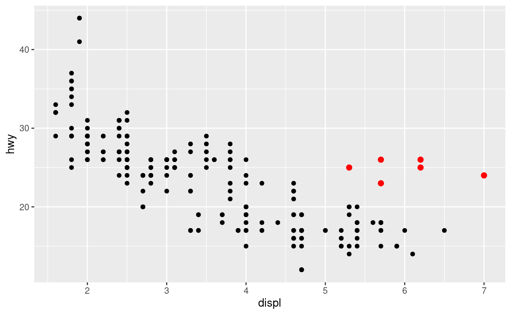

Ipotizziamo che le auto siano ibride. Un modo per verificare questa ipotesi è guardare il valore di "classe" per ogni auto. La variabile `class` del dataset `mpg` classifica le auto in gruppi come compatte, medie e SUV. Se i punti in eccesso sono auto ibride, dovrebbero essere classificati come auto compatte o, forse, auto subcompatte (tieni presente che questi dati sono stati raccolti prima che i camion e i SUV ibridi diventassero popolari).

Si può aggiungere una terza variabile, come "classe", ad uno scatterplot bidimensionale mappandola ad una __estetica__ ('aestetics', come in `aes`, NdT). Un'estetica è una proprietà visiva degli oggetti nel vostro grafico. Le estetiche includono cose come la dimensione, la forma o il colore dei tuoi punti. Puoi visualizzare un punto (come quello sotto) in modi diversi cambiando i valori delle sue proprietà estetiche. Dato che abbiamo già usato la parola "valore" per descrivere i dati, usiamo la parola "livello" per descrivere le proprietà estetiche. Qui cambiamo i livelli di dimensione, forma e colore di un punto per renderlo piccolo, triangolare o blu:


Puoi trasmettere informazioni sui tuoi dati mappando l'estetica del tuo grafico alle variabili del tuo set di dati. Per esempio, puoi mappare i colori dei tuoi punti sulla variabile `class` per rivelare la classe di ogni auto.


```r
ggplot(data = mpg) + 
  geom_point(mapping = aes(x = displ, y = hwy, color = class))
```

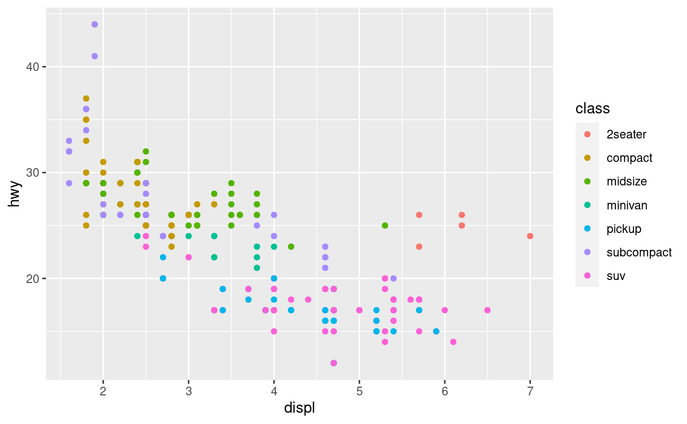

(Se preferite l'inglese britannico, come Hadley, potete usare `colour` invece di `color`).

Per mappare un'estetica ad una variabile, bisogna associare il nome dell'estetica al nome della variabile all'interno di `aes()`. ggplot2 assegnerà automaticamente un livello unico dell'estetica (qui un colore unico) ad ogni valore unico della variabile, un processo noto come __scaling__. ggplot2 aggiungerà anche una legenda che spiega quali livelli corrispondono a quali valori.

I colori rivelano che molti dei punti insoliti sono auto a due posti. Queste auto non sembrano ibride, e sono, infatti, auto sportive! Le auto sportive hanno grandi motori come i SUV e i pick-up, ma corpi piccoli come le auto medie e compatte, il che migliora il loro consumo di carburante. Con il senno di poi, è improbabile che queste auto siano ibride, dato che hanno grandi motori.

Nell'esempio precedente, abbiamo mappato la "classe" all'estetica del colore, ma avremmo potuto mappare la "classe" all'estetica delle dimensioni allo stesso modo. In questo caso, la dimensione esatta di ogni punto rivelerebbe la sua appartenenza di classe. Abbiamo un _warning_ ('avviso') qui, perché mappare una variabile non ordinata (`class`) ad un'estetica ordinata (`size`) non è una buona idea.


```r
ggplot(data = mpg) + 
  geom_point(mapping = aes(x = displ, y = hwy, size = class))
#> Warning: Using size for a discrete variable is not advised.
```


Oppure avremmo potuto mappare `class` all'estetica _alpha_, che controlla la trasparenza dei punti, o all'estetica shape, che controlla la forma dei punti.


```r
# Sinistra
ggplot(data = mpg) + 
  geom_point(mapping = aes(x = displ, y = hwy, alpha = class))

# Destra
ggplot(data = mpg) + 
  geom_point(mapping = aes(x = displ, y = hwy, shape = class))
```

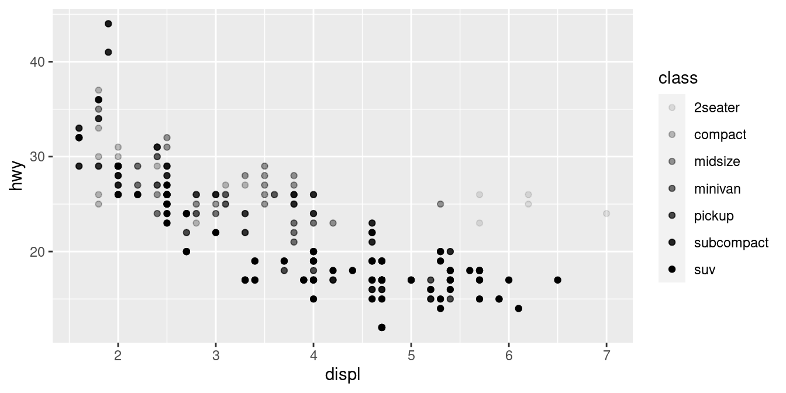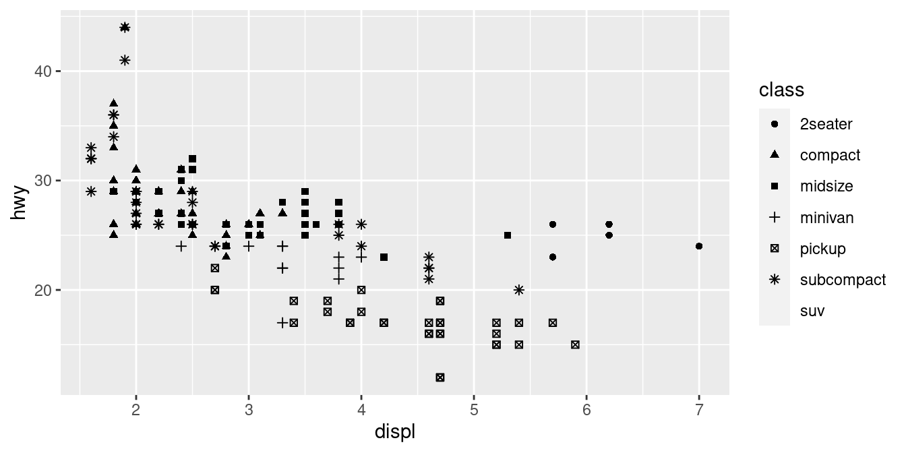

Cosa è successo ai SUV? ggplot2 userà solo sei forme alla volta. Per impostazione predefinita, i gruppi aggiuntivi non saranno tracciati quando si usa l'estetica delle forme.

Per ogni estetica, si usa `aes()` per associare il nome dell'estetica ad una variabile da visualizzare. La funzione `aes()` raccoglie tutte le mappature estetiche utilizzate da un livello e le passa all'argomento di mappatura del livello. La sintassi evidenzia un'utile intuizione su `x` e `y`: le posizioni x e y di un punto sono esse stesse estetiche, proprietà visive che si possono mappare su variabili per visualizzare informazioni sui dati. 

Una volta mappata un'estetica, ggplot2 si occupa del resto. Seleziona una scala ragionevole da usare con l'estetica, e costruisce una legenda che spiega la mappatura tra livelli e valori. Per le estetiche x e y, ggplot2 non crea una legenda, ma crea una linea d'asse con segni di spunta e un'etichetta. La linea dell'asse funge da legenda; spiega la mappatura tra livelli e valori.

Potete anche _impostare_ manualmente le proprietà estetiche del vostro geom. Per esempio, possiamo rendere blu tutti i punti del nostro grafico:


```r
ggplot(data = mpg) + 
  geom_point(mapping = aes(x = displ, y = hwy), color = "blue")
```

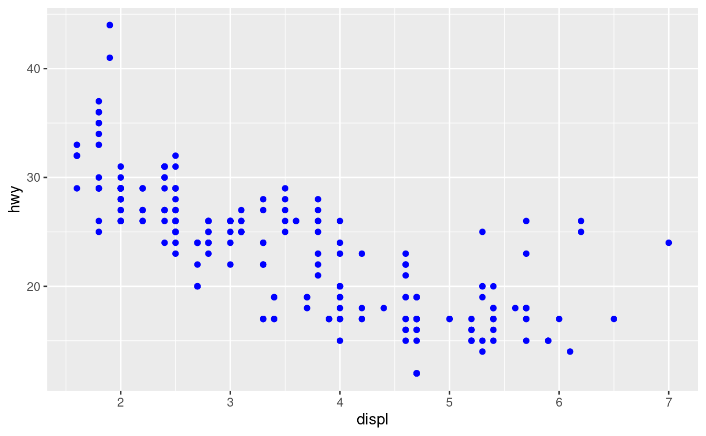

Qui, il colore non trasmette informazioni su una variabile, ma cambia solo l'aspetto del grafico. Per impostare un'estetica manualmente, impostate l'estetica per nome come argomento della vostra funzione geom; cioè va _fuori_ da `aes()`. Dovrete scegliere un livello che abbia senso per quell'estetica:

* Il nome di un colore come stringa di caratteri.

* La dimensione di un punto in mm.

* La forma di un punto come numero, come mostrato nella figura \@ref(fig:shapes).

<div class="figure" style="text-align: center">

<p class="caption">(\#fig:shapes)R ha 25 forme costruite che sono identificate da numeri. Ci sono alcuni apparentemente duplicati: per esempio, 0, 15 e 22 sono tutti quadrati. La differenza deriva dall'interazione dell'estetica del `colore` e del `riempimento`. Le forme vuote (0--14) hanno un bordo determinato dal `colore`; le forme piene (15--20) sono riempite di `colore`; le forme piene (21--24) hanno un bordo di `colore` e sono riempite di `fill`.</p>
</div>

### Esercizi

1.  Cosa è andato storto in questo codice? Perché i punti non sono blu?

    
    ```r
    ggplot(data = mpg) + 
      geom_point(mapping = aes(x = displ, y = hwy, color = "blue"))
    ```
    
    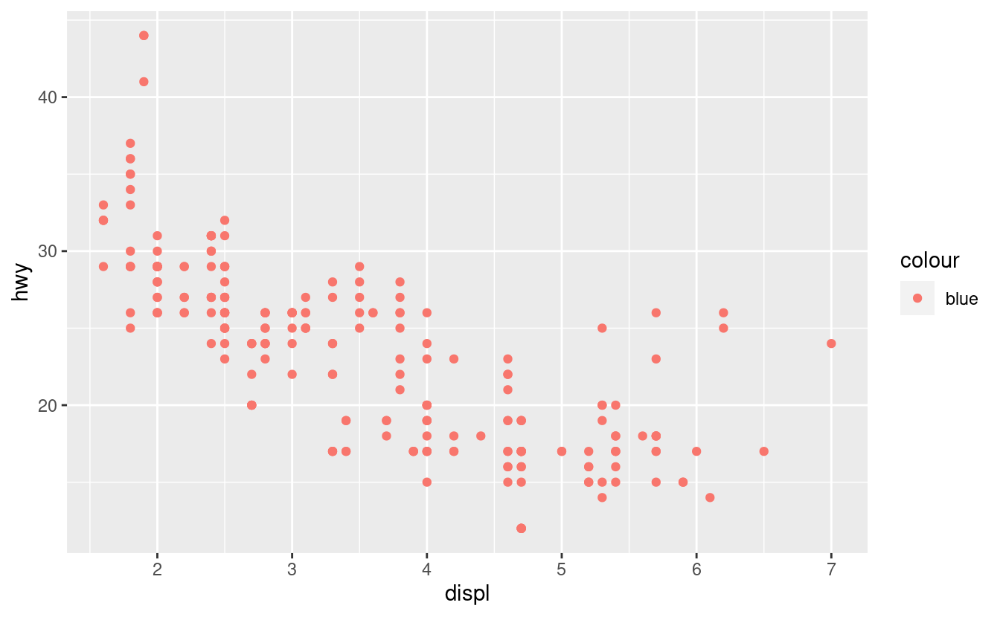
    
1.  Quali variabili in `mpg` sono categoriche? Quali variabili sono continue? 
    (Suggerimento: digita `?mpg` per leggere la documentazione del dataset). Come
    puoi vedere queste informazioni quando esegui `mpg`?

1.  Mappate una variabile continua a `color`, `size` e `shape`. Come si comportano
    queste estetiche si comportano diversamente per le variabili categoriche rispetto a quelle continue?
    continue? 
    
1.  Cosa succede se si mappa la stessa variabile a più estetiche? 

1.  Cosa fa l'estetica `stroke`? Con quali forme funziona?
    (Suggerimento: usa `?geom_point`)
    
1.  Cosa succede se si mappa un'estetica a qualcosa di diverso da un 
    variabile, come `aes(colour = displ < 5)`?  Nota, dovrai anche specificare x e y.

## Problemi comuni

Man mano che iniziate ad eseguire il codice R, è probabile che vi imbattiate in problemi. Non preoccupatevi, succede a tutti. Ho scritto codice R per anni, e ogni giorno scrivo ancora codice che non funziona! 

Inizia confrontando attentamente il codice che stai eseguendo con quello del libro. R è estremamente esigente, e un carattere fuori posto può fare la differenza. Assicuratevi che ogni `(` è abbinato ad un `)` e ogni `"` è abbinato ad un altro `"`. A volte eseguirai il codice e non succede nulla. Controllate la parte sinistra della vostra console: se è un `+`, significa che R non pensa che abbiate digitato un'espressione completa e sta aspettando che la finiate. In questo caso, di solito è facile ricominciare da zero premendo ESCAPE per interrompere l'elaborazione del comando corrente.

Un problema comune quando si creano i grafici di ggplot2 è quello di mettere il `+` nel posto sbagliato: deve arrivare alla fine della linea, non all'inizio. In altre parole, assicuratevi di non aver accidentalmente scritto codice come questo:

```R
ggplot(data = mpg) 
+ geom_point(mapping = aes(x = displ, y = hwy))
```

Se sei ancora bloccato, prova l'aiuto. Puoi ottenere aiuto su qualsiasi funzione di R eseguendo `?function_name` nella console, o selezionando il nome della funzione e premendo F1 in RStudio. Non preoccupatevi se l'aiuto non sembra molto utile - invece saltate giù agli esempi e cercate il codice che corrisponde a quello che state cercando di fare.

Se questo non aiuta, leggete attentamente il messaggio di errore. A volte la risposta sarà sepolta lì! Ma quando si è nuovi di R, la risposta potrebbe essere nel messaggio di errore ma non si sa ancora come capirlo. Un altro ottimo strumento è Google: provate a cercare su Google il messaggio di errore, perché è probabile che qualcun altro abbia avuto lo stesso problema e abbia trovato aiuto online.

## Sfaccettature ('facet')

Un modo per aggiungere variabili aggiuntive è l'estetica. Un altro modo, particolarmente utile per le variabili categoriche, è quello di dividere il vostro grafico in __facet__, sotto-grafici che mostrano ciascuna un sottoinsieme dei dati. 

Per sfaccettare il vostro grafico in base a una singola variabile, usate `facet_wrap()`. Il primo argomento di `facet_wrap()` dovrebbe essere una formula, creata con `~` seguita da un nome di variabile (qui "formula" è il nome di una struttura dati in R, non un sinonimo di "equazione"). La variabile che passate a `facet_wrap()` dovrebbe essere discreta. 


```r
ggplot(data = mpg) + 
  geom_point(mapping = aes(x = displ, y = hwy)) + 
  facet_wrap(~ class, nrow = 2)
```


Per sfaccettare il tuo grafico sulla combinazione di due variabili, aggiungi `facet_grid()` alla tua chiamata plot. Il primo argomento di `facet_grid()` è anch'esso una formula. Questa volta la formula dovrebbe contenere due nomi di variabili separati da una `~`. 


```r
ggplot(data = mpg) + 
  geom_point(mapping = aes(x = displ, y = hwy)) + 
  facet_grid(drv ~ cyl)
```

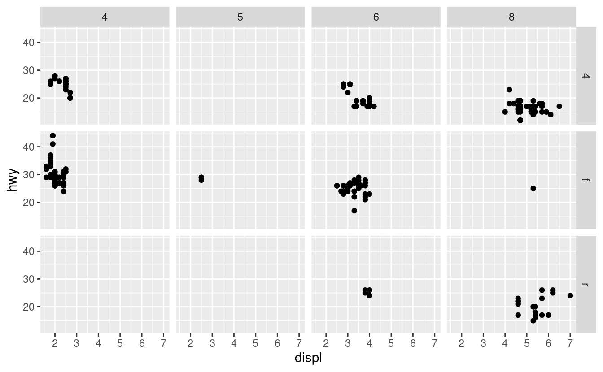

Se preferite non fare la sfaccettatura nella dimensione delle righe o delle colonne, usate un `.` al posto del nome della variabile, per esempio `+ facet_grid(. ~ cyl)`.

### Esercizi

1.  Cosa succede se si effettua la sfaccettatura su una variabile continua?

1.  Cosa significano le celle vuote nel grafico con `facet_grid(drv ~ cyl)`?
    Come si riferiscono a questo grafico?
    
    
    ```r
    ggplot(data = mpg) + 
      geom_point(mapping = aes(x = drv, y = cyl))
    ```

1.  Che grafici produce il seguente codice? Cosa fa `.`?

    
    ```r
    ggplot(data = mpg) + 
      geom_point(mapping = aes(x = displ, y = hwy)) +
      facet_grid(drv ~ .)
    
    ggplot(data = mpg) + 
      geom_point(mapping = aes(x = displ, y = hwy)) +
      facet_grid(. ~ cyl)
    ```

1.  Prendiamo il primo grafico sfaccettato di questa sezione:

    
    ```r
    ggplot(data = mpg) + 
      geom_point(mapping = aes(x = displ, y = hwy)) + 
      facet_wrap(~ class, nrow = 2)
    ```
    
    Quali sono i vantaggi di usare la sfaccettatura invece dell'estetica del colore?
    Quali sono gli svantaggi? Come potrebbe cambiare l'equilibrio se aveste un 
    set di dati più grande?
    
1.  Leggi `?facet_wrap`. Cosa fa `nrow`? Cosa fa `ncol`? Quali altre opzioni
    opzioni controllano la disposizione dei singoli pannelli? Perché non
    `facet_grid()`ha argomenti `nrow` e `ncol`?

1.  Quando si usa `facet_grid()` di solito si dovrebbe mettere la variabile con più
    livelli unici nelle colonne. Perché?

## Oggetti geometrici

In che modo sono simili questi due grafici? 


Entrambi i grafici contengono la stessa variabile x, la stessa variabile y, ed entrambi descrivono gli stessi dati. Ma i grafici non sono identici. Ogni grafico usa un oggetto visivo diverso per rappresentare i dati. Nella sintassi di ggplot2, diciamo che usano diversi __geom__.

Un __geom__ è l'oggetto geometrico che un grafico usa per rappresentare i dati. Le persone spesso descrivono i grafici in base al tipo di geom che il grafico usa. Per esempio, i grafici a barre usano geometrie a barre, i grafici a linee usano geometrie a linee, i boxplot usano geometrie boxplot, e così via. Gli scatterplot rompono la tendenza; usano la geometria a punti. Come si vede sopra, si possono usare diverse geometrie per tracciare gli stessi dati. Il grafico a sinistra usa la geometria a punti, mentre il grafico a destra usa la geometria 'smooth', una linea continua adattata ai dati. 

Per cambiare la geometria nel vostro grafico, cambiate la funzione `geom_` che aggiungete a `ggplot()`. Per esempio, per fare i grafici di cui sopra, potete usare questo codice:


```r
# left
ggplot(data = mpg) + 
  geom_point(mapping = aes(x = displ, y = hwy))

# right
ggplot(data = mpg) + 
  geom_smooth(mapping = aes(x = displ, y = hwy))
```

Ogni funzione geom in ggplot2 prende un argomento `mapping`. Tuttavia, non ogni estetica funziona con ogni geom. Potresti impostare la forma di un punto, ma non potresti impostare la "forma" di una linea. D'altra parte, si _potrebbe_ impostare il tipo di linea ad una linea. `geom_smooth()` disegnerà una linea diversa, con un diverso tipo di linea, per ogni valore unico della variabile che mappate a 'linetype'.


```r
ggplot(data = mpg) + 
  geom_smooth(mapping = aes(x = displ, y = hwy, linetype = drv))
```


Qui `geom_smooth()` separa le auto in tre linee basate sul loro valore `drv`, che descrive la trasmissione dell'auto. Una linea descrive tutti i punti con un valore `4`, una linea descrive tutti i punti con un valore `f` e una linea descrive tutti i punti con un valore `r`. Qui, `4` sta per quattro ruote motrici, `f` per la trazione anteriore e `r` per la trazione posteriore.

Se questo sembra strano, possiamo renderlo più chiaro sovrapponendo le linee ai dati grezzi e colorando il tutto secondo il `drv`. 

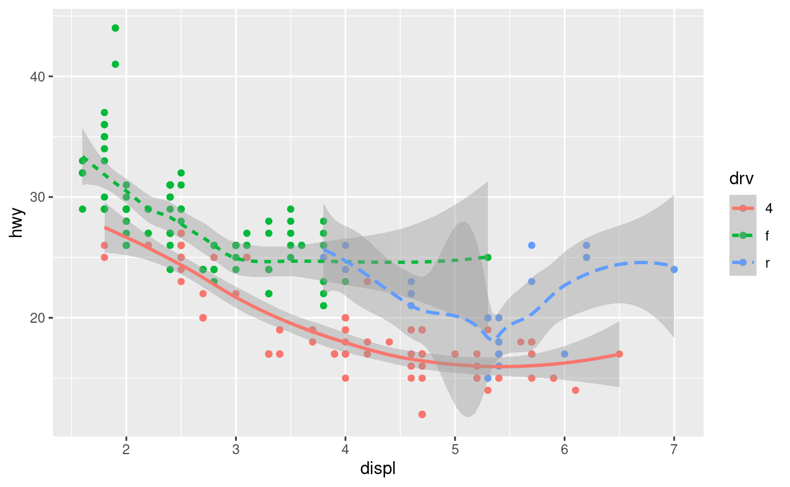

Notate che questo grafico contiene due geometrie nello stesso grafico! Se questo vi fa entusiasmare, allacciate le cinture. Impareremo molto presto come mettere più geom nello stesso grafico.

ggplot2 fornisce oltre 40 geom, e i pacchetti di estensione ne forniscono ancora di più (vedi <https://exts.ggplot2.tidyverse.org/gallery/> per qualche esempio). Il modo migliore per avere una panoramica completa è il cheatsheet di ggplot2, che potete trovare a <http://rstudio.com/resources/cheatsheets>. Per saperne di più su ogni singolo geom, usa lo strumento help: `?geom_smooth`.

Molti geom, come `geom_smooth()`, usano un singolo oggetto geometrico per visualizzare più righe di dati. Per questi geom, si può impostare l'estetica `group` su una variabile categorica per disegnare oggetti multipli. ggplot2 disegnerà un oggetto separato per ogni valore unico della variabile di raggruppamento. In pratica, ggplot2 raggrupperà automaticamente i dati per questi geom ogni volta che si mappa un'estetica ad una variabile discreta (come nell'esempio `linetype`). È conveniente fare affidamento su questa caratteristica perché l'estetica del gruppo da sola non aggiunge una legenda o caratteristiche distintive ai geom.


```r
ggplot(data = mpg) +
  geom_smooth(mapping = aes(x = displ, y = hwy))
              
ggplot(data = mpg) +
  geom_smooth(mapping = aes(x = displ, y = hwy, group = drv))
    
ggplot(data = mpg) +
  geom_smooth(
    mapping = aes(x = displ, y = hwy, color = drv),
    show.legend = FALSE
  )
```


Per visualizzare più geom in uno stesso grafico, aggiungete più funzioni geom a `ggplot()`:


```r
ggplot(data = mpg) + 
  geom_point(mapping = aes(x = displ, y = hwy)) +
  geom_smooth(mapping = aes(x = displ, y = hwy))
```

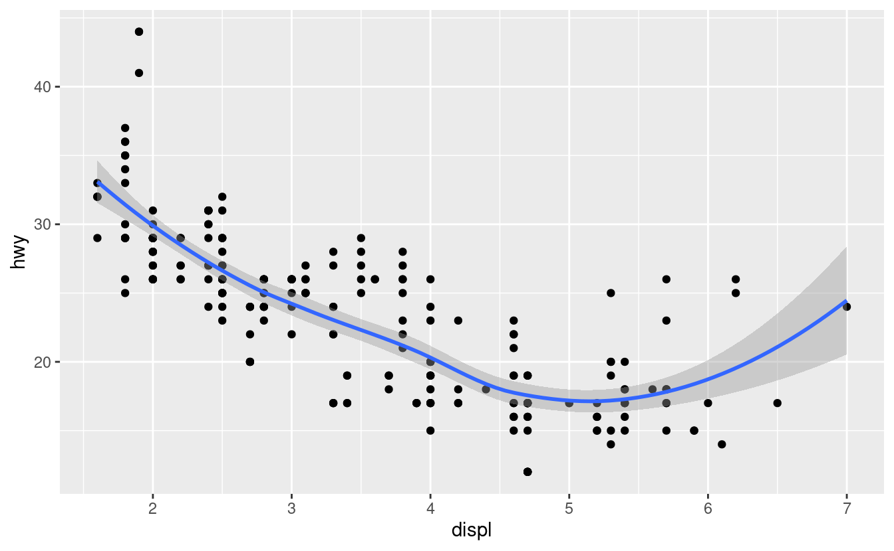

Questo, tuttavia, introduce qualche duplicazione nel nostro codice. Immaginate di voler cambiare l'asse y per visualizzare `cty` invece di `hwy`. Avreste bisogno di cambiare la variabile in due posti, e potreste dimenticare di aggiornarne uno. Potete evitare questo tipo di ripetizioni passando un insieme di mappature a `ggplot()`. ggplot2 tratterà queste mappature come mappature globali che si applicano ad ogni geom nel grafico.  In altre parole, questo codice produrrà lo stesso grafico del codice precedente:


```r
ggplot(data = mpg, mapping = aes(x = displ, y = hwy)) + 
  geom_point() + 
  geom_smooth()
```

Se si inseriscono mappature in una funzione geom, ggplot2 le tratterà come mappature locali per il livello. Userà queste mappature per estendere o sovrascrivere le mappature globali _per quel solo livello_. Questo rende possibile la visualizzazione di diverse estetiche in diversi livelli.


```r
ggplot(data = mpg, mapping = aes(x = displ, y = hwy)) + 
  geom_point(mapping = aes(color = class)) + 
  geom_smooth()
```


Puoi usare la stessa idea per specificare diversi `dati` per ogni livello. Qui, la nostra linea continua mostra solo un sottoinsieme del dataset `mpg`, le auto subcompatte. L'argomento dei dati locali in `geom_smooth()` sovrascrive l'argomento dei dati globali in `ggplot()` solo per quel livello.


```r
ggplot(data = mpg, mapping = aes(x = displ, y = hwy)) + 
  geom_point(mapping = aes(color = class)) + 
  geom_smooth(data = filter(mpg, class == "subcompact"), se = FALSE)
```


(Imparerai come funziona il `filter()` nel capitolo sulle trasformazioni dei dati: per ora, sappi che questo comando seleziona solo le auto subcompatte).

### Esercizi

1.  Quale geom. useresti per disegnare un grafico a linee? Un boxplot? 
    Un istogramma? Un grafico ad area?

1.  Eseguite questo codice nella vostra testa e prevedete come sarà l'output.
    Poi, esegui il codice in R e controlla le tue previsioni.
    
    
    ```r
    ggplot(data = mpg, mapping = aes(x = displ, y = hwy, color = drv)) + 
      geom_point() + 
      geom_smooth(se = FALSE)
    ```

1.  Cosa fa `show.legend = FALSE`?  Cosa succede se lo rimuovi?  
    Perché pensate che l'abbia usato all'inizio del capitolo?

1.  Cosa fa l'argomento `se` di `geom_smooth()`?


1.  Questi due grafici avranno un aspetto diverso? Perché/perché no?

    
    ```r
    ggplot(data = mpg, mapping = aes(x = displ, y = hwy)) + 
      geom_point() + 
      geom_smooth()
    
    ggplot() + 
      geom_point(data = mpg, mapping = aes(x = displ, y = hwy)) + 
      geom_smooth(data = mpg, mapping = aes(x = displ, y = hwy))
    ```

1.  Ricrea il codice R necessario per generare i seguenti grafici.
    
    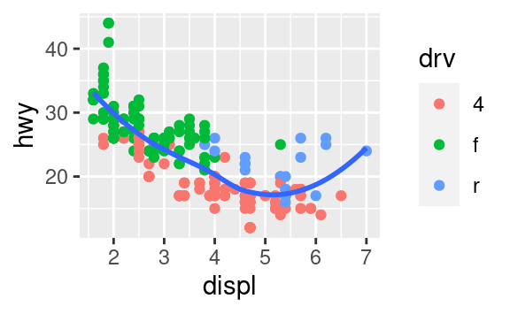

## Trasformazioni statistiche

Diamo un'occhiata a un grafico a barre. I grafici a barre sembrano semplici, ma sono interessanti perché rivelano qualcosa di sottile sui grafici. Considerate un grafico a barre di base, disegnato con `geom_bar()`. Il seguente grafico mostra il numero totale di diamanti nel dataset `diamonds`, raggruppati per `cut`. Il dataset `diamonds` viene fornito in ggplot2 e contiene informazioni su ~54.000 diamanti, inclusi il `prezzo` ('price'), la `caratura` ('carat'), il `colore` ('color'), la `chiarezza` ('clarity') e il `taglio` ('cut') di ogni diamante. Il grafico mostra che sono disponibili più diamanti con tagli di alta qualità che con tagli di bassa qualità. 


```r
ggplot(data = diamonds) + 
  geom_bar(mapping = aes(x = cut))
```


Sull'asse x, il grafico mostra `cut`, una variabile di `diamonds`. Sull'asse y, mostra il conteggio, ma il conteggio non è una variabile in `diamonds`! Da dove viene il conteggio? Molti grafici, come gli scatterplot, tracciano i valori grezzi del tuo set di dati. Altri grafici, come i grafici a barre, calcolano nuovi valori da tracciare:

* I grafici a barre, gli istogrammi e i poligoni di frequenza classificano i tuoi dati 
  e poi tracciano i conteggi dei bin ('contenitore'), il numero di punti che rientrano in ogni bin.

* Gli smoothers adattano un modello ai tuoi dati e poi tracciano le previsioni del
  modello.

* I boxplot calcolano un robusto riassunto della distribuzione e poi mostrano un 
  riquadro appositamente formattato.

L'algoritmo usato per calcolare nuovi valori per un grafico è chiamato __stat__, abbreviazione di trasformazione statistica. La figura sottostante descrive come funziona questo processo con `geom_bar()`.


Puoi sapere quale stat usa un geom ispezionando il valore di default per l'argomento `stat`. Per esempio, `?geom_bar` mostra che il valore di default per `stat` è "count", il che significa che `geom_bar()` usa `stat_count()`. `stat_count()` è documentato nella stessa pagina di `geom_bar()`, e se scorri in basso puoi trovare una sezione chiamata "Computed variables". Questa descrive come calcola due nuove variabili: `count` e `prop`.

Generalmente puoi usare geom e stats in modo intercambiabile. Per esempio, puoi ricreare il grafico precedente usando `stat_count()` invece di `geom_bar()`:


```r
ggplot(data = diamonds) + 
  stat_count(mapping = aes(x = cut))
```

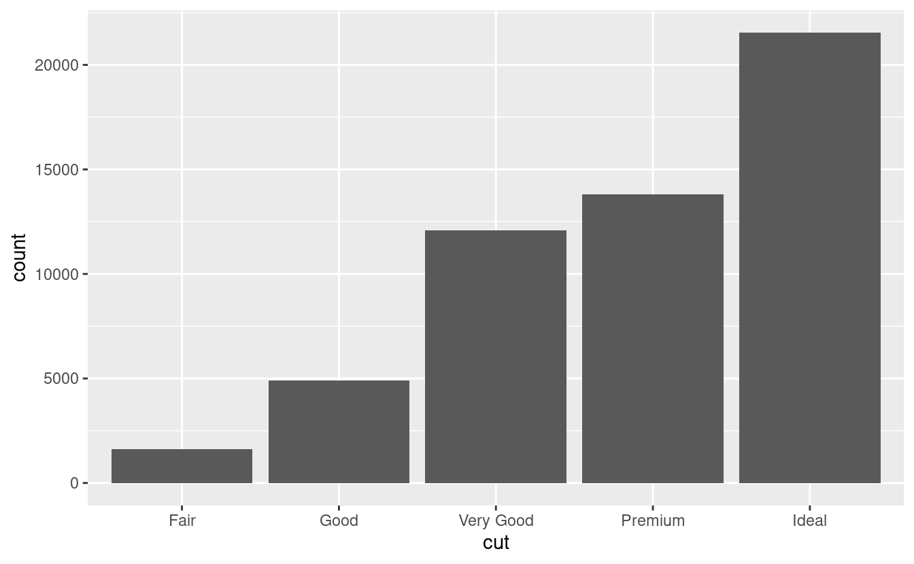

Questo funziona perché ogni geom ha una stat predefinita; e ogni stat ha una geom predefinita. Questo significa che in genere si possono usare i geom senza preoccuparsi della trasformazione statistica sottostante. Ci sono tre ragioni per cui potreste aver bisogno di usare una stat esplicitamente:

1.  Si potrebbe voler sovrascrivere la stat di default. Nel codice qui sotto, cambio 
    la stat di `geom_bar()` da count (il default) a identity. Questo mi permette di 
    Questo mi permette di mappare l'altezza delle barre ai valori grezzi di una variabile $y$. 
    Sfortunatamente quando la gente parla di grafici a barre, potrebbe
    riferirsi a questo tipo di grafico a barre, dove l'altezza della barra è già
    presente nei dati, o al precedente grafico a barre dove l'altezza della barra
    è generata dal conteggio delle righe.
    
    
    ```r
    demo <- tribble(
      ~cut,         ~freq,
      "Fair",       1610,
      "Good",       4906,
      "Very Good",  12082,
      "Premium",    13791,
      "Ideal",      21551
    )
    
    ggplot(data = demo) +
      geom_bar(mapping = aes(x = cut, y = freq), stat = "identity")
    ```
    
    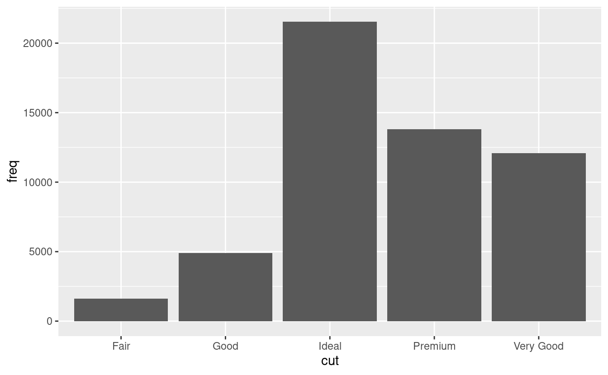
    
    (Non preoccupatevi di non aver visto `<-` o `tribble()` prima. Potresti
    indovinare il loro significato dal contesto, e presto imparerai esattamente
    cosa fanno!)

1.  Potreste voler sovrascrivere la mappatura predefinita dalle variabili trasformate
    all'estetica. Per esempio, potreste voler visualizzare un grafico a barre di
    proporzioni, piuttosto che il conteggio:
    
    
    ```r
    ggplot(data = diamonds) + 
      geom_bar(mapping = aes(x = cut, y = stat(prop), group = 1))
    #> Warning: `stat(prop)` was deprecated in ggplot2 3.4.0.
    #> ℹ Please use `after_stat(prop)` instead.
    ```
    
    

    Per trovare le variabili calcolate dalla stat, cercate la sezione di aiuto
    intitolata "computed variables".
    
1.  Potreste voler prestare maggiore attenzione alla trasformazione statistica
    nel vostro codice. Per esempio, potreste usare `stat_summary()`, che
    riassume i valori y per ogni unico valore x, per attirare 
    l'attenzione sul sommario che state calcolando:
    
    
    ```r
    ggplot(data = diamonds) + 
      stat_summary(
        mapping = aes(x = cut, y = depth),
        fun.min = min,
        fun.max = max,
        fun = median
      )
    ```
    
    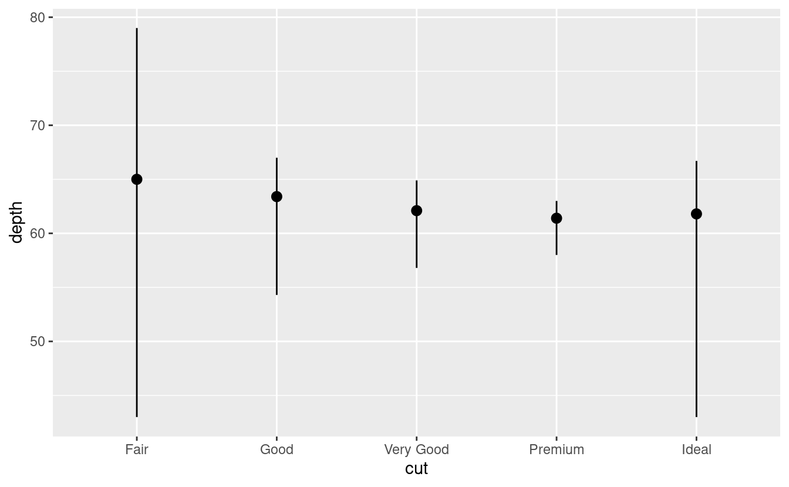
    
ggplot2 fornisce oltre 20 statistiche da usare. Ogni stat è una funzione, quindi si può ottenere aiuto nel solito modo, ad esempio `?stat_bin`. Per vedere l'elenco completo delle statistiche, provate il cheatsheet di ggplot2.

### Esercizi

1.  Qual è il geom di default associato a `stat_summary()`? Come potreste
    riscrivere il grafico precedente per usare quella funzione geom al posto della funzione 
    funzione stat?

1.  Cosa fa `geom_col()`? In che modo è diverso da `geom_bar()`?

1.  La maggior parte dei geom e delle statistiche sono in coppia e vengono quasi sempre usati in 
    concerto. Leggete la documentazione e fate una lista di tutte le 
    coppie. Cosa hanno in comune?

1.  Quali variabili calcola `stat_smooth()`? Quali parametri controllano
    il suo comportamento?

1.  Nel nostro grafico a barre proporzionali, dobbiamo impostare `group = 1`. Perché? In altre
    in altre parole, qual è il problema di questi due grafici?
    
    
    ```r
    ggplot(data = diamonds) + 
      geom_bar(mapping = aes(x = cut, y = after_stat(prop)))
    ggplot(data = diamonds) + 
      geom_bar(mapping = aes(x = cut, fill = color, y = after_stat(prop)))
    ```
  

## Regolazioni di posizione

C'è un altro pezzo di magia associato ai grafici a barre. Puoi colorare un grafico a barre usando l'estetica `colour` o, più utilmente, `fill`:


```r
ggplot(data = diamonds) + 
  geom_bar(mapping = aes(x = cut, colour = cut))
ggplot(data = diamonds) + 
  geom_bar(mapping = aes(x = cut, fill = cut))
```

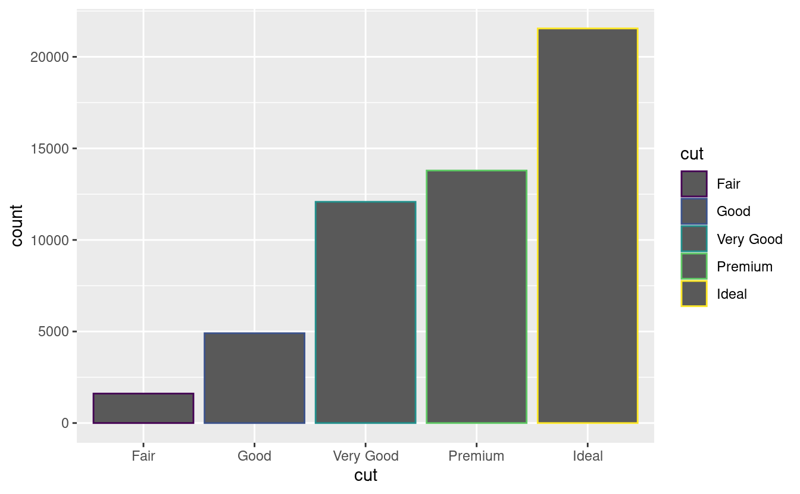

Notate cosa succede se si mappa l'estetica di riempimento ad un'altra variabile, come `clarity`: le barre sono automaticamente impilate. Ogni rettangolo colorato rappresenta una combinazione di `cut` e `clarity`.


```r
ggplot(data = diamonds) + 
  geom_bar(mapping = aes(x = cut, fill = clarity))
```

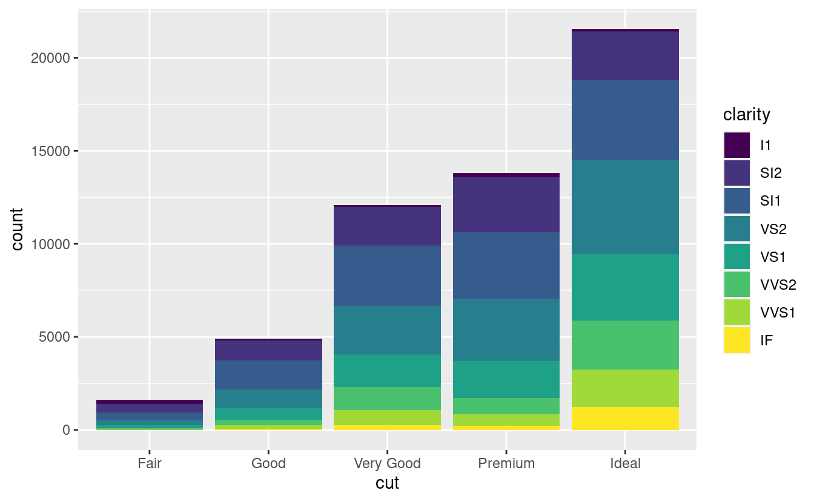

L'impilamento viene eseguito automaticamente dalla __regolazione della posizione__ specificata dall'argomento `position`. Se non vuoi un grafico a barre impilate, puoi usare una delle altre tre opzioni: `"identity"`, `"dodge"` o `"fill"`.

* `position = "identity"` posizionerà ogni oggetto esattamente dove cade nel 
    contesto del grafico. Questo non è molto utile per le barre, perché
    le sovrappone. Per vedere la sovrapposizione dobbiamo rendere le barre
    leggermente trasparenti impostando `alpha` ad un piccolo valore, o completamente
    trasparente impostando `fill = NA`.
    
    
    ```r
    ggplot(data = diamonds, mapping = aes(x = cut, fill = clarity)) + 
      geom_bar(alpha = 1/5, position = "identity")
    ggplot(data = diamonds, mapping = aes(x = cut, colour = clarity)) + 
      geom_bar(fill = NA, position = "identity")
    ```
    
    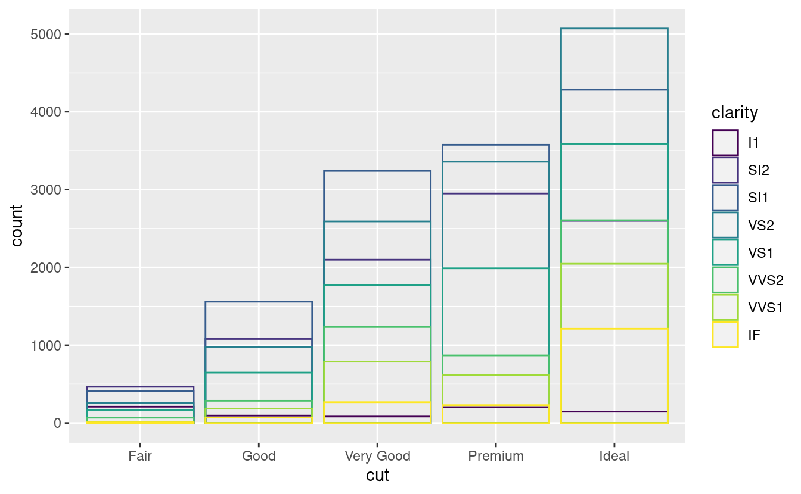
    
    La regolazione della posizione dell'identità è più utile per i geom 2d, come i punti,
    dove è il default.
    
* `position = "fill"` funziona come l'impilamento, ma rende ogni serie di barre impilate
    della stessa altezza. Questo rende più facile confrontare le proporzioni tra 
    gruppi.

    
    ```r
    ggplot(data = diamonds) + 
      geom_bar(mapping = aes(x = cut, fill = clarity), position = "fill")
    ```
    
    

* `position = "dodge"` posiziona gli oggetti sovrapposti direttamente _a fianco_, uno accanto all'altro. Questo rende più facile confrontare i valori individuali.

    
    ```r
    ggplot(data = diamonds) + 
      geom_bar(mapping = aes(x = cut, fill = clarity), position = "dodge")
    ```
    
    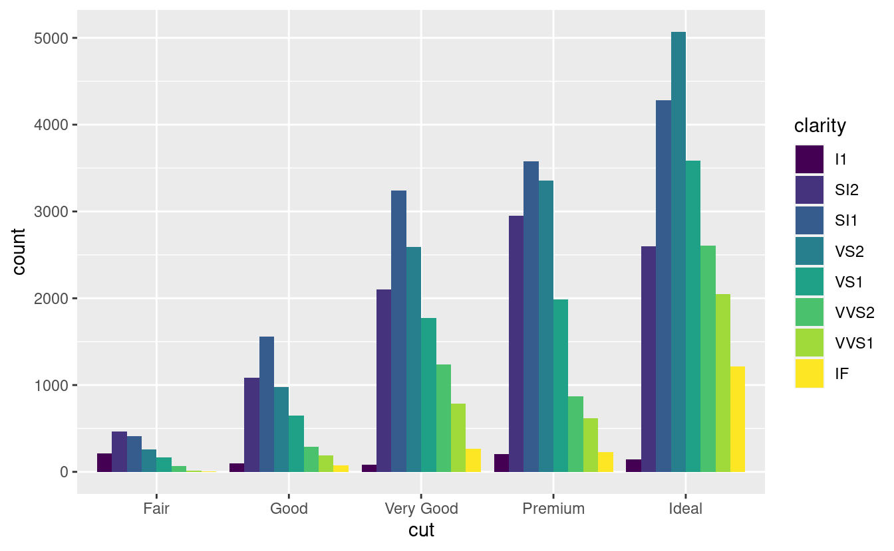

C'è un altro tipo di regolazione che non è utile per i grafici a barre, ma può essere molto utile per gli scatterplot. Ricordate il nostro primo grafico di dispersione. Avete notato che il grafico mostra solo 126 punti, anche se ci sono 234 osservazioni nel set di dati?


I valori di `hwy` e `displ` sono arrotondati così i punti appaiono su una griglia e molti punti si sovrappongono l'un l'altro. Questo problema è noto come __overplotting__. Questa disposizione rende difficile vedere dove si trova la massa dei dati. I punti dei dati sono distribuiti equamente in tutto il grafico, o c'è una combinazione speciale di `hwy` e `displ` che contiene 109 valori? 

Puoi evitare questa sovrapposizione impostando la regolazione della posizione su "jitter".  `position = "jitter"` aggiunge una piccola quantità di rumore casuale ad ogni punto. Questo disperde i punti perché non è probabile che due punti ricevano la stessa quantità di rumore casuale.


```r
ggplot(data = mpg) + 
  geom_point(mapping = aes(x = displ, y = hwy), position = "jitter")
```

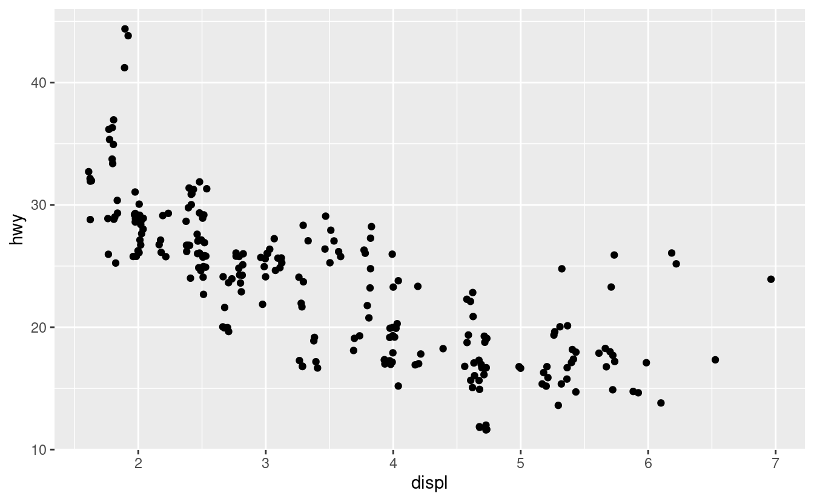

L'aggiunta di casualità sembra uno strano modo per migliorare il vostro grafico, ma mentre rende il vostro grafico meno accurato a piccole scale, lo rende _più_ rivelatore a grandi scale. Poiché questa è un'operazione così utile, ggplot2 ha un'abbreviazione per `geom_point(position = "jitter")`: `geom_jitter()`.

Per saperne di più su una regolazione di posizione, guarda la pagina di aiuto associata ad ogni regolazione: `?position_dodge`, `?position_fill`, `?position_identity`, `?position_jitter`, e `?position_stack`.

### Esercizi

1.  Qual è il problema di questo grafico? Come potresti migliorarlo?

    
    ```r
    ggplot(data = mpg, mapping = aes(x = cty, y = hwy)) + 
      geom_point()
    ```
    
    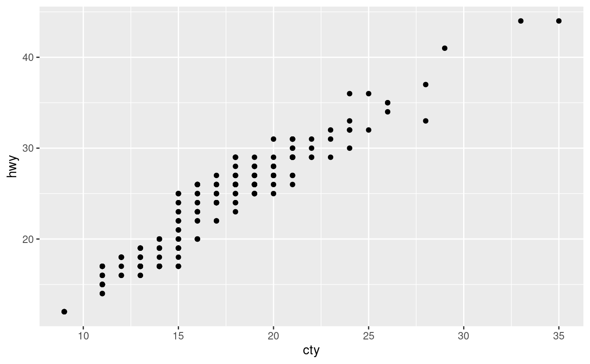

1.  Quali parametri di `geom_jitter()` controllano la quantità di jittering?

1.  Confrontate e contrastate `geom_jitter()` con `geom_count()`.

1.  2. Qual è la regolazione predefinita della posizione per `geom_boxplot()`? Create
    una visualizzazione del dataset `mpg` che lo dimostri.

## Sistemi di coordinate

I sistemi di coordinate sono probabilmente la parte più complicata di ggplot2. Il sistema di coordinate predefinito è il sistema di coordinate cartesiane dove le posizioni x e y agiscono indipendentemente per determinare la posizione di ogni punto. Ci sono un certo numero di altri sistemi di coordinate che sono occasionalmente utili.

* `coord_flip()` commuta gli assi x e y. Questo è utile (per esempio),
    se volete dei boxplot orizzontali. È anche utile per le etichette lunghe: è
    difficile farle entrare senza sovrapporle sull'asse x.
    
    
    ```r
    ggplot(data = mpg, mapping = aes(x = class, y = hwy)) + 
      geom_boxplot()
    ggplot(data = mpg, mapping = aes(x = class, y = hwy)) + 
      geom_boxplot() +
      coord_flip()
    ```
    
    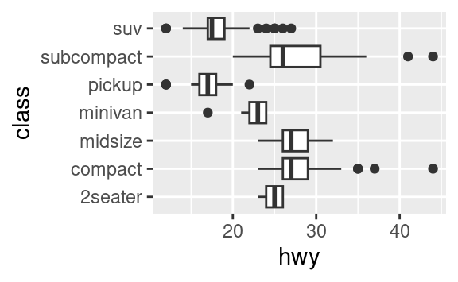

* `coord_quickmap()` imposta correttamente il rapporto di aspetto per le mappe. Questo è molto
    importante se state tracciando dati spaziali con ggplot2 (che purtroppo
    non abbiamo lo spazio per trattare in questo libro).

    
    ```r
    nz <- map_data("nz")
    
    ggplot(nz, aes(long, lat, group = group)) +
      geom_polygon(fill = "white", colour = "black")
    
    ggplot(nz, aes(long, lat, group = group)) +
      geom_polygon(fill = "white", colour = "black") +
      coord_quickmap()
    ```
    
    

* `coord_polar()` usa coordinate polari. Le coordinate polari rivelano un'interessante 
    interessante connessione tra un grafico a barre e un grafico Coxcomb.
    
    
    ```r
    bar <- ggplot(data = diamonds) + 
      geom_bar(
        mapping = aes(x = cut, fill = cut), 
        show.legend = FALSE,
        width = 1
      ) + 
      theme(aspect.ratio = 1) +
      labs(x = NULL, y = NULL)
    
    bar + coord_flip()
    bar + coord_polar()
    ```
    
    

### Esercizi

1.  Trasformare un grafico a barre impilato in un grafico a torta usando `coord_polar()`.

1.  Cosa fa `labs()`? Leggete la documentazione.

1.  Qual è la differenza tra `coord_quickmap()` e `coord_map()`?

1.  Cosa vi dice il grafico qui sotto sulla relazione tra città
    e autostrada? Perché è importante la funzione `coord_fixed()`? Che cosa fa 
    `geom_abline()` fa?
    
    
    ```r
    ggplot(data = mpg, mapping = aes(x = cty, y = hwy)) +
      geom_point() + 
      geom_abline() +
      coord_fixed()
    ```
    
    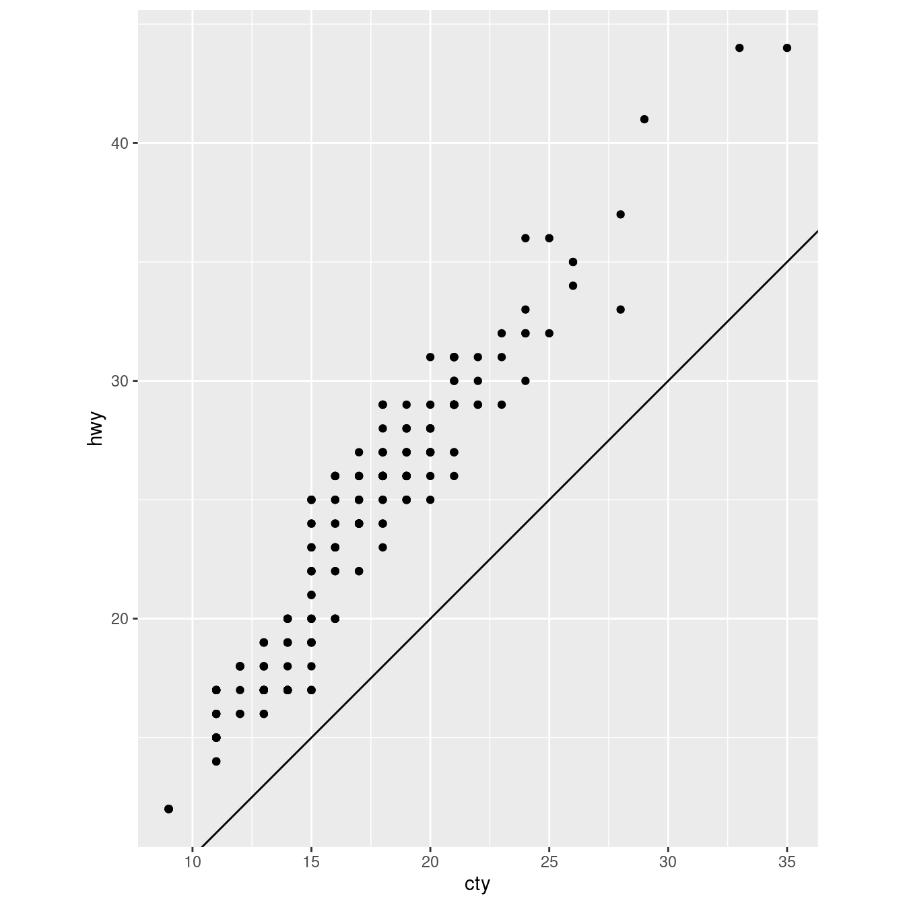

## La grammatica a strati dei grafici

Nelle sezioni precedenti, si è imparato molto di più che come fare scatterplot, grafici a barre e boxplot. Avete imparato una base che potete usare per fare _qualsiasi_ tipo di grafico con ggplot2. Per vedere questo, aggiungiamo regolazioni di posizione, statistiche, sistemi di coordinate e sfaccettature al nostro modello di codice:

```
ggplot(data = <DATA>) + 
  <GEOM_FUNCTION>(
     mapping = aes(<MAPPINGS>),
     stat = <STAT>, 
     position = <POSITION>
  ) +
  <COORDINATE_FUNCTION> +
  <FACET_FUNCTION>
```

Il nostro nuovo modello richiede sette parametri, le parole tra parentesi che appaiono nel modello. In pratica, raramente avrete bisogno di fornire tutti e sette i parametri per fare un grafico, perché ggplot2 fornirà utili impostazioni predefinite per tutto tranne che per i dati, le mappature e la funzione geom.

I sette parametri nel modello compongono la grammatica dei grafici, un sistema formale per costruire grafici. La grammatica della grafica si basa sull'intuizione che è possibile descrivere in modo univoco _qualsiasi_ grafico come una combinazione di un insieme di dati, un geom, un insieme di mappature, uno stat, una regolazione della posizione, un sistema di coordinate e uno schema di sfaccettatura. 

Per vedere come funziona, considerate come potreste costruire una grafico di base da zero: potreste iniziare con un set di dati e poi trasformarlo nelle informazioni che volete visualizzare (con una stat).


Poi, potreste scegliere un oggetto geometrico per rappresentare ogni osservazione nei dati trasformati. Potreste poi usare le proprietà estetiche dei geom. per rappresentare le variabili nei dati. Dovreste mappare i valori di ogni variabile ai livelli di un'estetica.


Poi si seleziona un sistema di coordinate in cui posizionare i geom. Useresti la posizione degli oggetti (che è di per sé una proprietà estetica) per visualizzare i valori delle variabili x e y. A quel punto, avreste un grafico completo, ma potreste regolare ulteriormente le posizioni dei geom all'interno del sistema di coordinate (un aggiustamento di posizione) o dividere il grafico in sottografici (faceting). Potreste anche estendere il grafico aggiungendo uno o più livelli aggiuntivi, dove ogni livello aggiuntivo utilizza un set di dati, un geom, un set di mappature, una statistica e una regolazione della posizione.


Potreste usare questo metodo per costruire _qualsiasi_ grafico che immaginiate. In altre parole, potete usare il modello di codice che avete imparato in questo capitolo per costruire centinaia di migliaia di grafici uniche.
