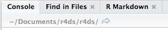
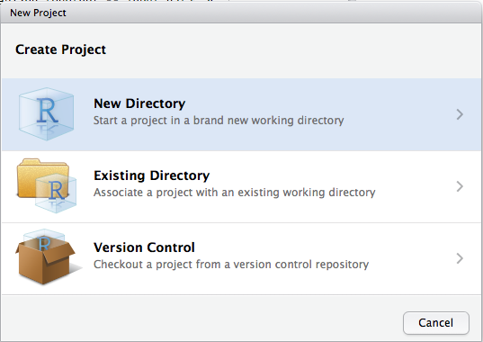

# Workflow: progetti

Un giorno avrete bisogno di lasciare R, andare a fare qualcos'altro e tornare alla vostra analisi il giorno dopo. Un giorno lavorerete su più analisi contemporaneamente che usano tutte R e volete tenerle separate. Un giorno avrete bisogno di portare dati dal mondo esterno in R e inviare risultati numerici e cifre da R al mondo esterno. Per gestire queste situazioni di vita reale, dovete prendere due decisioni:

1.  Cosa della vostra analisi è "reale", cioè cosa salverete come registrazione duratura di ciò che è successo?

1.  Dove "vive" la vostra analisi?

## Cosa è reale?

Come utente alle prime armi di R, va bene considerare il vostro ambiente (cioè gli oggetti elencati nel pannello dell'ambiente) "reale". Tuttavia, a lungo termine, migliorerete molto se considerate i vostri script R come "reali".

Con i vostri script R (e i vostri file di dati), potete ricreare l'ambiente. È molto più difficile ricreare i vostri script R dal vostro ambiente! Dovrete riscrivere un sacco di codice a memoria (commettendo errori per tutto il tempo) o dovrete scavare attentamente nella vostra storia di R.

Per favorire questo comportamento, vi consiglio vivamente di istruire RStudio a non conservare il vostro spazio di lavoro tra le sessioni:


Questo vi causerà un po' di grattacapi a breve termine, perché ora quando riavvierete RStudio non ricorderà i risultati del codice che avete eseguito l'ultima volta. Ma questi problemi a breve termine vi risparmieranno un'agonia a lungo termine perché vi costringe a catturare tutte le interazioni importanti nel vostro codice. Non c'è niente di peggio che scoprire tre mesi dopo il fatto che avete memorizzato solo i risultati di un calcolo importante nel vostro spazio di lavoro, non il calcolo stesso nel vostro codice.

C'è una comoda coppia di scorciatoie da tastiera che lavorano insieme per assicurarsi di aver catturato le parti importanti del vostro codice nell'editor:

1. Premi Cmd/Ctrl + Shift + F10 per riavvare RStudio.
2. Premi Cmd/Ctrl + Shift + S per ricompilare lo script corrente.

Uso questo schema centinaia di volte alla settimana.

## Dove vive la vostra analisi?

R ha una potente nozione di __cartella di lavoro__. Questa è dove R cerca i file che gli chiedete di caricare, e dove metterà qualsiasi file che gli chiedete di salvare. RStudio mostra la vostra directory di lavoro corrente in cima alla console:



E potete stamparlo nel codice R eseguendo `getwd()`:


```r
getwd()
#> [1] "/Users/hadley/Documents/r4ds/r4ds"
```

Come utente principiante di R, va bene lasciare che la vostra directory home, la directory documenti, o qualsiasi altra directory strana sul vostro computer sia la directory di lavoro di R. Ma hai letto sei capitoli di questo libro, e non sei più un principiante. Molto presto dovreste evolvere nell'organizzare i vostri progetti analitici in directory e, quando lavorate su un progetto, impostare la directory di lavoro di R nella directory associata.

__Non ve lo consiglio__, ma potete anche impostare la directory di lavoro dall'interno di R:


```r
setwd("/path/to/my/CoolProject")
```

Ma non dovresti mai farlo perché c'è un modo migliore; un modo che ti mette anche sulla strada per gestire il tuo lavoro di R come un esperto.

## Percorsi e directory

I percorsi (path) e le directory sono un po' complicati perché ci sono due stili di base di percorsi: Mac/Linux e Windows. Ci sono tre modi principali in cui differiscono:

1.  La differenza più importante è come si separano i componenti del
    percorso. Mac e Linux usano gli slash (ad esempio, `plots/diamonds.pdf`) e Windows
    usa i backslash (es. `plots\diamonds.pdf`). R può lavorare con entrambi i tipi
    (non importa quale piattaforma tu stia usando), ma sfortunatamente, 
    i backslash hanno un significato speciale per R, e per ottenere un singolo backslash 
    nel percorso, devi digitare due backslash! Questo rende la vita frustrante, 
    quindi raccomando di usare sempre lo stile Linux/Mac con le barre in avanti.

1.  I percorsi assoluti (cioè i percorsi che puntano allo stesso posto indipendentemente dalla 
    la vostra directory di lavoro) hanno un aspetto diverso. In Windows iniziano con una lettera di unità
    (ad esempio, `C:`) o due barre rovesciate (ad esempio, `\servername`) e in
    Mac/Linux iniziano con una barra "/" (es. `/users/hadley`). Non si dovrebbero
    __mai__ usare percorsi assoluti nei vostri script, perché ostacolano la condivisione: 
    nessun altro avrà esattamente la stessa configurazione di directory che avete voi.

1.  L'ultima piccola differenza è il posto a cui punta `~`. `~` è una
    comoda scorciatoia per la tua home directory. Windows non ha davvero 
    la nozione di una home directory, quindi punta invece alla tua directory dei documenti.

## Progetti RStudio

Gli esperti di R tengono tutti i file associati ad un progetto insieme --- dati di input, script R, risultati analitici, figure. Questa è una pratica così saggia e comune che RStudio ha un supporto integrato per questo tramite __projects__.

Creiamo un progetto da usare mentre lavorate al resto di questo libro. Cliccate su File > New Project, quindi:



Chiama il tuo progetto `r4ds` e pensa attentamente a quale _sottodirectory_ metti il progetto. Se non lo memorizzate in un posto sensato, sarà difficile trovarlo in futuro!

Una volta completato questo processo, avrete un nuovo progetto RStudio solo per questo libro. Controllate che la directory "home" del vostro progetto sia la directory di lavoro corrente:


```r
getwd()
#> [1] /Users/hadley/Documents/r4ds/r4ds
```

Ogni volta che si fa riferimento a un file con un percorso relativo, esso lo cercherà qui.

Ora inserite i seguenti comandi nell'editor di script e salvate il file, chiamandolo "diamonds.R". Successivamente, esegui lo script completo che salverà un file PDF e CSV nella directory del tuo progetto. Non preoccupatevi dei dettagli, li imparerete più avanti nel libro.


```r
library(tidyverse)

ggplot(diamonds, aes(carat, price)) + 
  geom_hex()
ggsave("diamonds.pdf")

write_csv(diamonds, "diamonds.csv")
```

Uscire da RStudio. Ispeziona la cartella associata al tuo progetto --- nota il file `.Rproj`. Fai doppio clic su quel file per riaprire il progetto. Notate che tornate al punto in cui avete lasciato: è la stessa directory di lavoro e la stessa cronologia dei comandi, e tutti i file su cui stavate lavorando sono ancora aperti. Poiché hai seguito le mie istruzioni sopra, avrai comunque un ambiente completamente nuovo, garantendoti che stai iniziando con una tabula rasa.

Nel tuo modo preferito, specifico per il sistema operativo, cerca sul tuo computer `diamonds.pdf` e troverai il PDF (nessuna sorpresa) ma _anche lo script che lo ha creato_ (`diamonds.R`). Questa è una grande vittoria! Un giorno vorrete rifare una figura o semplicemente capire da dove viene. Se salvate rigorosamente le figure su file __con il codice R__ e mai con il mouse o gli appunti, sarete in grado di riprodurre il vecchio lavoro con facilità!

## Riassunto

In sintesi, i progetti RStudio vi danno un solido flusso di lavoro che vi servirà bene in futuro:

* Creare un progetto RStudio per ogni progetto di analisi dei dati.

* Conservate lì i file di dati; parleremo del loro caricamento in R in [importazione dei dati].

* Tieni lì gli script; modificali, eseguili a pezzi o nella loro interezza.

* Salva i tuoi output (grafici e dati puliti) lì.

* Usa sempre e solo percorsi relativi, non assoluti.

Tutto ciò di cui hai bisogno è in un unico posto, e separato in modo pulito da tutti gli altri progetti su cui stai lavorando.
