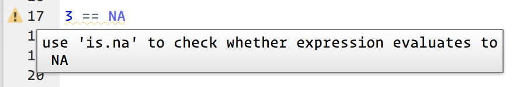

# Workflow: script

Finora avete usato la console per eseguire il codice. Questo è un ottimo punto di partenza, ma vi accorgerete che diventa angusto abbastanza rapidamente man mano che create grafici ggplot2 più complessi e pipe dplyr. Per darti più spazio per lavorare, è una grande idea usare l'editor di script. Aprilo cliccando sul menu File, e selezionando New File, poi R script, o usando la scorciatoia da tastiera Cmd/Ctrl + Shift + N. Ora vedrai quattro riquadri:

```{r echo = FALSE, out.width = "75%"}
knitr::include_graphics("diagrams/rstudio-editor.png")
```

L'editor di script è un ottimo posto per mettere il codice che ti interessa. Continuate a sperimentare nella console, ma una volta che avete scritto del codice che funziona e fa quello che volete, mettetelo nell'editor di script. RStudio salverà automaticamente il contenuto dell'editor quando si esce da RStudio, e lo caricherà automaticamente quando si riapre. Tuttavia, è una buona idea salvare regolarmente i propri script e farne il backup.

## Esecuzione del codice

L'editor di script è anche un ottimo posto per costruire complessi grafici ggplot2 o lunghe sequenze di manipolazioni dplyr. La chiave per usare efficacemente l'editor di script è memorizzare una delle più importanti scorciatoie da tastiera: Cmd/Ctrl + Enter. Questo esegue l'espressione R corrente nella console. Per esempio, prendete il codice qui sotto. Se il tuo cursore è su █, , premendo Cmd/Ctrl + Enter eseguirai il comando completo che genera `not_cancelled`. Sposterà anche il cursore all'istruzione successiva (che inizia con `not_cancelled %>%`). Questo rende facile eseguire il tuo script completo premendo ripetutamente Cmd/Ctrl + Invio.

```{r, eval = FALSE}
library(dplyr)
library(nycflights13)

not_cancelled <- flights %>% 
  filter(!is.na(dep_delay)█, !is.na(arr_delay))

not_cancelled %>% 
  group_by(year, month, day) %>% 
  summarise(mean = mean(dep_delay))
```

Invece di eseguire espressione per espressione, puoi anche eseguire lo script completo in un solo passo: Cmd/Ctrl + Shift + S. Farlo regolarmente è un ottimo modo per controllare di aver catturato tutte le parti importanti del tuo codice nello script. 

Ti consiglio di iniziare sempre il tuo script con i pacchetti che ti servono. In questo modo, se condividete il vostro codice con altri, possono facilmente vedere quali pacchetti hanno bisogno di installare. Notate, comunque, che non dovreste mai includere `install.packages()` o `setwd()` in uno script che condividete. È molto antisociale cambiare le impostazioni sul computer di qualcun altro!

Quando lavorerete nei prossimi capitoli, vi raccomando vivamente di iniziare nell'editor e di fare pratica con le scorciatoie da tastiera. Con il tempo, inviare codice alla console in questo modo diventerà così naturale che non ci penserete nemmeno.

## Diagnostica di RStudio

L'editor di script evidenzierà anche gli errori di sintassi con una linea rossa a ghirigori e una croce nella barra laterale:

```{r echo = FALSE, out.width = NULL}
knitr::include_graphics("screenshots/rstudio-diagnostic.png")
```

Hover over the cross to see what the problem is:

```{r echo = FALSE, out.width = NULL}
knitr::include_graphics("screenshots/rstudio-diagnostic-tip.png")
```

RStudio will also let you know about potential problems:

```{r echo = FALSE, out.width = NULL}

```

## Esercizi

1.  Andate sull'account twitter di RStudio Tips, <https://twitter.com/rstudiotips>
    e trova un suggerimento che sembra interessante. Esercitatevi ad usarlo!

1.  Quali altri errori comuni segnalerà la diagnostica di RStudio?  Leggete
    <https://support.rstudio.com/hc/en-us/articles/205753617-Code-Diagnostics> per 
    scoprirlo.
    
